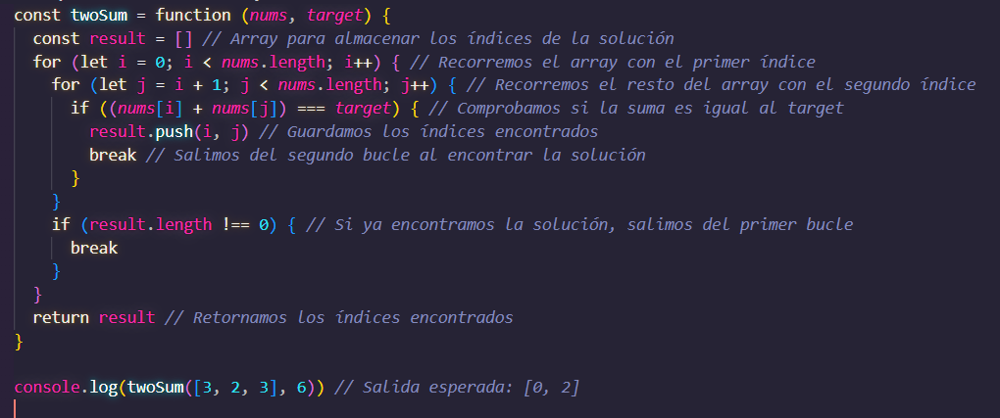
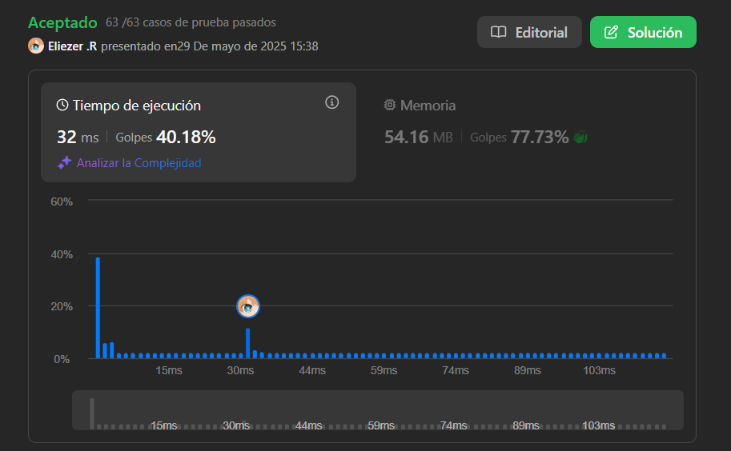
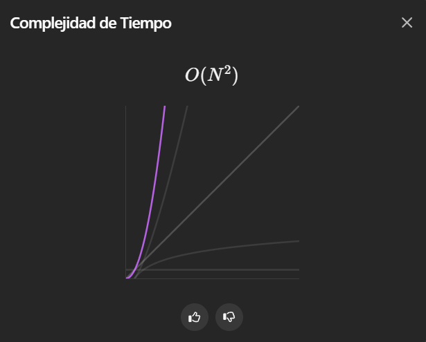
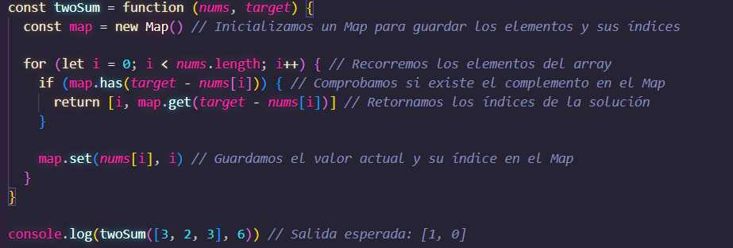

# 01. Two Sum

Dada una matriz de enteros `nums` y un número entero `target`, regresa los índices de los dos números de tal manera que su suma sea igual a `target`.

Puedes suponer que cada entrada tiene exactamente una solución y no puedes usar el mismo elemento dos veces.

Puedes devolver la respuesta en cualquier orden.

---

## 📋 Ejemplos

**Ejemplo 1:**

- Entrada: `nums = [2,7,11,15]`, `target = 9`
- Salida: `[0,1]`
- Explicación: Porque `nums[0] + nums[1] == 9`, devolvemos `[0, 1]`.

**Ejemplo 2:**

- Entrada: `nums = [3,2,4]`, `target = 6`
- Salida: `[1,2]`

**Ejemplo 3:**

- Entrada: `nums = [3,3]`, `target = 6`
- Salida: `[0,1]`

---

## 💭 Enfoque y Estrategia

### Análisis del problema

- **Objetivo**: Encontrar dos índices cuya suma sea igual al target.
- **Restricción**: No reutilizar el mismo elemento.
- **Garantía**: Siempre existe exactamente una solución.

### Estrategia implementada: Fuerza Bruta

1. **Loop externo**: Itera sobre cada elemento del array.
2. **Loop interno**: Busca en los elementos restantes.
3. **Verificación**: Comprueba si la suma es igual al target.
4. **Retorno temprano**: Sale del bucle al encontrar la solución.

## 🔧 Implementación

**Características de la solución:**

- **Algoritmo**: Fuerza bruta con bucles anidados.
- **Complejidad temporal**: O(n²) - Peor caso revisa todas las combinaciones.
- **Complejidad espacial**: O(1) - Solo almacena el array resultado.
- **Legibilidad**: Alta - Lógica directa y comentarios explicativos.

---

## 📊 Análisis de Rendimiento

### Resultados en LeetCode

### Complejidad Temporal

---

## 💡 Alternativa: Hash Map (O(n))

### Estrategia implementada: Hash map

1. **Loop externo**: Recorre los elementos
2. **Verificación**: Comprueba si el elemento esta introducido dentro del map.

---

A continuación se muestra la solución optimizada usando un diccionario (Hash Map), que permite encontrar la respuesta en tiempo lineal.

---

**Características de la solución:**

- **Algoritmo**: Hashing
- **Complejidad temporal**: O(n) - Peor caso revisa todas las combinaciones.
- **Complejidad espacial**: O(1) - Solo almacena el array resultado.
- **Legibilidad**: Alta - Lógica directa y comentarios explicativos.

---

## 🎯 Aprendizajes Clave

- **Comparación de enfoques**:  
  - La solución de **fuerza bruta** es sencilla de implementar y fácil de entender, ideal para comenzar y asegurar que comprendes el problema. Sin embargo, su complejidad O(n²) la hace poco eficiente para listas grandes.
  - La alternativa usando **Hash Map** es mucho más eficiente (O(n)), ya que permite encontrar la solución en una sola pasada utilizando memoria adicional.

- **Simplicidad vs Eficiencia**:  
  - Empezar por la solución más simple ayuda a entender el problema y validar casos edge.
  - Optimizar después con estructuras como Hash Map permite escalar la solución para entradas grandes.

- **Trade-offs**:  
  - Fuerza bruta prioriza bajo uso de memoria, pero sacrifica velocidad.
  - Hash Map sacrifica algo de memoria para obtener una mejora significativa en tiempo de ejecución.

- **Casos edge importantes**:  
  - Arrays mínimos, números negativos, duplicados y targets fuera del rango de los elementos.

- **Recomendación**:  
  - Siempre valida primero con fuerza bruta y luego optimiza si el problema lo requiere.

---

## 🏷️ Tags

`Array` `Brute Force` `Two Pointers` `Hash Table` `Easy`

---
 
**Tiempo invertido**: 4 minutos  
**Intentos**: 1  
**Dificultad percibida**: Ninguna

