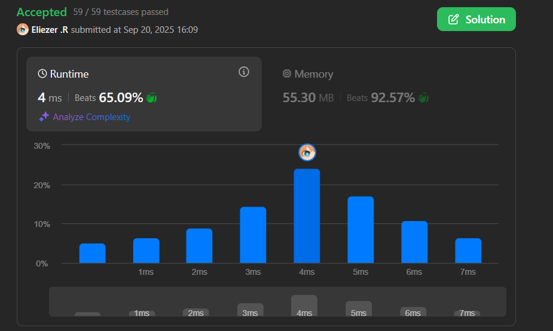

# 1021. Remove Outermost Parentheses

Una cadena de paréntesis válida es `""`, `"(" + A + ")"`, o `A + B`, donde `A` y `B` son cadenas de paréntesis válidas, y `+` representa concatenación de cadenas.

Una cadena de paréntesis válida `s` es **primitiva** si no está vacía, y no existe una forma de dividirla en `s = A + B`, con `A` y `B` cadenas de paréntesis válidas no vacías.

Dada una cadena de paréntesis válida `s`, considera su descomposición primitiva: `s = P1 + P2 + ... + Pk`, donde `Pi` son cadenas de paréntesis primitivas válidas.

Retorna `s` después de remover los paréntesis más externos de cada cadena primitiva en la descomposición primitiva de `s`.

**Dificultad:** Easy

---

## 📋 Ejemplos

**Ejemplo 1:**

- Entrada: `s = "(()())(())"`
- Salida: `"()()()"`
- Explicación: La descomposición primitiva es `"(()())" + "(())"`. Después de remover paréntesis externos: `"()()" + "()" = "()()()"`

**Ejemplo 2:**

- Entrada: `s = "(()())(())(()(()))"`
- Salida: `"()()()()(())"`
- Explicación: Descomposición primitiva: `"(()())" + "(())" + "(()(()))"`. Resultado: `"()()" + "()" + "()(())" = "()()()()(())"`

**Ejemplo 3:**

- Entrada: `s = "()()"`
- Salida: `""`
- Explicación: Descomposición primitiva: `"()" + "()"`. Después de remover externos: `"" + "" = ""`

---

## 💭 Enfoque y Estrategia

- **Objetivo**: Identificar y remover solo los paréntesis externos de cada grupo primitivo.
- **Insight clave**: Usar un contador de balance para detectar cuándo estamos en el nivel "exterior".
- **Técnica**: Balance counter - cuando balance > 1, estamos dentro de la primitiva.
- **Proceso**: Solo agregar caracteres cuando no son los paréntesis externos de cada primitiva.

La estrategia usa un contador de balance para rastrear la profundidad de anidación y solo incluir paréntesis que no sean los más externos de cada componente primitivo.

---

## 🔧 Implementación

```js
const removeOuterParentheses = function (s) {
    const arr = []     // Array para construir el resultado
    let balance = 0    // Contador de balance para rastrear nivel de anidación

    for (let i = 0; i < s.length; i++) {
        if (s[i] === '(') {
            // Si balance >= 1, no es paréntesis externo
            if (balance >= 1) {
                arr.push(s[i])
            }
            balance++  // Incrementar balance por paréntesis abierto
        } else {
            balance--  // Decrementar balance por paréntesis cerrado
            
            // Si balance >= 1 después de decrementar, no es paréntesis externo
            if (balance >= 1) {
                arr.push(s[i])
            }
        }
    }
    
    return arr.join('')
}

console.log(removeOuterParentheses("(()())(())")) // "()()()"

/**
 * Ejemplo paso a paso con s = "(()())(())":
 * 
 * i=0: '(' balance=0→1, 0>=1? No → no agregar
 * i=1: '(' balance=1→2, 1>=1? Sí → agregar '(' → arr=['(']
 * i=2: ')' balance=2→1, 1>=1? Sí → agregar ')' → arr=['(',')']  
 * i=3: '(' balance=1→2, 1>=1? Sí → agregar '(' → arr=['(',')','(']
 * i=4: ')' balance=2→1, 1>=1? Sí → agregar ')' → arr=['(',')','(',')']
 * i=5: ')' balance=1→0, 0>=1? No → no agregar (fin primitiva 1)
 * i=6: '(' balance=0→1, 0>=1? No → no agregar (inicio primitiva 2)
 * i=7: '(' balance=1→2, 1>=1? Sí → agregar '(' → arr=['(',')','(',')',')','(']
 * i=8: ')' balance=2→1, 1>=1? Sí → agregar ')' → arr=['(',')','(',')','(',')']
 * i=9: ')' balance=1→0, 0>=1? No → no agregar (fin primitiva 2)
 * 
 * Resultado: "()()" → join() → "()()()"
 */
```

---

## 📊 Análisis de Rendimiento

- **Complejidad temporal**: O(n), donde n es la longitud de la cadena s.
- **Complejidad espacial**: O(n), para el array resultado.


*Solución óptima con una sola pasada y construcción directa del resultado.*

---

## 🔍 Conceptos Clave del Balance

**Estados del balance:**
- `balance = 0`: Estamos en el nivel exterior (entre primitivas)
- `balance = 1`: Primer nivel dentro de una primitiva  
- `balance > 1`: Niveles más profundos de anidación

**Lógica de inclusión:**
- **Paréntesis abierto `(`**: Incluir solo si `balance >= 1` (ya estamos dentro)
- **Paréntesis cerrado `)`**: Incluir solo si `balance >= 1` después de decrementar

---

## 🎯 Visualización del Proceso

```
Entrada: "(()())(())"
Balance:  0123210123 (después de cada carácter)

Primitiva 1: "(()())"
- balance 0→1: '(' externo → no incluir
- balance 1→2: '(' interno → incluir  
- balance 2→1: ')' interno → incluir
- balance 1→2: '(' interno → incluir
- balance 2→1: ')' interno → incluir  
- balance 1→0: ')' externo → no incluir

Primitiva 2: "(())"
- Proceso similar...

Resultado: "()()"
```

---

## 🔄 Enfoque Alternativo con Stack

```js
const removeOuterParenthesesStack = function(s) {
    const result = []
    const stack = []
    
    for (let char of s) {
        if (char === '(') {
            if (stack.length > 0) {
                result.push(char)
            }
            stack.push(char)
        } else {
            stack.pop()
            if (stack.length > 0) {
                result.push(char)
            }
        }
    }
    
    return result.join('')
}
```

---

## 🎯 Aprendizajes Clave

- **Balance counting**: Técnica fundamental para problemas de paréntesis.
- **Detección de niveles**: Usar contador para identificar profundidad de anidación.
- **Filtrado condicional**: Solo incluir elementos que cumplen cierta condición de nivel.
- **Una sola pasada**: Construir resultado directamente sin necesidad de múltiples recorridos.
- **Primitivas**: Entender el concepto de componentes primitivos en estructuras anidadas.

---

## 🔍 Casos Edge

- String vacío: `""` → `""`
- Un par simple: `"()"` → `""`
- Múltiples pares simples: `"()()"` → `""`
- Anidación profunda: `"((()))"` → `"(())"`
- Múltiples primitivas complejas: Cada una procesada independientemente

---

## 🧮 Ejemplos Adicionales

```
"(())" → "()"
"()()" → ""  
"((()))" → "(())"
"(()())" → "()()"
"()(())" → "()"
```

---

## 🏷️ Tags

`String` `Stack` `Easy`

---

**Tiempo invertido**: 22 minutos  
**Intentos**: 3  
**Dificultad percibida**: Easy-Medium