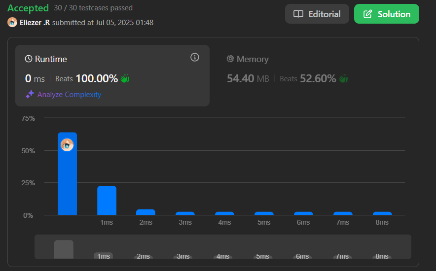

# 118. Pascal's Triangle

Dado un entero `numRows`, devuelve las primeras `numRows` filas del triángulo de Pascal.

En el triángulo de Pascal, cada número es la suma de los dos números directamente encima de él.

---

## 📋 Ejemplos

**Ejemplo 1:**

- Entrada: `numRows = 5`
- Salida: `[[1],[1,1],[1,2,1],[1,3,3,1],[1,4,6,4,1]]`

**Ejemplo 2:**

- Entrada: `numRows = 1`
- Salida: `[[1]]`

---

## 💭 Enfoque y Estrategia

- **Objetivo**: Construir el triángulo de Pascal hasta la fila `numRows`.
- **Restricción**: Cada elemento es la suma de los dos elementos superiores de la fila anterior.
- **Salida**: Un array de arrays representando el triángulo.

La estrategia es construir cada fila usando la anterior, sumando los valores adyacentes y agregando 1 al inicio y al final de cada fila.

---

## 🔧 Implementación

```js
const generate = function (numRows) {
  const arr = [] // Inicializamos un array para guardar los subArrays

  for (let i = 0; i < numRows; i++) {
    const subArr = [] // Inicilizamos el subArray
    subArr[0] = 1 // Para que el metodo funcione necesitamos que en la primera posicion siempre sea 1
    for (let j = 1; j < i; j++) {
      subArr[j] = arr[i - 1][j - 1] + arr[i - 1][j] // Aqui simplemente vamos sumando desde la posicion 0 hasta subArr - 1
    }
    subArr[i] = 1 // Ahora al final del subArray lo que hacemos es que en la ultima posicion pusheamos 1
    arr.push(subArr) // Introducimos el subArr al array
  }
  return arr // Retornamos
}

console.log(generate(5)) // [[1],[1,1],[1,2,1],[1,3,3,1],[1,4,6,4,1]]

/**
 * Pequeño ejemplo
 * Primera iteracion del primer for
 * subArr = [1]
 * En esta iteracion el segundo for no entra, asi que seguimos
 * OJO al final se vuelve a poner 1 en la posicion 0 de subArr por la varible del for, i
 * arr = [[1]]
 * Segunda iteracion del primer for
 * subArr = [1]
 * En esta iteracion tampoco entra el segundo array asi que :
 * subArr = [1,1] gracias al i del primer for
 * Entonces :
 * arr = [[1],[1,1]]
 * Tercera iteracion del primer for
 * subArr = 1
 * Ahora si el segundo for, entramos
 * subArr[j] que es la posicion siguiente es igual a arr[i - 1][j - 1] que es igual a este array [1,1] la pocion 0 + la posicion 1 que es 1
 * Ahora salimos y veremos que el subArr se ve asi :
 *  subArr = [1,2] por el segundo for
 * ya luego al final
 * subArr = [1,2,1]
 * arr = [[1], [1,1], [1,2,1]] y asi sucesivamente
 */

```

---

## 📊 Análisis de Rendimiento

- **Complejidad temporal**: O(n^2), donde n es `numRows`, ya que cada fila puede tener hasta n elementos.
- **Complejidad espacial**: O(n^2), por el almacenamiento de todas las filas.



---

## 🎯 Aprendizajes Clave

- El triángulo de Pascal es un clásico ejemplo de programación dinámica.
- Cada fila se construye a partir de la anterior, reutilizando resultados previos.
- Es útil para problemas combinatorios y de coeficientes binomiales.

---

## 🏷️ Tags

`Array` `Dynamic Programming` `Easy`

---

**Tiempo invertido**: 5 minutos  
**Intentos**: 1  
**Dificultad percibida**: Fácil