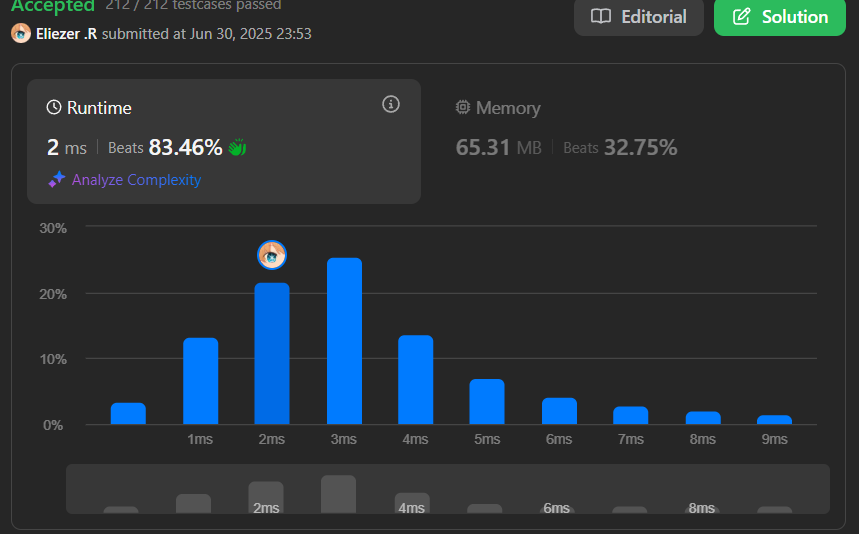

# 121. Best Time to Buy and Sell Stock

Se te da un array `prices` donde `prices[i]` es el precio de una acción en el día `i`.

Quieres maximizar tu ganancia eligiendo un solo día para comprar una acción y un día diferente en el futuro para venderla.

Devuelve la máxima ganancia que puedes obtener de esta transacción. Si no puedes obtener ninguna ganancia, devuelve 0.

---

## 📋 Ejemplos

**Ejemplo 1:**

- Entrada: `prices = [7,1,5,3,6,4]`
- Salida: `5`
- Explicación: Compra en el día 2 (precio = 1) y vende en el día 5 (precio = 6), ganancia = 6-1 = 5.

**Ejemplo 2:**

- Entrada: `prices = [7,6,4,3,1]`
- Salida: `0`
- Explicación: En este caso, no se realiza ninguna transacción y la ganancia máxima es 0.

---

## 💭 Enfoque y Estrategia

- **Objetivo**: Encontrar el máximo beneficio posible comprando y vendiendo una sola vez.
- **Restricción**: Solo se puede comprar antes de vender.
- **Salida**: Un número entero representando la máxima ganancia posible.

La estrategia óptima es recorrer el array manteniendo el precio mínimo visto hasta el momento y calcular la ganancia máxima posible en cada paso.

---

## 🔧 Implementación

```js
var maxProfit = function(prices) {
    let min = Infinity // Aqui pondremos el valor/numero que se menor, lo que buscamos por que asi evitamos que no se reste tanto o mas bien que no nos quiten tanto 
    let resul = 0 // este sera el resultado 

    for (let i = 0; i < prices.length; i++) { // iteramos 
      if (prices[i] < min) min = prices[i] // Bien, aqui le preguntaremos si el valor que tenemos es menor a infinity, ya saben que infinity es un numero infinito y superior a todo 
      if (resul < (prices[i + 1] - min)) resul = (prices[i + 1] - min) // Si resul es menor al venta - compra entonces nos quedamos con ese resultado 
    }

    return resul // Retornamos
    
};

console.log(maxProfit([7,1,5,3,6,4]))
/**
 * Pequeño ejemplo:
 * Veamos como serian las iteraciones 
 * Primera iteracion
 * if(prices[i] = 7 < min = infinity) (Si) min es igual a 7
 * if(resul = 0 < (prices[i + 1]= 1 - min = 7 ) = -6 Aqui recalco que prices + 1 seria la venta y min seria la compra, tambien podriamos poner el if al revez, (No) 
 * min = 7 
 * resul = 0
 * 
 * Segunda iteracion 
 *  * if(prices[i] = 1 < min = 7) (Si) min es igual a 1
 * if(resul = 0 < (prices[i + 1] = 5 - min = 1 ) = 4 (Si) resul es igual a 4
 * min = 1
 * resul = 4
 * 
 * Tercera iteracion 
 *  * if(prices[i] = 5 < min = 1) (No) min Sigue siendo igual a 1
 * if(resul = 4 < (prices[i + 1] = 3 - min = 1 ) = 2 (No) resul sigue siendo igual a 4
 * min = 1
 * resul = 4
 * Y asi hasta llegar hasta a un numero mayor como lo es 6
 * 
 */
```

---

## 📊 Análisis de Rendimiento

- **Complejidad temporal**: O(n), donde n es la longitud del array.
- **Complejidad espacial**: O(1), solo se usan variables auxiliares.



---

## 🎯 Aprendizajes Clave

- Mantener el precio mínimo visto hasta el momento es clave para calcular la ganancia máxima.
- Si no hay oportunidad de obtener ganancia, se retorna 0.
- Este patrón es muy útil para problemas de diferencias máximas en arrays.

---

## 🏷️ Tags

`Array` `Dynamic Programming` `Easy`

---

**Tiempo invertido**: 2 minutos  
**Intentos**: 1  
**Dificultad percibida**: Muy facil