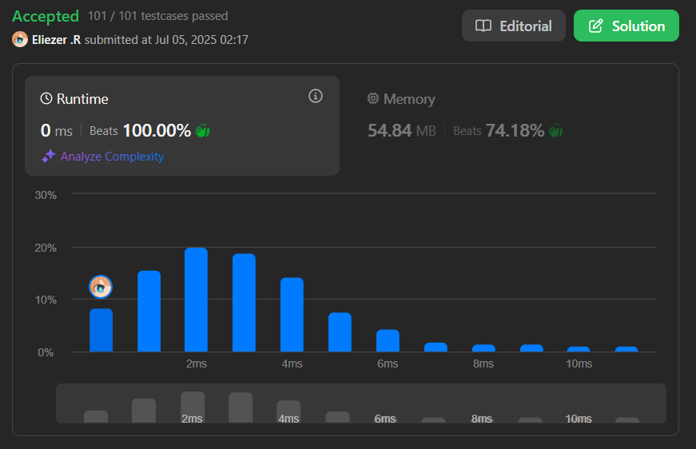

# 1394. Find Lucky Integer in an Array

Dado un array de enteros `arr`, un entero afortunado ("lucky integer") es aquel cuyo valor es igual a la frecuencia con la que aparece en el array.

Devuelve el entero afortunado más grande del array. Si no existe ninguno, devuelve `-1`.

---

## 📋 Ejemplos

**Ejemplo 1:**

- Entrada: `arr = [2,2,3,4]`
- Salida: `2`
- Explicación: El único número afortunado es 2 porque aparece exactamente 2 veces.

**Ejemplo 2:**

- Entrada: `arr = [1,2,2,3,3,3]`
- Salida: `3`
- Explicación: 1, 2 y 3 son números afortunados, pero el mayor es 3.

**Ejemplo 3:**

- Entrada: `arr = [2,2,2,3,3]`
- Salida: `-1`
- Explicación: No hay ningún número afortunado en el array.

---

## 💭 Enfoque y Estrategia

- **Objetivo**: Encontrar el número afortunado más grande, es decir, el mayor número cuya frecuencia en el array es igual a su valor.
- **Restricción**: Si no existe ningún número afortunado, devolver `-1`.
- **Salida**: Un entero representando el número afortunado más grande o `-1`.

La estrategia es contar la frecuencia de cada número usando un mapa y luego buscar el mayor número que cumpla la condición.

---

## 🔧 Implementación

```js

const findLucky = function (arr) {
  const map = new Map() // Creamos un map para almacenar todo las secuencias/numeros
  let count = 0 // En esta variable le asignaremos el valor maximo del map si esta
  let keyMin = -1 // Aqui almacenaremos la key que en este caso seria el numero que cumple con la regla
  for (let i = 0; i < arr.length; i++) {
    map.set(arr[i], (map.get(arr[i]) + 1) || 1) // En este primero for simplemnte vamos sumando los nuero que aparecen
  }

  for (const [value, key] of map.entries()) { // Tambien podemos usar un forEach
    if (value === key && value > count) { // Luego aca la regla es que debe de ser igual a el numero
      count = value
      keyMin = key
    }
  }

  return keyMin // Retornamos
}

console.log(findLucky([2, 2, 3, 4])) // 2

/**
 * en el primero for el map se vera asi:
 * Map(3) { 2 => 2, 3 => 1, 4 => 1 }
 * Como se ve, el del lado izquierdo es la key que es el numero que veremos cuantas veces a aparecido en el array y el valor
 * luego en el segundo for simplemnte vamos buscando si por ejemplo value que es igual a 2 === key que es igual 2 y && value es mayor a count
 *
 * ya luego al final retornamos keyMin
 */

```

---

## 📊 Análisis de Rendimiento

- **Complejidad temporal**: O(n), donde n es la longitud del array.
- **Complejidad espacial**: O(n), por el uso del mapa para contar frecuencias.



---

## 🎯 Aprendizajes Clave

- El uso de un mapa/frecuencia es clave para problemas de conteo.
- Buscar el mayor valor que cumpla una condición requiere comparar y actualizar el resultado durante la iteración.
- Si no existe ningún número afortunado, se retorna -1.

---

## 🏷️ Tags

`Array` `Hash Table` `Counting` `Easy`

---

**Tiempo invertido**: 3 minutos  
**Intentos**: 2 
**Dificultad percibida**: Fácil