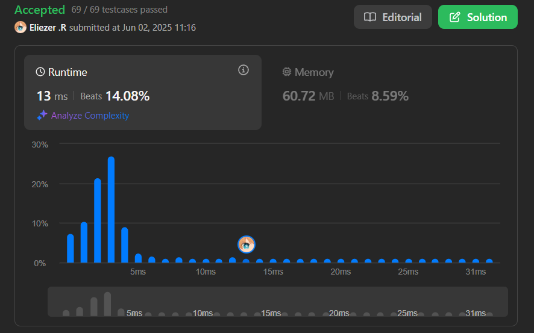
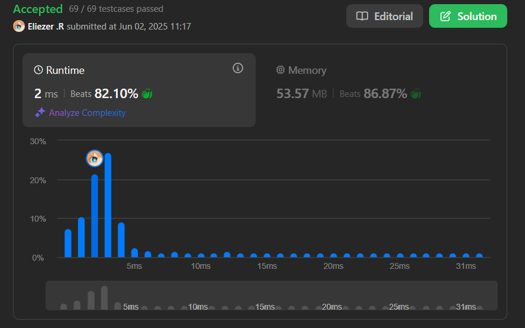

# 1408. String Matching in an Array

Dada una lista de palabras, devuelve todas las palabras que son subcadenas de otra palabra en la lista.

---

## 📋 Ejemplos

**Ejemplo 1:**

- Entrada: `words = ["mass","as","hero","superhero"]`
- Salida: `["as","hero"]`
- Explicación: `"as"` es subcadena de `"mass"` y `"hero"` es subcadena de `"superhero"`.

**Ejemplo 2:**

- Entrada: `words = ["leetcode","et","code"]`
- Salida: `["et","code"]`
- Explicación: `"et"` es subcadena de `"leetcode"`, `"code"` también.

**Ejemplo 3:**

- Entrada: `words = ["blue","green","bu"]`
- Salida: `[]`
- Explicación: Ninguna palabra es subcadena de otra.

---

## 💭 Enfoque y Estrategia

### Análisis del problema

- **Objetivo**: Encontrar todas las palabras que aparecen como subcadena en otra palabra de la lista.
- **Restricción**: No contar una palabra como subcadena de sí misma.
- **Salida**: Lista de palabras (sin duplicados) que cumplen la condición.

---

### Estrategia 1: Triple bucle sin metodo `includes` y comparación de subcadenas (`main.js`)

1. **Recorrer cada palabra** como posible subcadena.
2. Para cada palabra, **comparar con todas las demás**.
3. Para cada comparación, **recorrer todas las posiciones posibles** de la palabra candidata y extraer subcadenas.
4. Si la subcadena coincide y no es la misma palabra, agregarla al resultado.
5. Eliminar duplicados usando `Set`.

#### Implementación

```js
const stringMatching = function (words) {
  const subMap = [] // Creamos una variable para almacenar los subStrings

  for (let i = 0; i < words.length; i++) { // Usamos el primer bucle para obtener el primer elemnto del array
    const firtElem = words[i] // El primer elemnto del array
    for (let j = 0; j < words.length; j++) { // Usamos el segundo bucle para poder recorrer el segundo elemnto
      for (let r = 0; r < words[j].length; r++) { // Recorremos el segundo elemento y evitamos su mismo indice en el if
        const subStr = words[j].slice(r, firtElem.length + r) // Usamos esta variable cortando el elemnto tal que quede del mismo tamaño como el primer elemnto  example : mass --- quedaria = ma y luego en el segundo bucle : mass --- quedaria = as
        if (subStr === firtElem && j !== i) { // Comparamos si as === as si no es asi seguimos
          subMap.push(firtElem) //  si es asi introducimos el subString
        }
      }
    }
  }

  return Array.from(new Set(subMap)) // Evitamos duplicados y retornamos el valor
}

console.log(stringMatching(['mass', 'as', 'hero', 'superhero']))
// Input: words = ["mass","as","hero","superhero"]
// Output: ["as","hero"]
```

**Características:**

- **Algoritmo**: Comparación exhaustiva de subcadenas.
- **Complejidad temporal**: O(n³ * m) donde n es el número de palabras y m la longitud máxima.
- **Complejidad espacial**: O(n).
- **Ventaja**: Encuentra todas las coincidencias posibles.
- **Desventaja**: Poco eficiente para listas grandes.

---

### Estrategia 2: Uso de `some` para buscar subcadenas (`main2.js`)

1. Para cada palabra, usar `Array.some` para verificar si es subcadena de otra palabra (distinta).
2. Si es así, agregarla al resultado.
3. No hay duplicados porque solo se agrega una vez por palabra.

#### Implementación

```js
const stringMatching = function (words) {
  const subArr = [] // Creamos un array para almacenar los subString
  for (let i = 0; i < words.length; i++) { // Recorremos words
    const elem = words[i] // Almacenamos el primer elemento
    if (words.some((word, index) => (word.includes(elem) && index !== i))) { // aqui usamos el metodo some y includes y basicamente le dicimos some: si hay al menos un elemnto que cumpla con esta linea (word.includes(elem) && index !== i) introduce el subString includes: preguna si el elem esta incluido dentro de elem example: od esta incluido en leetcoder ? esto es verdadero
      subArr.push(elem) // Introducimos el subString
    }
  }
  return subArr // Retornamos el valor
}

console.log(stringMatching(['leetcoder', 'leetcode', 'od', 'hamlet', 'am']))
// Input: words = ["leetcode","et","code"]
// Output: ["et","code"]
```

**Características:**

- **Algoritmo**: Uso de `includes` y `some` para buscar subcadenas.
- **Complejidad temporal**: O(n² * m).
- **Complejidad espacial**: O(n).
- **Ventaja**: Más legible y eficiente que la anterior.
- **Desventaja**: Puede ser menos eficiente si las palabras son muy largas.

---

## 📊 Análisis de Rendimiento

- Ambas soluciones funcionan bien para listas pequeñas o medianas.
- La segunda solución (`main2.js`) es preferible por su simplicidad y eficiencia.

`Sin includes`: 
 

`Con el metodo includes`: 
 

---

## 🎯 Aprendizajes Clave

- Usar métodos como `includes` y `some` puede simplificar mucho el código.
- Eliminar duplicados es importante cuando una palabra puede aparecer varias veces como subcadena.
- Siempre considerar casos edge: palabras idénticas, subcadenas al inicio/final, palabras que no son subcadenas de ninguna.

---

## 🏷️ Tags

`Array` `String` `Substrings` `Easy`

---

**Tiempo invertido**: 1h | 7 minutos  
**Intentos**: 2  
**Dificultad percibida**: Medianamente facil
