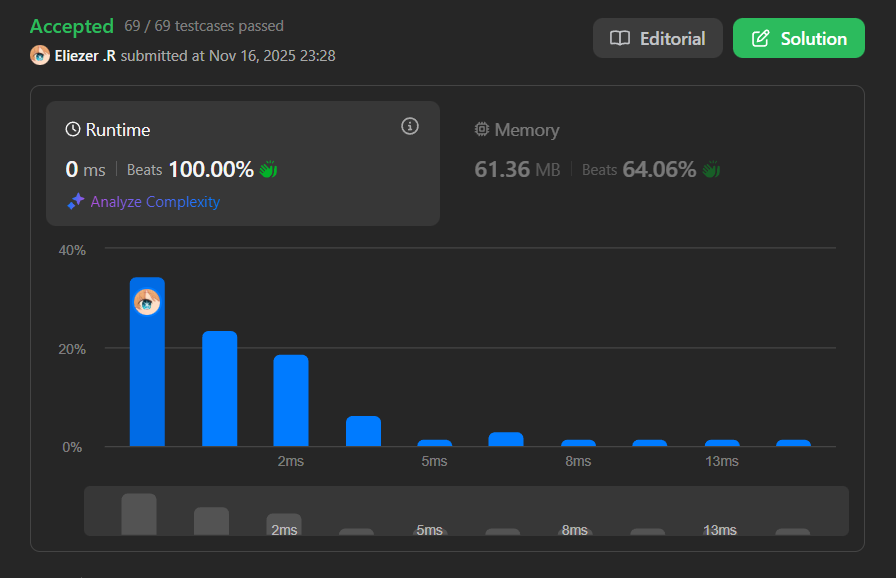

# 1437. Check If All 1's Are at Least Length K Places Away

Dado un arreglo binario **nums** y un entero **k**, retorna `true` si **todos los `1's` están al menos k lugares de distancia** entre sí, de lo contrario retorna `false`.

**Dificultad:** Easy

---

## 📋 Ejemplos

**Ejemplo 1:**

- Entrada: `nums = [1,0,0,0,1,0,0,1]`, `k = 2`
- Salida: `true`
- Explicación: Cada uno de los `1's` está al menos 2 lugares de distancia entre sí:
  - `1` en índice 0 y `1` en índice 4 → distancia = 4 - 0 - 1 = 3 ≥ 2 ✓
  - `1` en índice 4 y `1` en índice 7 → distancia = 7 - 4 - 1 = 2 ≥ 2 ✓

**Ejemplo 2:**

- Entrada: `nums = [1,0,0,1,0,1]`, `k = 2`
- Salida: `false`
- Explicación: El segundo `1` y el tercer `1` están solo a 1 lugar de distancia entre sí:
  - `1` en índice 3 y `1` en índice 5 → distancia = 5 - 3 - 1 = 1 < 2 ✗

---

## 💭 Enfoque y Estrategia

- **Objetivo**: Verificar que la distancia entre cualquier par de `1's` consecutivos sea al menos `k`.
- **Insight clave**: Solo necesitamos rastrear la posición del último `1` encontrado y comparar con el actual.
- **Técnica**: Recorrido lineal con una variable para guardar la última posición de `1`.
- **Retos**: Manejar el caso cuando encontramos el primer `1` y calcular correctamente la distancia.

La solución es directa: mantener la posición del último `1` y verificar que cada nuevo `1` esté suficientemente lejos.

---

## 🔧 Implementación

```javascript
var kLengthApart = function (nums, k) {
    let last = -1; // Posición del último '1' encontrado (-1 significa que no hemos encontrado ninguno)

    for (let i = 0; i < nums.length; i++) {
        if (nums[i] === 1) {
            // Verificar si este no es el primer '1' y si la distancia es suficiente
            if (last !== -1 && i - last - 1 < k) {
                return false;
            }
            // Actualizar la posición del último '1'
            last = i;
        }
    }

    return true;
};

console.log(kLengthApart([1,0,0,0,1,0,0,1], 2)); // true

/**
 * Ejemplo paso a paso con nums = [1,0,0,0,1,0,0,1], k = 2:
 * Índices:  0 1 2 3 4 5 6 7
 * Array:   [1,0,0,0,1,0,0,1]
 * 
 * Iteración por cada elemento:
 * 
 * i=0, nums[0]=1:
 *   last=-1 (primer '1')
 *   → No verificar distancia, solo actualizar
 *   last=0
 * 
 * i=1, nums[1]=0:
 *   → No hacer nada
 * 
 * i=2, nums[2]=0:
 *   → No hacer nada
 * 
 * i=3, nums[3]=0:
 *   → No hacer nada
 * 
 * i=4, nums[4]=1:
 *   last=0 (no es -1)
 *   Distancia: i - last - 1 = 4 - 0 - 1 = 3
 *   3 < 2? No ✓ → continuar
 *   last=4
 * 
 * i=5, nums[5]=0:
 *   → No hacer nada
 * 
 * i=6, nums[6]=0:
 *   → No hacer nada
 * 
 * i=7, nums[7]=1:
 *   last=4 (no es -1)
 *   Distancia: i - last - 1 = 7 - 4 - 1 = 2
 *   2 < 2? No ✓ → continuar
 *   last=7
 * 
 * Terminó el bucle → return true
 * 
 * Explicación de la fórmula de distancia:
 * - i: índice del '1' actual
 * - last: índice del '1' anterior
 * - i - last: número total de posiciones entre ellos (incluyendo ambos '1's)
 * - i - last - 1: número de posiciones ENTRE los '1's (excluyendo ambos '1's)
 * 
 * Visualización:
 *   Índices:    0  1  2  3  4
 *   Array:     [1, 0, 0, 0, 1]
 *                ^           ^
 *              last=0       i=4
 *   
 *   Distancia = 4 - 0 - 1 = 3
 *   Hay 3 posiciones entre ellos: índices 1, 2, 3
 */
```

---

## 📊 Análisis de Rendimiento

- **Complejidad temporal**: O(n), un solo recorrido del arreglo.
- **Complejidad espacial**: O(1), solo usamos una variable auxiliar.


*Esta solución es óptima ya que necesitamos examinar cada elemento al menos una vez.*

---

## 🔧 Detalles Técnicos Importantes

**Cálculo de la distancia:**

```javascript
i - last - 1
```

Esta fórmula calcula el número de elementos **entre** dos `1's`, excluyendo los propios `1's`.

**Visualización detallada:**

```
Ejemplo: nums = [1,0,0,1], k = 2
          ^     ^
        last=0  i=3

Posiciones: 0, 1, 2, 3
Elementos entre los '1's: índices 1 y 2 (2 elementos)

Distancia = i - last - 1
         = 3 - 0 - 1
         = 2 ✓
```

**¿Por qué `last = -1` inicialmente?**

- `-1` es un valor centinela que indica que aún no hemos encontrado ningún `1`.
- La condición `last !== -1` nos permite distinguir el primer `1` de los subsiguientes.
- Para el primer `1`, no hay distancia que verificar.

**Casos especiales:**

```javascript
// Un solo '1' → siempre true (no hay par para verificar)
[1,0,0,0], k=2 → true

// Dos '1's consecutivos → siempre false si k > 0
[1,1], k=1 → false (distancia = 1 - 0 - 1 = 0 < 1)

// Sin '1's → siempre true (condición vacía)
[0,0,0], k=2 → true
```

---

## 🎯 Aprendizajes Clave

- **Recorrido simple**: Una sola pasada es suficiente para verificar la condición.
- **Variable de estado**: Mantener `last` nos permite verificar distancias sin almacenar todas las posiciones.
- **Detección temprana**: Retornar `false` inmediatamente al encontrar una violación.
- **Valor centinela**: Usar `-1` para distinguir casos especiales.

---

## 🔍 Casos Edge

- **Sin `1's`**: `[0,0,0,0]`, `k=2` → `true`
- **Un solo `1`**: `[0,1,0,0]`, `k=2` → `true`
- **Dos `1's` consecutivos**: `[1,1]`, `k=1` → `false`
- **k = 0**: `[1,1,1]`, `k=0` → `true` (cualquier distancia ≥ 0)
- **Array vacío**: `[]`, `k=1` → `true`
- **Todos `1's`**: `[1,1,1,1]`, `k=0` → `true`, pero con `k=1` → `false`
- **Distancia exacta k**: `[1,0,0,1]`, `k=2` → `true` (2 ≥ 2)

---

## 🧮 Ejemplos Adicionales

```javascript
[1,0,0,0,1,0,0,1], k=2 → true  (distancias: 3, 2)
[1,0,0,1,0,1], k=2     → false (distancias: 2, 1)
[1,0,1], k=1           → true  (distancia: 1)
[1,1], k=0             → true  (distancia: 0)
[1,1], k=1             → false (distancia: 0)
[0,1,0,1], k=2         → false (distancia: 1)
```

---

## 🚀 Variante Alternativa: Guardando Todas las Posiciones

Si necesitáramos procesar las posiciones de otra manera:

```javascript
var kLengthApartAlt = function(nums, k) {
    const positions = [];
    
    // Recolectar todas las posiciones de '1's
    for (let i = 0; i < nums.length; i++) {
        if (nums[i] === 1) {
            positions.push(i);
        }
    }
    
    // Verificar distancias entre pares consecutivos
    for (let i = 1; i < positions.length; i++) {
        if (positions[i] - positions[i-1] - 1 < k) {
            return false;
        }
    }
    
    return true;
};
```

**Complejidad**: O(n) tiempo, O(m) espacio donde m es el número de `1's`.

La solución original es mejor porque usa O(1) espacio.

---

## 🔬 Comparación: Solución Optimizada vs Alternativa

**Solución Optimizada (presentada):**
- Espacio: O(1)
- Detección temprana: retorna `false` en cuanto encuentra una violación
- Más eficiente en casos donde la violación ocurre temprano

**Solución Alternativa:**
- Espacio: O(m) donde m = número de `1's`
- Detección: siempre recorre todo el array primero
- Útil si necesitas las posiciones para otros propósitos

---

## 💡 Variante: Usando Index Inicial Negativo Grande

Otra forma de manejar el primer `1`:

```javascript
var kLengthApartV2 = function(nums, k) {
    let last = -(k + 1); // Inicializar suficientemente lejos
    
    for (let i = 0; i < nums.length; i++) {
        if (nums[i] === 1) {
            if (i - last - 1 < k) {
                return false;
            }
            last = i;
        }
    }
    
    return true;
};
```

Al inicializar `last = -(k+1)`, garantizamos que la primera verificación siempre pase:
```
i - (-(k+1)) - 1 = i + k + 1 - 1 = i + k ≥ k
```

Esto elimina la necesidad de la condición `last !== -1`, pero es menos intuitivo.

---

## 🧠 Intuición Visual

Para `nums = [1,0,0,0,1,0,0,1]`, `k = 2`:

```
Índices:  0  1  2  3  4  5  6  7
Array:   [1, 0, 0, 0, 1, 0, 0, 1]
          ↑           ↑           ↑
        last=0      i=4         i=7
        
Primera verificación (i=4):
  Distancia entre índices 0 y 4:
  [1, 0, 0, 0, 1]
      └──┬──┘
    3 posiciones
  3 ≥ 2 ✓

Segunda verificación (i=7):
  Distancia entre índices 4 y 7:
  [1, 0, 0, 1]
      └─┬─┘
    2 posiciones
  2 ≥ 2 ✓
```

---

## 📚 Problema Relacionado

Este problema es similar a:
- **Gas Station** (encontrar si hay una solución válida)
- **Can Place Flowers** (verificar espaciado mínimo)
- **Meeting Rooms** (verificar conflictos de tiempo)

Todos comparten el patrón de verificar distancias/espaciado entre elementos.

---

## 🏷️ Tags

`Array` `Easy`

---