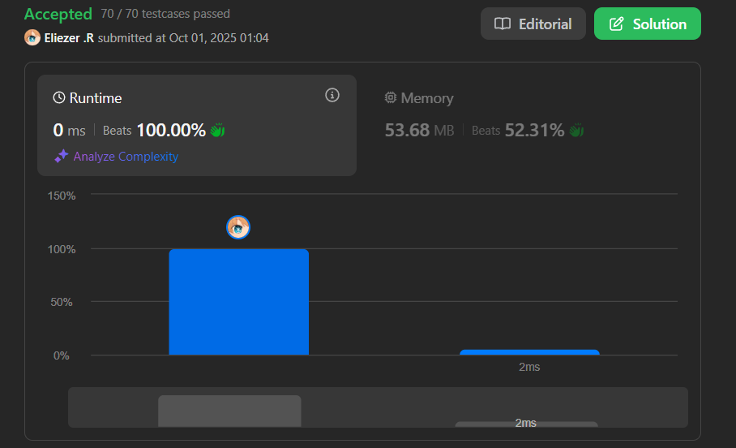

# 1518. Water Bottles

Tienes `numBottles` botellas de agua llenas. Puedes intercambiar `numExchange` botellas vacías por una botella llena de agua.

La operación de beber una botella llena de agua la convierte en una botella vacía.

Dados los dos enteros `numBottles` y `numExchange`, retorna el **número máximo** de botellas de agua que puedes beber.

**Dificultad:** Easy

---

## 📋 Ejemplos

**Ejemplo 1:**

- Entrada: `numBottles = 9, numExchange = 3`
- Salida: `13`
- Explicación: Puedes intercambiar 3 botellas vacías para obtener 1 botella llena de agua.
  - Número de botellas que puedes beber: `9 + 3 + 1 = 13`.

**Ejemplo 2:**

- Entrada: `numBottles = 15, numExchange = 4`
- Salida: `19`
- Explicación: Puedes intercambiar 4 botellas vacías para obtener 1 botella llena.
  - Número de botellas que puedes beber: `15 + 3 + 1 = 19`.

---

## 💭 Enfoque y Estrategia

- **Objetivo**: Calcular el total de botellas que puedes beber considerando los intercambios.
- **Insight clave matemático**: Existe una fórmula directa que evita simular los intercambios.
- **Fórmula**: `totalDrunk = numBottles + floor((numBottles - 1) / (numExchange - 1))`
- **Ventaja**: Solución O(1) en lugar de O(log n) con simulación.

La estrategia aprovecha una observación matemática: cada botella adicional que obtienes por intercambio requiere `numExchange - 1` botellas vacías (porque 1 botella vacía se convierte en llena).

---

## 🔧 Implementación

```js
const numWaterBottles = function(numBottles, numExchange) {
    // Fórmula matemática directa
    return numBottles + Math.floor((numBottles - 1) / (numExchange - 1))
}

console.log(numWaterBottles(9, 3)) // 13

/**
 * Explicación de la fórmula:
 * 
 * totalDrunk = iniciales + extras por intercambio
 * 
 * extras = floor((numBottles - 1) / (numExchange - 1))
 * 
 * ¿Por qué (numExchange - 1)?
 * - Para obtener 1 botella extra, necesitas numExchange vacías
 * - Pero esa botella extra también se volverá vacía
 * - Entonces el "costo neto" es numExchange - 1
 * 
 * Ejemplo con numBottles = 9, numExchange = 3:
 * 
 * Método tradicional (simulación):
 * Inicial: 9 llenas → bebes 9 → 9 vacías
 * Round 1: 9/3 = 3 intercambios → 3 llenas, 0 vacías sobrantes
 *          bebes 3 → 3 vacías
 * Round 2: 3/3 = 1 intercambio → 1 llena, 0 vacías
 *          bebes 1 → 1 vacía
 * Round 3: 1 < 3, no más intercambios
 * Total: 9 + 3 + 1 = 13
 * 
 * Con fórmula:
 * 9 + floor((9-1) / (3-1))
 * = 9 + floor(8 / 2)
 * = 9 + floor(4)
 * = 9 + 4
 * = 13 ✓
 */
```

---

## 📊 Análisis de Rendimiento

- **Complejidad temporal**: O(1), cálculo matemático directo.
- **Complejidad espacial**: O(1), solo variables auxiliares.


*Mucho más eficiente que el enfoque de simulación O(log n).*

---

## 🧮 Derivación de la Fórmula

**¿De dónde viene la fórmula?**

Observación clave: Cada botella extra que obtenemos "cuesta" `numExchange - 1` botellas vacías netas.

```
Sea x = número de botellas extras por intercambio

Después de beber numBottles iniciales, tenemos numBottles vacías.
Para cada intercambio:
- Usamos numExchange vacías
- Obtenemos 1 llena
- Al beberla, obtenemos 1 vacía de vuelta
- Costo neto: numExchange - 1 vacías

Por tanto:
x * (numExchange - 1) ≤ numBottles
x ≤ numBottles / (numExchange - 1)

Pero necesitamos considerar que la última botella no genera más intercambios:
x = floor((numBottles - 1) / (numExchange - 1))

Total = numBottles + x
```

---

## 🔄 Enfoque Alternativo (Simulación)

```js
const numWaterBottlesSimulation = function(numBottles, numExchange) {
    let total = numBottles     // Total bebido
    let empty = numBottles     // Botellas vacías actuales
    
    // Mientras podamos hacer intercambios
    while (empty >= numExchange) {
        const newBottles = Math.floor(empty / numExchange)  // Nuevas botellas llenas
        total += newBottles           // Las bebemos
        empty = empty % numExchange + newBottles  // Vacías restantes + nuevas vacías
    }
    
    return total
}

// O(log n) tiempo - menos eficiente que la fórmula
```

**Comparación de enfoques:**
```
numBottles = 15, numExchange = 4

Simulación:
- Bebidas: 15, vacías: 15
- Intercambio: 15/4 = 3 nuevas, vacías: 15%4 + 3 = 6
- Bebidas: 18, vacías: 6
- Intercambio: 6/4 = 1 nueva, vacías: 6%4 + 1 = 3  
- Bebidas: 19, vacías: 3
- 3 < 4, terminar
Total: 19

Fórmula:
15 + floor((15-1)/(4-1)) = 15 + floor(14/3) = 15 + 4 = 19 ✓
```

---

## 🎯 Aprendizajes Clave

- **Optimización matemática**: A veces una fórmula directa es mejor que simulación.
- **Análisis de patrones**: Observar el "costo neto" de cada operación.
- **Floor division**: Crucial para manejar intercambios parciales.
- **Edge case handling**: El `-1` en la fórmula maneja el caso final correctamente.
- **Complejidad**: O(1) vs O(log n) es una mejora significativa.

---

## 🔍 Casos Edge

- **No hay intercambios posibles**: `numBottles = 2, numExchange = 3` → `2`
- **Un solo intercambio**: `numBottles = 3, numExchange = 3` → `4`
- **Muchos intercambios**: `numBottles = 100, numExchange = 3` → La fórmula maneja eficientemente
- **numExchange = 2**: Caso extremo donde casi todas las botellas pueden intercambiarse

---

## 🧮 Verificación Manual

```
Caso 1: numBottles = 9, numExchange = 3
Fórmula: 9 + floor(8/2) = 9 + 4 = 13

Verificación:
Inicial: 9 bebidas
9 vacías → 3 llenas → 3 bebidas (total: 12)
3 vacías → 1 llena → 1 bebida (total: 13)
1 vacía → no alcanza para intercambio
✓ Correcto

---

Caso 2: numBottles = 15, numExchange = 4  
Fórmula: 15 + floor(14/3) = 15 + 4 = 19

Verificación:
Inicial: 15 bebidas
15 vacías → 3 llenas, 3 sobrantes → 3 bebidas (total: 18, 6 vacías)
6 vacías → 1 llena, 2 sobrantes → 1 bebida (total: 19, 3 vacías)
3 vacías → no alcanza
✓ Correcto
```

---

## 🏷️ Tags

`Math` `Simulation` `Easy`

---

**Tiempo invertido**: 15 minutos  
**Intentos**: 1  
**Dificultad percibida**: Easy