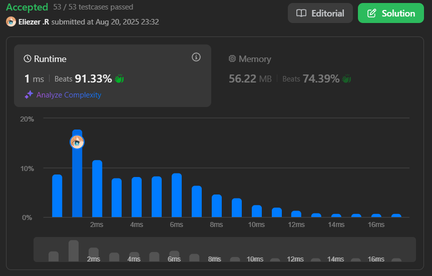

# 169. Majority Element

Dado un array de enteros `nums`, encuentra el elemento mayoritario, es decir, el que aparece más de ⌊n / 2⌋ veces.

Debes implementar una solución con complejidad temporal O(n) y espacio O(1).

---

## 📋 Ejemplos

**Ejemplo 1:**

- Entrada: `nums = [3,2,3]`
- Salida: `3`

**Ejemplo 2:**

- Entrada: `nums = [2,2,1,1,1,2,2]`
- Salida: `2`

---

## 💭 Enfoque y Estrategia

- **Objetivo**: Encontrar el elemento que aparece más de la mitad de las veces en el array.
- **Restricción**: Complejidad O(n) y espacio O(1).
- **Salida**: El elemento mayoritario.

La estrategia óptima es usar el algoritmo de Boyer-Moore Voting, que mantiene un candidato y un contador. Si el contador llega a cero, cambiamos de candidato. Al final, el candidato es el mayoritario.

---

## 🔧 Implementación

```js
const majorityElement = function (nums) {
  let count = 0 // Contador para el algoritmo de Boyer-Moore
  let candidate = null // Candidato actual a elemento mayoritario

  // Recorremos el array
  for (let i = 0; i < nums.length; i++) {
    // Si el contador es 0, cambiamos el candidato al elemento actual
    if (count === 0) {
      candidate = nums[i]
    }
    // Si el elemento actual es igual al candidato, incrementamos el contador
    if (nums[i] === candidate) {
      count++
    } else {
      // Si no es igual, decrementamos el contador
      count--
    }
  }

  // Al final, candidate es el elemento mayoritario
  return candidate
}

console.log(majorityElement([3, 2, 3])) // 3

/**
 * Ejemplo paso a paso con nums = [3,2,3]:
 * i=0: nums[0]=3, count=0 → candidate=3, count=1
 * i=1: nums[1]=2, candidate=3 ≠ 2 → count=0
 * i=2: nums[2]=3, count=0 → candidate=3, count=1
 * Resultado final: candidate=3
 *
 * Así, el elemento mayoritario es 3.
 */
```

---

## 📊 Análisis de Rendimiento

- **Complejidad temporal**: O(n), donde n es la longitud del array.
- **Complejidad espacial**: O(1), solo se usan variables auxiliares.



---

## 🎯 Aprendizajes Clave

- El algoritmo de Boyer-Moore permite encontrar el elemento mayoritario en una sola pasada y sin espacio extra.
- Es importante reiniciar el candidato cuando el contador llega a cero.
- Este patrón es útil para problemas de mayoría o frecuencia dominante.

---

## 🏷️ Tags

`Array` `Hash Table` `Divide and Conquer` `Bit Manipulation` `Easy`

---

**Tiempo invertido**: 20 minutos  
**Intentos**: 2 
**Dificultad percibida**: Fácil