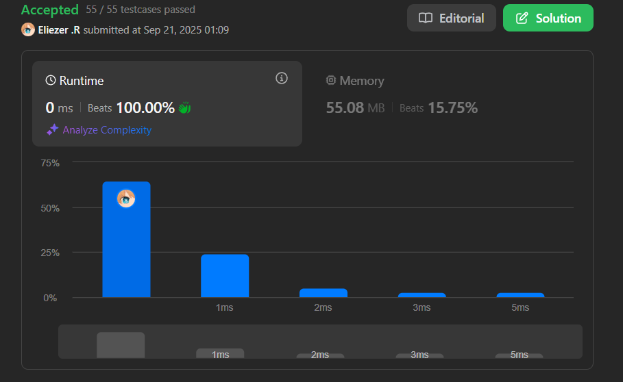

# 1700. Number of Students Unable to Eat Lunch

La cafetería de la escuela ofrece sándwiches circulares y cuadrados en el descanso del almuerzo, referidos por los números `0` y `1` respectivamente. Todos los estudiantes están en una cola. Cada estudiante prefiere sándwiches cuadrados o circulares.

El número de sándwiches en la cafetería es igual al número de estudiantes. Los sándwiches se colocan en una pila. En cada paso:

- Si el estudiante al frente de la cola prefiere el sándwich en la parte superior de la pila, lo tomará y saldrá de la cola.
- De lo contrario, lo dejará e irá al final de la cola.

Esto continúa hasta que ninguno de los estudiantes en la cola quiera tomar el sándwich superior y por lo tanto no puedan comer.

Dados dos arrays de enteros `students` y `sandwiches`, retorna el número de estudiantes que no pueden comer.

**Dificultad:** Easy

---

## 📋 Ejemplos

**Ejemplo 1:**

- Entrada: `students = [1,1,0,0], sandwiches = [0,1,0,1]`
- Salida: `0`
- Explicación: Todos los estudiantes logran comer siguiendo el proceso de rotación.

**Ejemplo 2:**

- Entrada: `students = [1,1,1,0,0,1], sandwiches = [1,0,0,0,1,1]`
- Salida: `3`
- Explicación: Algunos estudiantes no pueden obtener el tipo de sándwich que prefieren.

---

## 💭 Enfoque y Estrategia

- **Insight clave**: No necesitamos simular la cola. Solo importa cuántos estudiantes quieren cada tipo de sándwich.
- **Observación crítica**: Si un sándwich requiere estudiantes que ya no quedan, todos los restantes no podrán comer.
- **Técnica**: Contar preferencias + procesar pila de sándwiches secuencialmente.
- **Optimización**: O(n) tiempo sin simular el proceso completo de cola.

La estrategia evita la simulación costosa contando cuántos estudiantes prefieren cada tipo, luego procesando la pila para ver cuándo se agotan las preferencias.

---

## 🔧 Implementación

```js
const countStudents = function (students, sandwiches) {
    let n = students.length
    let count0 = 0  // Estudiantes que prefieren sándwich tipo 0 (circular)
    let count1 = 0  // Estudiantes que prefieren sándwich tipo 1 (cuadrado)
    
    // Paso 1: Contar preferencias de los estudiantes
    for (let i = 0; i < n; i++) {
        if (students[i] === 1) {
            count1++
        } else {
            count0++
        }
    }

    // Paso 2: Procesar pila de sándwiches secuencialmente
    for (let j = 0; j < sandwiches.length; j++) {
        if (sandwiches[j] === 1) {
            // Sándwich cuadrado en la parte superior
            if (count1 > 0) {
                count1--  // Un estudiante toma el sándwich y se va
            } else {
                return count0  // No hay más estudiantes que quieran tipo 1
            }
        } else {
            // Sándwich circular en la parte superior  
            if (count0 > 0) {
                count0--  // Un estudiante toma el sándwich y se va
            } else {
                return count1  // No hay más estudiantes que quieran tipo 0
            }
        }
    }

    return 0  // Todos los estudiantes pudieron comer
}

console.log(countStudents([1,1,1,0,0,1], [1,0,0,0,1,1])) // 3

/**
 * Ejemplo paso a paso con students = [1,1,1,0,0,1], sandwiches = [1,0,0,0,1,1]:
 * 
 * 1. Conteo inicial:
 *    count0 = 2 (estudiantes que prefieren circular)
 *    count1 = 4 (estudiantes que prefieren cuadrado)
 * 
 * 2. Procesando pila de sándwiches:
 *    j=0: sandwiches[0]=1, count1>0 → count1=3
 *    j=1: sandwiches[1]=0, count0>0 → count0=1  
 *    j=2: sandwiches[2]=0, count0>0 → count0=0
 *    j=3: sandwiches[3]=0, count0=0 → return count1=3
 * 
 * Resultado: 3 estudiantes no pueden comer
 */
```

---

## 📊 Análisis de Rendimiento

- **Complejidad temporal**: O(n), donde n es el número de estudiantes/sándwiches.
- **Complejidad espacial**: O(1), solo usamos variables de conteo.


*Mucho más eficiente que simular todo el proceso de cola que sería O(n²) en el peor caso.*

---

## 🔄 Enfoque Naive (Simulación Completa)

```js
// Simulación directa - menos eficiente
const countStudentsSimulation = function(students, sandwiches) {
    const studentQueue = [...students]
    const sandwichStack = [...sandwiches]
    
    while (studentQueue.length > 0 && sandwichStack.length > 0) {
        let rotations = 0
        let initialLength = studentQueue.length
        
        while (rotations < initialLength) {
            if (studentQueue[0] === sandwichStack[0]) {
                studentQueue.shift()
                sandwichStack.shift()
                break
            } else {
                studentQueue.push(studentQueue.shift())
                rotations++
            }
        }
        
        if (rotations === initialLength) {
            break // Ningún estudiante quiere el sándwich actual
        }
    }
    
    return studentQueue.length
}
```

---

## 🎯 Aprendizajes Clave

- **Abstracción del problema**: No siempre es necesario simular el proceso completo.
- **Conteo vs simulación**: Contar elementos es más eficiente que manejar estructuras.
- **Condición de parada**: Identificar cuándo es imposible continuar.
- **Optimización algorítmica**: Reducir O(n²) a O(n) con mejor análisis del problema.
- **Invariantes**: El orden de procesamiento de sándwiches importa, pero no el de estudiantes.

---

## 🔍 Casos Edge

- Todos pueden comer: `students=[1,0], sandwiches=[1,0]` → `0`
- Nadie puede comer: `students=[1,1], sandwiches=[0,0]` → `2`
- Un solo estudiante: `students=[1], sandwiches=[1]` → `0`
- Preferencias balanceadas: Cuando hay exacta coincidencia de tipos

---

## 🧠 Intuición del Problema

El problema simula una cola real, pero la clave es darse cuenta de que:
1. Los estudiantes eventualmente rotan hasta que encuentran su sándwich preferido
2. Si un sándwich no tiene estudiantes que lo quieran, el proceso se detiene
3. Solo importa la **cantidad** de cada preferencia, no el **orden** de los estudiantes

---

## 🏷️ Tags

`Array` `Stack` `Queue` `Simulation` `Easy`

---

**Tiempo invertido**: 18 minutos  
**Intentos**: 2  
**Dificultad percibida**: Easy-Medium