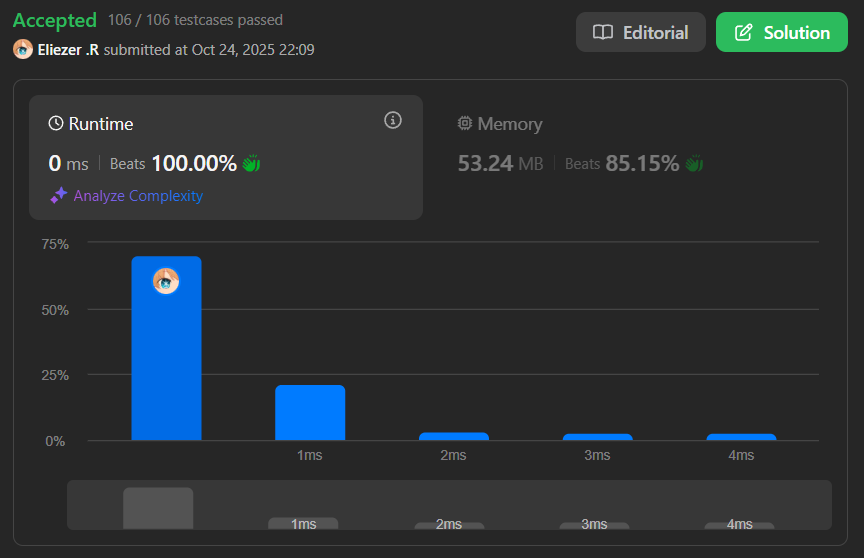

# 1716. Calculate Money in Leetcode Bank

## 🧠 Descripción

Hercy quiere ahorrar dinero para su primer auto. Pone dinero en el banco de Leetcode todos los días.

Comienza poniendo `$1` el lunes, el primer día. Cada día de martes a domingo, pondrá `$1` más que el día anterior. En cada lunes subsiguiente, pondrá `$1` más que el lunes anterior.

Dado `n`, retorna la cantidad total de dinero que tendrá en el banco de Leetcode al final del día `n`.

---

## 📋 Ejemplos

### Ejemplo 1:

* **Entrada**: `n = 4`
* **Salida**: `10`
* **Explicación**: Después del día 4, el total es 1 + 2 + 3 + 4 = 10.

### Ejemplo 2:

* **Entrada**: `n = 10`
* **Salida**: `37`
* **Explicación**: Después del día 10, el total es (1 + 2 + 3 + 4 + 5 + 6 + 7) + (2 + 3 + 4) = 37.
  * Nota que en el segundo lunes, Hercy solo pone $2.

### Ejemplo 3:

* **Entrada**: `n = 20`
* **Salida**: `96`
* **Explicación**: Después del día 20, el total es (1 + 2 + 3 + 4 + 5 + 6 + 7) + (2 + 3 + 4 + 5 + 6 + 7 + 8) + (3 + 4 + 5 + 6 + 7 + 8) = 96.

---

## 💭 Estrategia y Enfoque

Este problema tiene un **patrón matemático** que podemos aprovechar:

### 📊 Patrón observado:
```
Semana 1: 1  2  3  4  5  6  7  = 28
Semana 2: 2  3  4  5  6  7  8  = 35
Semana 3: 3  4  5  6  7  8  9  = 42
...
```

Cada semana completa suma: `28 + 7k`, donde `k` es el número de la semana (empezando desde 0).

### 🧩 Fórmula matemática:

1. **Calcular semanas completas**: `weeks = floor(n / 7)`
2. **Días sobrantes**: `extraDays = n % 7`
3. **Total de semanas completas**:
   - Primera semana: 28
   - Cada semana adicional suma 7 más
   - Fórmula: `28 × weeks + 7 × (weeks × (weeks - 1)) / 2`
4. **Total de días extras**:
   - Es una suma aritmética empezando desde `(weeks + 1)`
   - Fórmula: `((1 + extraDays) × extraDays) / 2 + extraDays × weeks`

---

## 💻 Implementación en JavaScript

```js
var totalMoney = function(n) {
    // Calculamos cuántas semanas completas hay
    const weeks = Math.floor(n / 7)
    
    // Calculamos cuántos días extra quedan después de las semanas completas
    const extraDays = n % 7
    
    // Calculamos el total de las semanas completas
    // 28 es la suma de la primera semana (1+2+3+4+5+6+7)
    // Cada semana adicional suma 7 más que la anterior
    // La fórmula 7 * (weeks * (weeks - 1)) / 2 es la suma aritmética del incremento
    let totalWeeks = 28 * weeks + (7 * (weeks * (weeks - 1))) / 2
    
    // Calculamos el total de los días extra
    // ((1 + extraDays) * extraDays) / 2 es la suma de 1 + 2 + ... + extraDays
    // extraDays * weeks suma el offset de la semana actual
    let totalDays = ((1 + extraDays) * extraDays) / 2 + extraDays * weeks

    // Retornamos la suma total
    return totalWeeks + totalDays
}

console.log(totalMoney(4))   // 10
console.log(totalMoney(10))  // 37
console.log(totalMoney(20))  // 96
```

### 📝 Ejemplo paso a paso con `n = 10`:

```
n = 10 días

weeks = Math.floor(10 / 7) = 1 semana completa
extraDays = 10 % 7 = 3 días extra

Semana 1 completa:
  Día 1: $1
  Día 2: $2
  Día 3: $3
  Día 4: $4
  Día 5: $5
  Día 6: $6
  Día 7: $7
  Total semana 1: 28

totalWeeks = 28 × 1 + (7 × (1 × 0)) / 2
           = 28 + 0
           = 28

Días extra (Semana 2, días 1-3):
  Día 8 (lunes semana 2): $2
  Día 9 (martes semana 2): $3
  Día 10 (miércoles semana 2): $4
  Total días extra: 2 + 3 + 4 = 9

totalDays = ((1 + 3) × 3) / 2 + 3 × 1
          = (4 × 3) / 2 + 3
          = 6 + 3
          = 9

Resultado: 28 + 9 = 37
```

### 📝 Ejemplo detallado con `n = 20`:

```
n = 20 días

weeks = Math.floor(20 / 7) = 2 semanas completas
extraDays = 20 % 7 = 6 días extra

Semana 1: 1+2+3+4+5+6+7 = 28
Semana 2: 2+3+4+5+6+7+8 = 35
Total semanas: 63

totalWeeks = 28 × 2 + (7 × (2 × 1)) / 2
           = 56 + 7
           = 63

Días extra (Semana 3, días 1-6):
  Día 15: $3
  Día 16: $4
  Día 17: $5
  Día 18: $6
  Día 19: $7
  Día 20: $8
  Total: 3+4+5+6+7+8 = 33

totalDays = ((1 + 6) × 6) / 2 + 6 × 2
          = (7 × 6) / 2 + 12
          = 21 + 12
          = 33

Resultado: 63 + 33 = 96
```

---

## 📊 Análisis de Rendimiento

* **Complejidad temporal**: O(1), solo operaciones matemáticas constantes.
* **Complejidad espacial**: O(1), solo variables auxiliares.


---

## 🎯 Aprendizajes Clave

* **Reconocer patrones matemáticos** en lugar de simular día por día.
* **Suma aritmética**: `1 + 2 + ... + n = n × (n + 1) / 2`
* **Dividir el problema**: Semanas completas + días extra.
* **Optimización O(1) vs O(n)**: Fórmula matemática vs loop.
* **Incremento semanal**: Cada lunes suma 1 más que el lunes anterior.

---

## 🔄 Enfoque Alternativo (Simulación)

```js
// Enfoque más intuitivo pero menos eficiente O(n)
var totalMoneySimulation = function(n) {
    let total = 0
    let mondayValue = 1
    
    for (let day = 1; day <= n; day++) {
        let dayOfWeek = (day - 1) % 7
        total += mondayValue + dayOfWeek
        
        if (dayOfWeek === 6) { // Es domingo, próximo es lunes
            mondayValue++
        }
    }
    
    return total
}
```

---

## 🏷️ Etiquetas

`Math` `Simulation` `Easy`