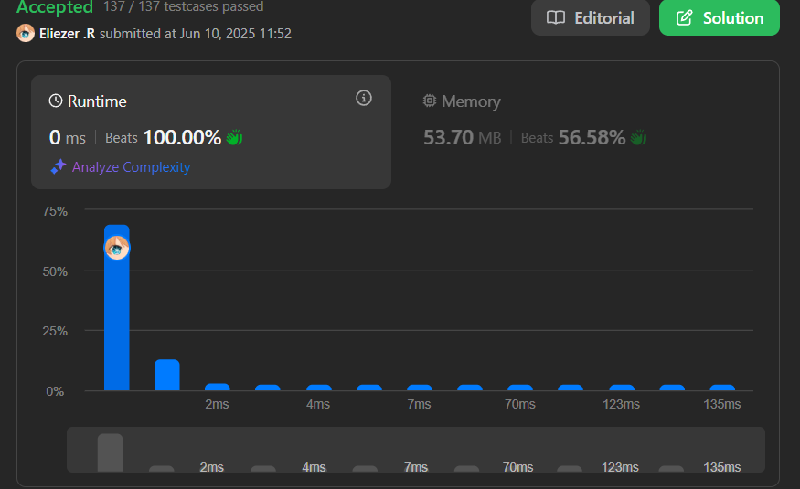

# 1790. Check if One String Swap Can Make Strings Equal

Dadas dos cadenas `s1` y `s2` de la misma longitud, determina si es posible hacer que sean iguales intercambiando exactamente dos caracteres en `s1` **una sola vez** (o ninguna si ya son iguales).

---

## 📋 Ejemplos

**Ejemplo 1:**

- Entrada: `s1 = "bank"`, `s2 = "kanb"`
- Salida: `true`
- Explicación: Intercambiando el primer y último carácter de `s1` obtenemos `"kanb"`.

**Ejemplo 2:**

- Entrada: `s1 = "attack"`, `s2 = "defend"`
- Salida: `false`
- Explicación: No hay forma de igualar las cadenas con un solo swap.

**Ejemplo 3:**

- Entrada: `s1 = "kelb"`, `s2 = "kelb"`
- Salida: `true`
- Explicación: Las cadenas ya son iguales.

**Ejemplo 4:**

- Entrada: `s1 = "abcd"`, `s2 = "dcba"`
- Salida: `false`
- Explicación: Se requieren más de un swap.

---

## 💭 Enfoque y Estrategia

### Análisis del problema

- **Objetivo**: Verificar si se puede igualar `s1` a `s2` con un solo swap de dos caracteres (o ninguno si ya son iguales).
- **Restricción**: Solo un swap permitido.
- **Salida**: `true` si es posible, `false` en caso contrario.

---

## 🔧 Implementación

```js
const areAlmostEqual = function (s1, s2) {
  if (s1 === s2) return true // Comprobamos que sean iguales al principio para evitar iteraciones innecesarias

  const subArr = [] // Creamos un subArra para almacenar indices

  for (let i = 0; i < s1.length; i++) { // Iteramos
    if (s1[i] !== s2[i]) subArr.push(i) // Si no son iguales almacenamos ese indice

    if (subArr.length > 2) return false // Si subArr es mayor a 2 quiere decir que hay mas casos lo cual no cumple
  }

  return subArr.length === 2 && // Comprobamos que subArr es 2 (opcional)
      s1[subArr[0]] === s2[subArr[1]] && // Aqui le decimos que si el primer indice de s1 es igual al ultimo indice de s2
      s2[subArr[0]] === s1[subArr[1]] // Aqui es lo mismo pero al reves
}

console.log(areAlmostEqual('bank', 'kanb'))
```

---

## 📊 Análisis de Rendimiento

- **Complejidad temporal**: O(n), donde n es la longitud de las cadenas.
- **Complejidad espacial**: O(1), solo se almacenan como máximo dos índices.
 

---

## 🎯 Aprendizajes Clave

- Si las cadenas ya son iguales, no se requiere swap.
- Solo es posible igualar las cadenas si hay exactamente dos posiciones diferentes y los caracteres se pueden intercambiar.
- Si hay más de dos diferencias, no es posible con un solo swap.

---

## 🏷️ Tags

`String` `Array` `Easy` `Simulation`

---

**Tiempo invertido**: 40 minutos  
**Intentos**: 5 
**Dificultad percibida**: Fácil-intermedio