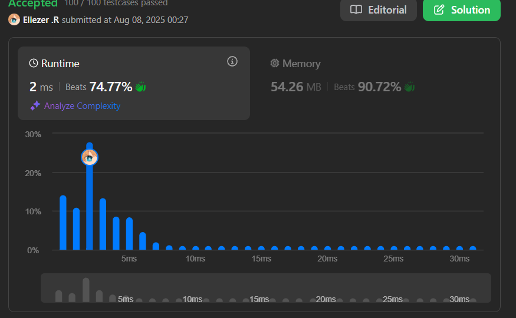

# 20. Valid Parentheses

Dada una cadena `s` que contiene solo los caracteres `'('`, `')'`, `'{'`, `'}'`, `'['`, `']'`, determina si la cadena es válida.

## Una cadena es válida si:

- Los paréntesis abiertos se cierran con el mismo tipo de paréntesis.
- Los paréntesis abiertos se cierran en el orden correcto.
- Cada paréntesis de cierre tiene su correspondiente paréntesis de apertura del mismo tipo.

---

## 📋 Ejemplos

| Entrada   | Salida  |
|-----------|---------|
| `"()"`    | `true`  |
| `"()[]{}"`| `true`  |
| `"(]"`    | `false` |
| `"([])"`  | `true`  |
| `"([)]"`  | `false` |

---

## 💭 Enfoque y Estrategia

**Objetivo:** Comprobar si los paréntesis están balanceados y en el orden correcto.

**Idea:** Usar una pila (stack).

- Cuando veas un paréntesis de apertura, lo empujas a la pila.
- Cuando veas un paréntesis de cierre, sacas el último de la pila y verificas que case (mismo tipo).
- Si en cualquier momento no coincide o intentas sacar de una pila vacía → cadena inválida.
- Al final, la pila debe quedar vacía para que la cadena sea válida.

---

## 🔧 Implementación (tu código)

```js
var isValid = function (s) {
    if (s.length < 2) return false;
    const subArr = [];
    const obj = {
        "(": ")",
        "[": "]",
        "{": "}"
    };

    for (let i = 0; i < s.length; i++) {
        if (obj[s[i]]) {
            subArr.push(s[i]);
        } else {
            const poper = subArr.pop();
            if (obj[poper] !== s[i]) {
                return false;
            }
        }
    }
    return subArr.length === 0;
};
```

---

## 📌 Observaciones sobre el código

- `if (s.length < 2) return false` → devuelve false para cadenas de longitud 0 o 1. En LeetCode las restricciones suelen decir `1 <= s.length`, así que cadenas de longitud 1 deben ser false. Si quieres que `""` (cadena vacía) sea true habría que adaptar esa condición.
- `subArr` actúa como pila (stack) guardando paréntesis de apertura.
- `obj` es un mapa que relaciona apertura → cierre, facilitando la comprobación.

---

## 🔎 Línea por línea — explicación detallada

```js
var isValid = function (s) {
```
Define la función `isValid` que recibe la cadena `s`.

```js
    if (s.length < 2) return false;
```
Si la longitud de `s` es menor que 2, retorna false. Nota: Esto hace que `"("` o `")"` devuelvan false. Si quieres considerar `""` válido habría que eliminar o cambiar esta línea.

```js
    const subArr = [];
```
Declara `subArr` como array vacío. Lo usamos como pila para guardar paréntesis de apertura.

```js
    const obj = {
        "(": ")",
        "[": "]",
        "{": "}"
    };
```
`obj` es un mapa (objeto) que mapea cada paréntesis de apertura a su correspondiente paréntesis de cierre. Facilita la comparación.

```js
    for (let i = 0; i < s.length; i++) {
```
Recorremos la cadena carácter por carácter.

```js
        if (obj[s[i]]) {
            subArr.push(s[i]);
        } else {
```
Si `s[i]` es una clave en `obj` (es decir, es `'('` o `'['` o `'{'`), es un paréntesis de apertura, así que lo empujamos (push) en la pila `subArr`.

Si no está en `obj`, entonces es un paréntesis de cierre (ya que la entrada solo contiene los seis caracteres válidos).

```js
            const poper = subArr.pop();
```
Sacamos el último elemento de la pila (pop).

Importante: si la pila está vacía, `poper` será `undefined` (esto significa que hay un paréntesis de cierre sin apertura previa).

```js
            if (obj[poper] !== s[i]) {
                return false;
            }
```
Comprobamos si el cierre esperado para `poper` (`obj[poper]`) coincide con el carácter actual `s[i]` (el cierre real).

Si no coincide → la cadena es inválida, retornamos false inmediatamente.

```js
        }
    }
```
Fin del else y del for. Seguimos procesando hasta el final de la cadena.

```js
    return subArr.length === 0;
```
Si al final la pila está vacía (`length === 0`) significa que todos los paréntesis de apertura tuvieron su cierre correcto y en orden → retornamos true.

Si quedan elementos en la pila → faltaron cierres → retornamos false.

```js
};
```
Fin de la función.

---

## 🧪 Ejemplos con evolución de la pila (`subArr`)

A continuación muestro paso a paso cómo cambia `subArr` para distintos inputs — esto te ayudará a entender por qué el algoritmo acepta o rechaza cada caso.

### Ejemplo A — `s = "()"` (debe ser `true`)

| i | s[i] | Acción                    | subArr (después) |
|---|-------|--------------------------|------------------|
| 0 | `(`   | es apertura → push `(`    | [`(`]            |
| 1 | `)`   | es cierre → pop `(`; comprobar `obj['('] === ')'` → OK | []               |
| - | -     | fin del for → pila vacía → `true` | []               |

---

### Ejemplo B — `s = "()[]{}"` (debe ser `true`)

| i | s[i] | Acción                    | subArr           |
|---|-------|--------------------------|------------------|
| 0 | `(`   | push `(`                 | [`(`]            |
| 1 | `)`   | pop `(` → coincide       | []               |
| 2 | `[`   | push `[`                 | [`[`]            |
| 3 | `]`   | pop `[` → coincide       | []               |
| 4 | `{`   | push `{`                 | [`{`]            |
| 5 | `}`   | pop `{` → coincide       | []               |
| - | -     | fin → pila vacía → `true` | []               |

---

### Ejemplo C — `s = "(]"` (debe ser `false`)

| i | s[i] | Acción                            | subArr           |
|---|-------|----------------------------------|------------------|
| 0 | `(`   | push `(`                         | [`(`]            |
| 1 | `]`   | cierre → pop → `poper = '('`; `obj['('] === ')'` pero `s[i] === ']'` → no coincide → `return false` | []               |

El código devuelve `false` en la comprobación `if (obj[poper] !== s[i])`.

---

### Ejemplo D — `s = "([])"` (debe ser `true`)

| i | s[i] | Acción                    | subArr           |
|---|-------|--------------------------|------------------|
| 0 | `(`   | push `(`                 | [`(`]            |
| 1 | `[`   | push `[`                 | [`(`, `[`]       |
| 2 | `]`   | pop `[` → coincide       | [`(`]            |
| 3 | `)`   | pop `(` → coincide       | []               |
| - | -     | fin → pila vacía → `true` | []               |

---

### Ejemplo E — `s = "([)]"` (debe ser `false`)

| i | s[i] | Acción                            | subArr           |
|---|-------|----------------------------------|------------------|
| 0 | `(`   | push `(`                         | [`(`]            |
| 1 | `[`   | push `[`                         | [`(`, `[`]       |
| 2 | `)`   | cierre → pop → `poper = '['`; `obj['['] === ']'` pero `s[i] === ')'` → no coincide → `return false` | [`(`]            |

Falla en la comprobación porque se cierra `)` pero el último abierto fue `[`.

---

## 📊 Análisis de Rendimiento

- Complejidad temporal: O(n) — recorremos la cadena una vez, donde n es `s.length`.
- Complejidad espacial: O(n) en el peor caso (si todos los caracteres son paréntesis de apertura, se almacenan en la pila). En promedio depende del balance de apertura/cierre.
 


---

## 🎯 Aprendizajes Clave

- El uso de una pila es la estrategia natural y eficiente para problemas de balanceo de paréntesis.
- Mantener un mapa apertura→cierre (`obj`) simplifica la comparación.
- Hay que manejar bordes: paréntesis de cierre sin apertura previa (pop sobre pila vacía) y restos en la pila al final.
- Presta atención a los detalles: la condición `s.length < 2` puede estar bien según la especificación, pero si se permite cadena vacía, debe cambiarse.

---

## 🏷️ Tags

String | Stack | Easy | Parentheses

---

## ⏱️ Tiempo invertido

30m

---

## 🔄 Intentos

2

---

## 💡 Dificultad percibida

Fácil