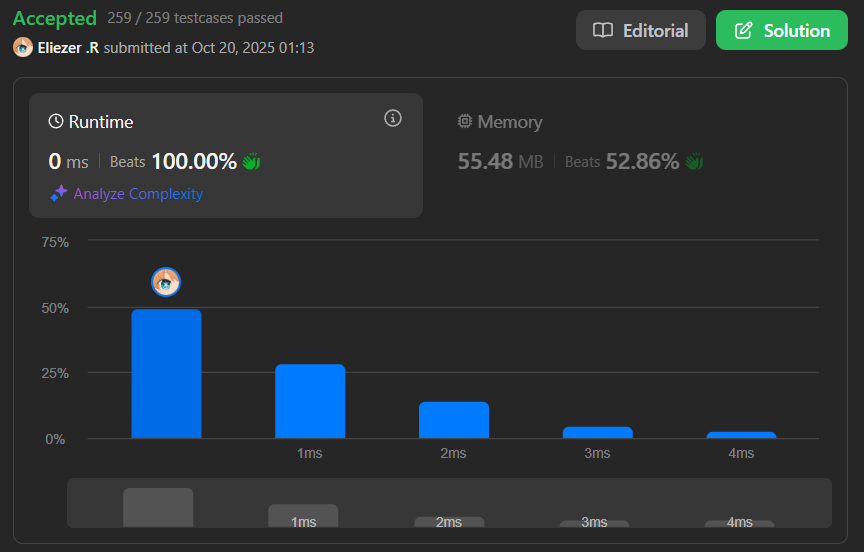

# 2011. Final Value of Variable After Performing Operations

Hay un lenguaje de programación con solo cuatro operaciones y una variable `X`:
- `++X` y `X++` incrementan el valor de la variable `X` en 1.
- `--X` y `X--` decrementan el valor de la variable `X` en 1.

Inicialmente, el valor de `X` es 0. Se te da un array de strings `operations` que contiene una lista de operaciones. Retorna el valor final de `X` después de realizar todas las operaciones.

**Dificultad:** Easy

---

## 📋 Ejemplos

**Ejemplo 1:**

- Entrada: `operations = ["--X","X++","X++"]`
- Salida: `1`
- Explicación:
```
Inicialmente, X = 0
--X: X = 0 - 1 = -1
X++: X = -1 + 1 = 0
X++: X = 0 + 1 = 1
```

**Ejemplo 2:**

- Entrada: `operations = ["++X","++X","X++"]`
- Salida: `3`
- Explicación:
```
Inicialmente, X = 0
++X: X = 0 + 1 = 1
++X: X = 1 + 1 = 2
X++: X = 2 + 1 = 3
```

**Ejemplo 3:**

- Entrada: `operations = ["X++","++X","--X","X--"]`
- Salida: `0`

---

## 💭 Enfoque y Estrategia

- **Objetivo**: Calcular el valor final de X después de aplicar todas las operaciones.
- **Observación clave**: No importa si el operador está antes o después de X, el resultado es el mismo (incremento o decremento).
- **Simplificación**: Solo necesitamos verificar si la operación contiene `++` o `--`.
- **Técnica**: Iterar por el array y sumar/restar según corresponda.

---

## 🔧 Implementación

```js
var finalValueAfterOperations = function (operations) {
    let x = 0

    for (let i = 0; i < operations.length; i++) {
        if (operations[i] === "--X" || operations[i] === "X--") {
            x--
        } else {
            x++
        }
    }

    return x
}

console.log(finalValueAfterOperations(["--X","X++","X++"])) // 1
console.log(finalValueAfterOperations(["++X","++X","X++"])) // 3
console.log(finalValueAfterOperations(["X++","++X","--X","X--"])) // 0

/**
 * Explicación del proceso:
 * - Cada operación incrementa o decrementa X en 1
 * - "--X" y "X--" decrementan → x--
 * - "++X" y "X++" incrementan → x++
 * - Simplemente contamos la diferencia neta
 */
```

---

## 📊 Análisis de Rendimiento

- **Complejidad temporal**: O(n), donde n es la longitud del array operations.
  - Recorremos el array una vez
- **Complejidad espacial**: O(1), solo usamos una variable adicional.
 
---

## 🔄 Optimización Adicional

**Enfoque más elegante:**
```js
var finalValueAfterOperations = function(operations) {
    return operations.reduce((x, op) => x + (op[1] === '+' ? 1 : -1), 0)
}
// Aprovecha que el segundo carácter siempre indica la operación
```

---

## 🎯 Aprendizajes Clave

- **Pattern matching**: Identificar que múltiples operaciones tienen el mismo efecto.
- **Simplificación**: El orden del operador no afecta el resultado.
- **String checking**: Comparar strings completos vs verificar caracteres específicos.

---

## 🏷️ Tags

`Array` `String` `Simulation` `Easy`

---
 
**Tiempo invertido**: 1 minuto 
**Intentos**: 1
**Dificultad percibida**: Fácil

---
