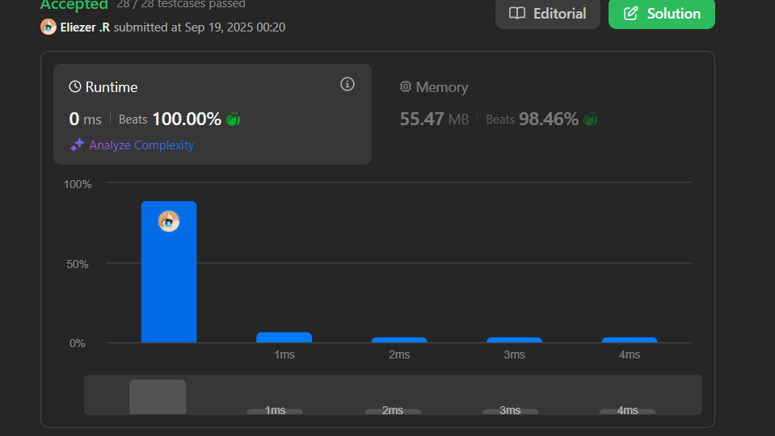

# 206. Reverse Linked List

Dado el `head` de una lista enlazada simple, invierte la lista y retorna la lista invertida.

**Dificultad:** Easy

**Follow up:** Una lista enlazada puede ser invertida iterativamente o recursivamente. ¿Podrías implementar ambas?

---

## 📋 Ejemplos

**Ejemplo 1:**

- Entrada: `head = [1,2,3,4,5]`
- Salida: `[5,4,3,2,1]`

**Ejemplo 2:**

- Entrada: `head = [1,2]`
- Salida: `[2,1]`

**Ejemplo 3:**

- Entrada: `head = []`
- Salida: `[]`

---

## 💭 Enfoque y Estrategia

- **Objetivo**: Invertir las conexiones entre nodos para cambiar la dirección de la lista.
- **Insight clave**: Necesitamos invertir cada enlace `next` manteniendo referencia al nodo anterior.
- **Técnica**: Tres punteros (prev, current, next) para manejar la inversión paso a paso.
- **Reto**: No perder referencias mientras modificamos los enlaces.

La estrategia utiliza tres punteros para mantener control total sobre la inversión: uno para el nodo anterior, uno para el actual, y uno para el siguiente (para no perderlo).

---

## 🔧 Implementación

```js
const reverseList = function (head) {
    let prev = null      // Puntero al nodo anterior (inicialmente null)
    let current = head   // Puntero al nodo actual (empieza en head)

    // Iterar hasta procesar todos los nodos
    while (current !== null) {
        let next = current.next  // Guardar referencia al siguiente nodo
        current.next = prev      // Invertir el enlace: apuntar al anterior
        prev = current           // Mover prev al nodo actual  
        current = next           // Mover current al siguiente nodo
    }

    return prev  // prev ahora apunta al nuevo head (último nodo original)
}

/**
 * Ejemplo paso a paso con head = [1,2,3,4,5]:
 * 
 * Estado inicial:
 * prev = null, current = 1→2→3→4→5→null
 * 
 * Iteración 1:
 * next = 2→3→4→5→null
 * current.next = null → 1→null
 * prev = 1→null, current = 2→3→4→5→null
 * 
 * Iteración 2: 
 * next = 3→4→5→null
 * current.next = 1→null → 2→1→null
 * prev = 2→1→null, current = 3→4→5→null
 * 
 * Iteración 3:
 * next = 4→5→null  
 * current.next = 2→1→null → 3→2→1→null
 * prev = 3→2→1→null, current = 4→5→null
 * 
 * Iteración 4:
 * next = 5→null
 * current.next = 3→2→1→null → 4→3→2→1→null  
 * prev = 4→3→2→1→null, current = 5→null
 * 
 * Iteración 5:
 * next = null
 * current.next = 4→3→2→1→null → 5→4→3→2→1→null
 * prev = 5→4→3→2→1→null, current = null
 * 
 * Resultado: prev = 5→4→3→2→1→null
 */
```

---

## 📊 Análisis de Rendimiento

- **Complejidad temporal**: O(n), donde n es el número de nodos en la lista.
- **Complejidad espacial**: O(1), solo usamos punteros auxiliares.


*Solución óptima en espacio constante con una sola pasada.*

---

## 🔄 Implementación Recursiva

```js
const reverseListRecursive = function(head) {
    // Caso base: lista vacía o un solo nodo
    if (!head || !head.next) {
        return head
    }
    
    // Recursivamente invertir el resto de la lista
    const newHead = reverseListRecursive(head.next)
    
    // Invertir el enlace actual
    head.next.next = head
    head.next = null
    
    return newHead
}

/**
 * Ejemplo recursivo con [1,2,3]:
 * 
 * reverseList(1→2→3→null)
 * ├─ reverseList(2→3→null)  
 * │  ├─ reverseList(3→null) → return 3
 * │  ├─ 2.next.next = 2 → 3→2
 * │  ├─ 2.next = null → 3→2→null
 * │  └─ return 3→2→null
 * ├─ 1.next.next = 1 → 3→2→1  
 * ├─ 1.next = null → 3→2→1→null
 * └─ return 3→2→1→null
 */
```

---

## 🎯 Comparación de Enfoques

| Enfoque | Tiempo | Espacio | Ventajas | Desventajas |
|---------|---------|---------|----------|-------------|
| Iterativo | O(n) | O(1) | Eficiente en espacio, fácil de entender | Más código |
| Recursivo | O(n) | O(n) | Elegante, menos variables | Stack overflow risk |

---

## 🔧 Visualización del Proceso Iterativo

```
Original: 1 → 2 → 3 → 4 → 5 → null

Paso 0: prev=null, curr=1, next=2
        null  1 → 2 → 3 → 4 → 5 → null

Paso 1: prev=1, curr=2, next=3  
        null ← 1  2 → 3 → 4 → 5 → null

Paso 2: prev=2, curr=3, next=4
        null ← 1 ← 2  3 → 4 → 5 → null

Paso 3: prev=3, curr=4, next=5
        null ← 1 ← 2