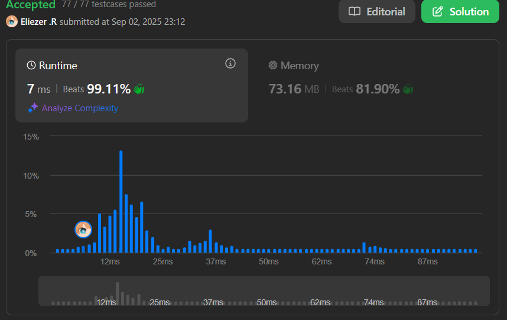

# 217. Contains Duplicate

Dado un array de enteros `nums`, determina si algún valor aparece al menos dos veces en el array.

Devuelve `true` si algún valor aparece al menos dos veces, y `false` si todos los elementos son distintos.

---

## 📋 Ejemplos

**Ejemplo 1:**

- Entrada: `nums = [1,2,3,1]`
- Salida: `true`

**Ejemplo 2:**

- Entrada: `nums = [1,2,3,4]`
- Salida: `false`

**Ejemplo 3:**

- Entrada: `nums = [1,1,1,3,3,4,3,2,4,2]`
- Salida: `true`

---

## 💭 Enfoque y Estrategia

- **Objetivo**: Detectar si hay algún elemento duplicado en el array.
- **Restricción**: Se busca una solución eficiente en tiempo y espacio.
- **Salida**: Booleano (`true` si hay duplicados, `false` si no).

La estrategia óptima es usar un Set para almacenar los elementos únicos mientras recorremos el array. Si encontramos un elemento que ya está en el Set, retornamos `true`.

---

## 🔧 Implementación

```js
const containsDuplicate = function (nums) {
  const window = new Set() // Creamos un Set para almacenar los elementos únicos

  // Recorremos el array nums
  for (let i = 0; i < nums.length; i++) {
    // Si el elemento ya está en el Set, hay duplicado y retornamos true
    if (window.has(nums[i])) return true

    // Si no está, lo agregamos al Set
    window.add(nums[i])
  }

  // Si terminamos el ciclo sin encontrar duplicados, retornamos false
  return false
}

console.log(containsDuplicate([1, 2, 3, 1])) // true

/**
 * Ejemplo paso a paso con nums = [1, 2, 3, 1]:
 * i=0: window = {}. No está 1, lo agrego → window = {1}
 * i=1: window = {1}. No está 2, lo agrego → window = {1,2}
 * i=2: window = {1,2}. No está 3, lo agrego → window = {1,2,3}
 * i=3: window = {1,2,3}. Ya está 1, retorna true
 */

```

---

## 📊 Análisis de Rendimiento

- **Complejidad temporal**: O(n), donde n es la longitud del array.
- **Complejidad espacial**: O(n), por el uso del Set.


---

## 🎯 Aprendizajes Clave

- El uso de un Set permite detectar duplicados de forma eficiente.
- Retornar en cuanto se detecta el primer duplicado ahorra tiempo.
- Este patrón es útil para problemas de unicidad en arrays.

---

## 🏷️ Tags

`Array` `Hash Table` `Easy`

---

**Tiempo invertido**: 30 minutos  
**Intentos**: 6  
**Dificultad percibida**: fácil