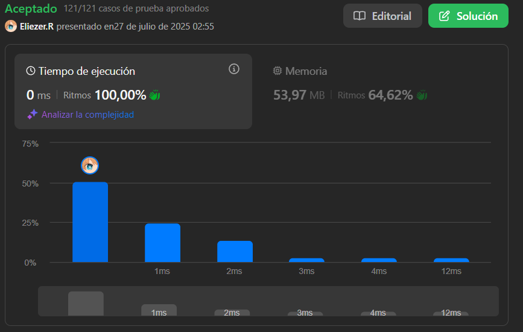

# 2210. Count Hills and Valleys in an Array

Dado un array de enteros `nums`, un índice `i` es parte de una colina ("hill") si sus vecinos más cercanos no iguales son menores que `nums[i]`. Es parte de un valle ("valley") si sus vecinos más cercanos no iguales son mayores que `nums[i]`. Índices adyacentes con el mismo valor forman parte de la misma colina o valle.

Devuelve el número de colinas y valles en `nums`.

---

## 📋 Ejemplos

**Ejemplo 1:**

- Entrada: `nums = [2,4,1,1,6,5]`
- Salida: `3`
- Explicación: Hay colinas en los índices 1 y 4, y un valle en los índices 2 y 3 (cuentan como uno).

**Ejemplo 2:**

- Entrada: `nums = [6,6,5,5,4,1]`
- Salida: `0`
- Explicación: No hay colinas ni valles.

---

## 💭 Enfoque y Estrategia

- **Objetivo**: Contar cuántas colinas y valles hay en el array.
- **Restricción**: Solo se consideran vecinos no iguales a izquierda y derecha.
- **Salida**: Un entero representando la cantidad de colinas y valles.

La estrategia es recorrer el array, buscar los vecinos no iguales a izquierda y derecha, y verificar si el valor actual es mayor o menor que ambos.

---

## 🔧 Implementación

```js
const countHillValley = function (nums) {
  let count = 0 // Contador de colinas y valles

  // Recorremos desde la segunda posición hasta la penúltima
  for (let i = 1; i < nums.length - 1; i++) {
    let start = i - 1 // Puntero para buscar el vecino no igual a la izquierda
    let end = i + 1 // Puntero para buscar el vecino no igual a la derecha

    // Avanzamos start hacia atrás mientras sea igual al valor actual
    while (start >= 0 && nums[i] === nums[start]) start--
    // Avanzamos end hacia adelante mientras sea igual al valor actual
    while (end < nums.length && nums[i] === nums[end]) end++

    // Verificamos si es valle: menor que ambos vecinos no iguales
    const right = (nums[i] < nums[start] && nums[i] < nums[end])
    // Verificamos si es colina: mayor que ambos vecinos no iguales
    const left = (nums[i] > nums[start] && nums[i] > nums[end])

    // Si es colina o valle, incrementamos el contador
    if ((right || left)) {
      count++
    }

    // Saltamos los siguientes elementos iguales para no contar la misma colina/valle varias veces
    while (i < nums.length && nums[i + 1] === nums[i]) i++
  }

  return count // Retornamos el número de colinas y valles
}

console.log(countHillValley([2, 4, 1, 1, 6, 5])) // 3

/**
 * Ejemplo paso a paso con nums = [2,4,1,1,6,5]:
 * i = 1: nums[1]=4, start=0 (2), end=2 (1) => 4 > 2 && 4 > 1 => count=1
 * i = 2: nums[2]=1, start=1 (4), end=4 (6) (end avanza por el 1 igual) => 1 < 4 && 1 < 6 => count=2
 * i = 4: nums[4]=6, start=3 (1), end=5 (5) => 6 > 1 && 6 > 5 => count=3
 * Resultado final: count = 3
 */
```

---

## 📊 Análisis de Rendimiento

- **Complejidad temporal**: O(n), donde n es la longitud del array.
- **Complejidad espacial**: O(1), solo se usan variables auxiliares.



---

## 🎯 Aprendizajes Clave

- Buscar vecinos no iguales es clave para identificar correctamente colinas y valles.
- Los valores iguales consecutivos forman parte de la misma colina o valle.
- El patrón de dos punteros es útil para saltar valores repetidos.

---

## 🏷️ Tags

`Array` `Simulation` `Easy`

---

**Tiempo invertido**: 5 minutos  
**Intentos**: 1  
**Dificultad percibida**: Fácil