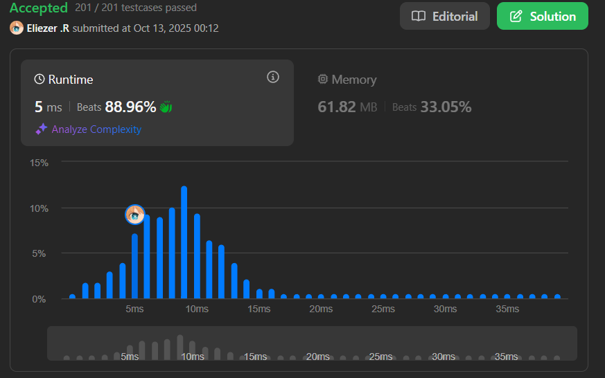

# 2273. Find Resultant Array After Removing Anagrams

Se te da un array de strings `words` indexado en 0, donde `words[i]` consiste de letras minúsculas en inglés.

En una operación, selecciona cualquier índice `i` tal que `0 < i < words.length` y `words[i - 1]` y `words[i]` sean anagramas, y elimina `words[i]` de `words`. Continúa realizando esta operación mientras puedas seleccionar un índice que satisfaga las condiciones.

Retorna `words` después de realizar todas las operaciones. Se puede demostrar que seleccionar los índices para cada operación en cualquier orden arbitrario conducirá al mismo resultado.

Un **anagrama** es una palabra o frase formada al reorganizar las letras de una palabra o frase diferente usando todas las letras originales exactamente una vez.

**Dificultad:** Easy

---

## 📋 Ejemplos

**Ejemplo 1:**

- Entrada: `words = ["abba","baba","bbaa","cd","cd"]`
- Salida: `["abba","cd"]`
- Explicación:
```
"bbaa" es anagrama de "baba" → eliminar "bbaa" → ["abba","baba","cd","cd"]
"baba" es anagrama de "abba" → eliminar "baba" → ["abba","cd","cd"]
"cd" es anagrama de "cd" → eliminar "cd" → ["abba","cd"]
```

**Ejemplo 2:**

- Entrada: `words = ["a","b","c","d","e"]`
- Salida: `["a","b","c","d","e"]`
- Explicación: No hay dos strings adyacentes que sean anagramas.

---

## 💭 Enfoque y Estrategia

- **Objetivo**: Eliminar strings consecutivos que sean anagramas entre sí.
- **Observación clave**: Dos strings son anagramas si al ordenar sus caracteres resultan iguales.
- **Técnica**: Crear una "firma" para cada string ordenando sus caracteres.
- **Implementación**: Comparar firma actual con la anterior, solo añadir si son diferentes.

---

## 🔧 Implementación

```js
var removeAnagrams = function (words) {
    const result = []
    let prevSig = ""

    for (const w of words) {
        // Crear firma del string ordenando caracteres
        const sig = w.split('').sort().join('')
        
        // Solo añadir si es diferente al anterior
        if (sig !== prevSig) {
            result.push(w)
            prevSig = sig
        }
    }
    
    return result
}

console.log(removeAnagrams(["abba","baba","bbaa","cd","cd"])) 
// ["abba","cd"]

console.log(removeAnagrams(["a","b","c","d","e"])) 
// ["a","b","c","d","e"]

/**
 * Ejemplo paso a paso con words = ["abba","baba","bbaa","cd","cd"]:
 * 
 * i=0: w="abba", sig="aabb", prevSig=""
 *      sig !== prevSig ✓ → añadir "abba", prevSig="aabb"
 * 
 * i=1: w="baba", sig="aabb", prevSig="aabb"
 *      sig === prevSig → NO añadir (es anagrama)
 * 
 * i=2: w="bbaa", sig="aabb", prevSig="aabb"
 *      sig === prevSig → NO añadir (es anagrama)
 * 
 * i=3: w="cd", sig="cd", prevSig="aabb"
 *      sig !== prevSig ✓ → añadir "cd", prevSig="cd"
 * 
 * i=4: w="cd", sig="cd", prevSig="cd"
 *      sig === prevSig → NO añadir (es anagrama)
 * 
 * Resultado: ["abba", "cd"]
 */
```

---

## 📊 Análisis de Rendimiento

- **Complejidad temporal**: O(n × m log m), donde n es el número de palabras y m es la longitud promedio de cada palabra.
  - Ordenar cada palabra: O(m log m)
  - Hacer esto n veces: O(n × m log m)
- **Complejidad espacial**: O(n × m), para almacenar el resultado y firmas.


---

## 🎯 Visualización del Proceso

```
Input: ["abba", "baba", "bbaa", "cd", "cd"]

Firmas:
"abba" → "aabb"  ✓ añadir
"baba" → "aabb"  ✗ anagrama
"bbaa" → "aabb"  ✗ anagrama
"cd"   → "cd"    ✓ añadir (diferente)
"cd"   → "cd"    ✗ anagrama

Output: ["abba", "cd"]
```

---

## 🔄 Enfoque Alternativo con Frecuencia

```js
var removeAnagramsAlt = function(words) {
    const result = []
    let prevFreq = null
    
    for (const w of words) {
        const freq = new Array(26).fill(0)
        for (const c of w) {
            freq[c.charCodeAt(0) - 97]++
        }
        
        const freqStr = freq.join(',')
        if (freqStr !== prevFreq) {
            result.push(w)
            prevFreq = freqStr
        }
    }
    
    return result
}
// Evita ordenar pero usa más espacio
```

---

## 🔍 Casos Edge

- **Todos anagramas**: `["abc", "bca", "cab"]` → `["abc"]`
- **Ningún anagrama**: `["a", "b", "c"]` → `["a", "b", "c"]`
- **Palabras idénticas**: `["cd", "cd", "cd"]` → `["cd"]`

---

## 🎯 Aprendizajes Clave

- **Anagram detection**: Ordenar caracteres es una forma simple de detectar anagramas.
- **Signature pattern**: Crear firmas únicas para comparación eficiente.
- **Sequential processing**: Solo comparar con el elemento anterior.
- **In-place logic**: No necesitamos modificar el array original, solo construir uno nuevo.

---

## 🏷️ Tags

`Array` `String` `Hash Table` `Sorting` `Easy`

---

**Tiempo invertido**: 20 minutos  
**Intentos**: 1  
**Dificultad percibida**: Easy