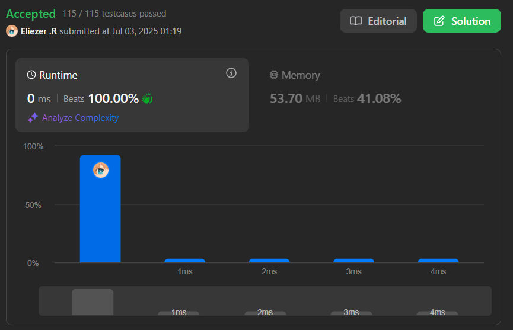

# 27. Remove Element

Dado un array de enteros `nums` y un entero `val`, elimina todas las ocurrencias de `val` en `nums` **in-place**. El orden de los elementos puede cambiar. Devuelve el número de elementos en `nums` que no son iguales a `val`.

Debes modificar el array `nums` de modo que los primeros `k` elementos contengan los valores distintos de `val`. El resto de elementos no importa.

---

## 📋 Ejemplos

**Ejemplo 1:**

- Entrada: `nums = [3,2,2,3]`, `val = 3`
- Salida: `2, nums = [2,2,_,_]`
- Explicación: La función debe retornar `k = 2`, con los dos primeros elementos de `nums` siendo 2. El resto no importa.

**Ejemplo 2:**

- Entrada: `nums = [0,1,2,2,3,0,4,2]`, `val = 2`
- Salida: `5, nums = [0,1,4,0,3,_,_,_]`
- Explicación: La función debe retornar `k = 5`, con los primeros cinco elementos de `nums` siendo 0, 1, 4, 0 y 3 (en cualquier orden). El resto no importa.

---

## 💭 Enfoque y Estrategia

- **Objetivo**: Eliminar todas las ocurrencias de `val` en el array y devolver la cantidad de elementos restantes.
- **Restricción**: Modificar el array en el lugar, sin usar espacio adicional significativo.
- **Salida**: Un entero `k` y el array modificado en sus primeros `k` elementos.

La estrategia óptima es usar dos punteros: uno para recorrer el array y otro para colocar los elementos válidos.

---

## 🔧 Implementación

```js
const removeElement = function(nums, val) {
  let k = 0 // Puntero para la posición de los elementos válidos
  for (let i = 0; i < nums.length; i++) {
    if (nums[i] !== val) {
      nums[k] = nums[i] // Colocamos el elemento válido en la posición k
      k++
    }
  }
  return k
}

let nums1 = [3,2,2,3]
console.log(removeElement(nums1, 3), nums1) // 2, [2,2,2,3] (los dos primeros son válidos)

let nums2 = [0,1,2,2,3,0,4,2]
console.log(removeElement(nums2, 2), nums2) // 5, [0,1,3,0,4,...]
```

---

## 📊 Análisis de Rendimiento

- **Complejidad temporal**: O(n), donde n es la longitud del array.
- **Complejidad espacial**: O(1), ya que se modifica el array en el lugar.


---

## 🎯 Aprendizajes Clave
- Sinceramente es un problema realmente facil, pero encuentro que la description de leetcode fue muy pesima en este ejercico y por eso me tomo tiempo hacerlo
- El uso de dos punteros permite modificar el array eficientemente sin espacio extra.
- El orden de los elementos no importa después de la posición `k`.
- Un punto a tomar en cuenta es, devolver el número de elementos válidos, no el array completo.

---

## 🏷️ Tags

`Array` `Two Pointers` `Easy`

---

**Tiempo invertido**: 2h  
**Intentos**: 20  
**Dificultad percibida**: facil