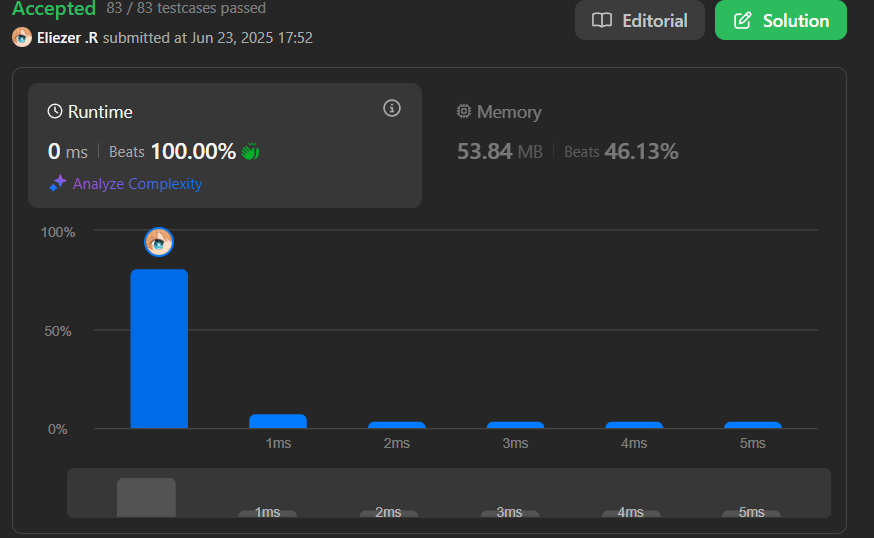

# 28. Find the Index of the First Occurrence in a String

Dadas dos cadenas `needle` y `haystack`, devuelve el índice de la primera aparición de `needle` en `haystack`, o `-1` si `needle` no es parte de `haystack`.

---

## 📋 Ejemplos

**Ejemplo 1:**

- Entrada: `haystack = "sadbutsad"`, `needle = "sad"`
- Salida: `0`
- Explicación: `"sad"` aparece en los índices 0 y 6. La primera aparición es en el índice 0.

**Ejemplo 2:**

- Entrada: `haystack = "leetcode"`, `needle = "leeto"`
- Salida: `-1`
- Explicación: `"leeto"` no aparece en `"leetcode"`, así que retornamos `-1`.

---

## 💭 Enfoque y Estrategia

### Análisis del problema

- **Objetivo**: Encontrar el índice de la primera aparición de `needle` en `haystack`.
- **Restricción**: Si `needle` no está presente, retornar `-1`.
- **Salida**: Un número entero representando el índice o `-1`.

---

## 🔧 Implementación

```js
const strStr = function (haystack, needle) {
  if (haystack === needle) return 0 // Si los str son iguales retornarmos 0

  for (let i = 0; i < haystack.length; i++) { // Iteramos normal
    if (haystack.slice(i, needle.length + i) === needle) return i // Aqui cortamos el haystack desde 0 hasta needle.length + i asegurandonos de que avancemos de 1 en 1 apartir de needle.length
  }
  return -1 // Si no encontramos retornamos -1
}

console.log(strStr('mississippi', 'issi'))
// Pequeño ejem
// En la primera iteracion se vera algo asi : haystack.slice(i, needle.length + i) sera igual a = miss
// Luego segunda iteracion : haystack.slice(i, needle.length + i) sera igual a = issi
// Estoy sucede ya que vamos avanzando con i que es 0 hasta needle.length + i que seria 5 y luego 6, 7 etc
```

---

## 📊 Análisis de Rendimiento

- **Complejidad temporal**: O(n * m), donde n es la longitud de `haystack` y m la de `needle`.
- **Complejidad espacial**: O(1), solo se usan variables auxiliares.
 

---

## 🎯 Aprendizajes Clave

- El uso de `slice` permite comparar subcadenas fácilmente.
- Si `needle` es igual a `haystack`, el resultado es siempre 0.
- Si no se encuentra la subcadena, se retorna -1.

---

## 🏷️ Tags

`Two Pointers` `String` `String Matching` `Easy`

---

**Tiempo invertido**: 5 minutos  
**Intentos**: 1  
**Dificultad percibida**: Facil