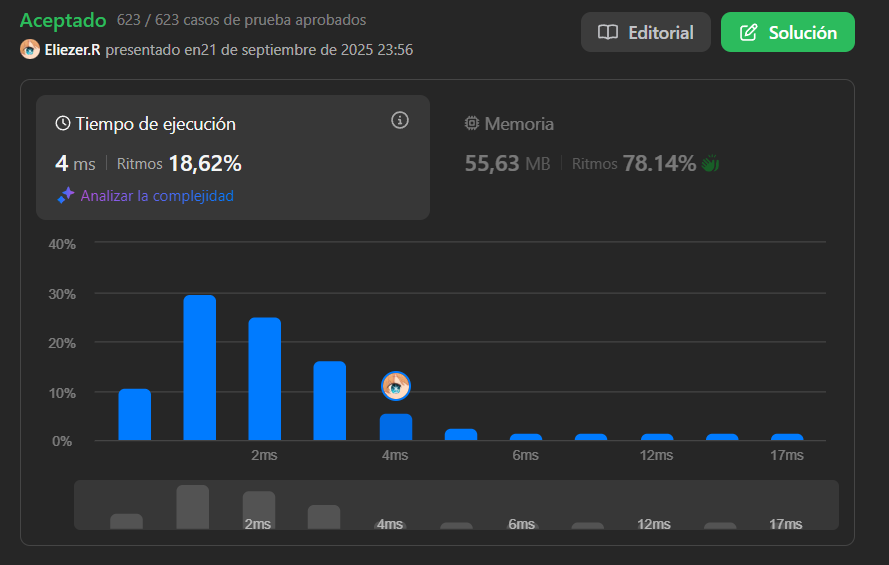

# 3005. Count Elements With Maximum Frequency

Se le proporciona una matriz `nums` consistente en números enteros positivos.

Retorna las **frecuencias totales** de elementos de modo que todos esos elementos tienen la **máxima frecuencia** en `nums`.

La **frecuencia** de un elemento es el número de apariciones de ese elemento en la matriz.

**Dificultad:** Easy

---

## 📋 Ejemplos

**Ejemplo 1:**

- Entrada: `nums = [1,2,2,3,1,4]`
- Salida: `4`
- Explicación: Los elementos `1` y `2` tienen una frecuencia de `2`, que es la frecuencia máxima en la matriz. Entonces, el número de elementos en la matriz con frecuencia máxima es `4`.

**Ejemplo 2:**

- Entrada: `nums = [1,2,3,4,5]`
- Salida: `5`
- Explicación: Todos los elementos de la matriz tienen una frecuencia de `1`, que es la máxima. Entonces, el número de elementos en la matriz con frecuencia máxima es `5`.

---

## 💭 Enfoque y Estrategia

- **Objetivo**: Sumar las frecuencias de todos los elementos que tienen la frecuencia máxima.
- **Técnica**: Hash Map para contar frecuencias + búsqueda del máximo + suma condicional.
- **Proceso**: Contar → Encontrar máximo → Sumar frecuencias que coinciden con el máximo.

La estrategia es primero contar todas las frecuencias, luego identificar cuál es la frecuencia máxima, y finalmente sumar todas las frecuencias que igualan ese máximo.

---

## 🔧 Implementación

```js
const maxFrequencyElements = function (nums) {
    const map = new Map()  // Map para contar frecuencias
    let resul = 0          // Resultado: suma de frecuencias máximas
    
    // Paso 1: Contar frecuencias de cada elemento
    for (let i = 0; i < nums.length; i++) {
        map.set(nums[i], (map.get(nums[i]) || 0) + 1)
    }
    
    // Paso 2: Encontrar la frecuencia máxima
    const maxNum = Math.max(...map.values())
    
    // Paso 3: Sumar todas las frecuencias que igualan el máximo
    map.forEach((values, _) => {
        if (values === maxNum) resul += values
    });
    
    return resul
}

console.log(maxFrequencyElements([1,2,2,3,1,4])) // 4

/**
 * Ejemplo paso a paso con nums = [1,2,2,3,1,4]:
 * 
 * 1. Conteo de frecuencias:
 *    map = {1: 2, 2: 2, 3: 1, 4: 1}
 * 
 * 2. Frecuencia máxima:
 *    maxNum = Math.max(2, 2, 1, 1) = 2
 * 
 * 3. Suma de frecuencias máximas:
 *    - Elemento 1: frecuencia 2 === maxNum → resul += 2 → resul = 2
 *    - Elemento 2: frecuencia 2 === maxNum → resul += 2 → resul = 4
 *    - Elemento 3: frecuencia 1 < maxNum → no suma
 *    - Elemento 4: frecuencia 1 < maxNum → no suma
 * 
 * Resultado: 4 (2 + 2)
 */
```

---

## 📊 Análisis de Rendimiento

- **Complejidad temporal**: O(n + k), donde n es la longitud de nums y k es el número de elementos únicos.
- **Complejidad espacial**: O(k), donde k es el número de elementos únicos en el Map.


*El Math.max(...map.values()) es O(k) y el forEach final también es O(k).*

---

## 🔄 Enfoque Optimizado en Una Pasada

```js
const maxFrequencyElementsOptimized = function (nums) {
    const map = new Map()
    let maxFreq = 0
    let result = 0
    
    // Contar frecuencias y rastrear máximo simultáneamente
    for (const num of nums) {
        const freq = (map.get(num) || 0) + 1
        map.set(num, freq)
        
        if (freq > maxFreq) {
            maxFreq = freq
            result = freq  // Nueva frecuencia máxima encontrada
        } else if (freq === maxFreq) {
            result += freq // Otra ocurrencia de la frecuencia máxima
        }
    }
    
    return result
}
```

---

## 🎯 Aprendizajes Clave

- **Conteo de frecuencias**: Map es la estructura ideal para este tipo de problemas.
- **Math.max con spread operator**: `Math.max(...array)` para encontrar el máximo de una colección.
- **Suma condicional**: Sumar solo los valores que cumplen cierta condición.
- **Optimización posible**: Se puede resolver en una sola pasada rastreando el máximo dinámicamente.
- **Diferencia conceptual**: No contar elementos únicos, sino sumar todas sus ocurrencias.

---

## 🔍 Casos Edge

- Un solo elemento: `[5]` → `1`
- Todos elementos iguales: `[3,3,3]` → `3`  
- Todos elementos únicos: `[1,2,3,4]` → `4`
- Dos grupos de frecuencia máxima: `[1,1,2,2,3]` → `4` (2+2)

---

## 🧮 Ejemplos Adicionales

```
nums = [1,1,1,2,2,3] → frecuencias: {1:3, 2:2, 3:1} → maxFreq=3 → resultado=3
nums = [5,5,5,5] → frecuencias: {5:4} → maxFreq=4 → resultado=4  
nums = [1,2,1,2,3,3] → frecuencias: {1:2, 2:2, 3:2} → maxFreq=2 → resultado=6
```

---

## 🏷️ Tags

`Array` `Hash Table` `Counting` `Easy`

---

**Tiempo invertido**: 12 minutos  
**Intentos**: 1  
**Dificultad percibida**: Easy