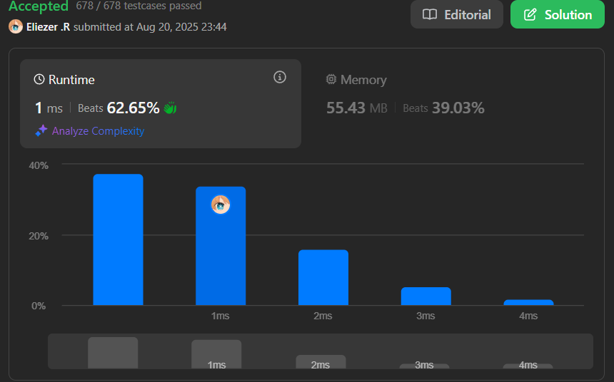

# 3136. Valid Word

Una palabra se considera **válida** si:
- Contiene un **mínimo** de 3 caracteres.
- Contiene solo dígitos (0-9) y letras en inglés (mayúsculas y minúsculas).
- Incluye **al menos** una **vocal**.
- Incluye **al menos** una **consonante**.

Dado un string `word`, devuelve `true` si la palabra es válida, de lo contrario devuelve `false`.

**Notas:**
- `'a'`, `'e'`, `'i'`, `'o'`, `'u'`, y sus mayúsculas son **vocales**.
- Una **consonante** es una letra en inglés que no es vocal.

---

## 📋 Ejemplos

**Ejemplo 1:**

- Entrada: `word = "234Adas"`
- Salida: `true`
- Explicación: Esta palabra satisface todas las condiciones.

**Ejemplo 2:**

- Entrada: `word = "b3"`
- Salida: `false`
- Explicación: La longitud es menor a 3 caracteres y no tiene vocal.

**Ejemplo 3:**

- Entrada: `word = "a3$e"`
- Salida: `false`
- Explicación: Contiene el carácter `'$'` y no tiene consonante.

---

## 💭 Enfoque y Estrategia

- **Objetivo**: Verificar si una palabra cumple con 4 condiciones específicas.
- **Validaciones**: Longitud mínima, caracteres permitidos, al menos una vocal y una consonante.
- **Salida**: Un booleano indicando si la palabra es válida.

La estrategia es usar un Set para obtener caracteres únicos, verificar cada carácter usando códigos ASCII, y mantener flags para vocales y consonantes encontradas.

---

## 🔧 Implementación

```js
const isValid = function (word) {
  // Verificar longitud mínima
  if (word.length < 3) return false

  const vowels = new Set('aeiou') // Set de vocales para búsqueda O(1)
  const seen = new Set(word.toLowerCase()) // Caracteres únicos en minúsculas

  let hasVowel = false // Flag para detectar al menos una vocal
  let hasConsonant = false // Flag para detectar al menos una consonante

  // Recorremos cada carácter único
  for (const char of seen) {
    const code = char.charCodeAt(0) // Obtenemos el código ASCII

    if (code >= 97 && code <= 122) { // letra minúscula (a-z)
      if (vowels.has(char)) {
        hasVowel = true // Encontramos una vocal
      } else {
        hasConsonant = true // Encontramos una consonante
      }
    } else if (code >= 48 && code <= 57) {
      // es número (0-9), permitido pero no suma a vocales/consonantes
      continue
    } else {
      return false // símbolo u otro carácter no válido
    }
  }

  // Debe tener al menos una vocal Y una consonante
  return hasVowel && hasConsonant
}

console.log(isValid('234Adas')) // true

/**
 * Ejemplo paso a paso con word = "234Adas":
 * 1. length = 7 >= 3 ✓
 * 2. seen = Set{'2', '3', '4', 'a', 'd', 's'} (caracteres únicos en minúscula)
 * 3. '2','3','4' → números válidos
 * 4. 'a' → vocal (hasVowel = true)
 * 5. 'd','s' → consonantes (hasConsonant = true)
 * 6. hasVowel && hasConsonant = true ✓
 * Resultado: true
 */
```

---

## 📊 Análisis de Rendimiento

- **Complejidad temporal**: O(n), donde n es la longitud de la palabra.
- **Complejidad espacial**: O(n), para almacenar los caracteres únicos en el Set.



---

## 🎯 Aprendizajes Clave

- Usar Set para obtener caracteres únicos optimiza la verificación.
- Los códigos ASCII facilitan la validación de rangos de caracteres.
- Convertir a minúsculas simplifica la lógica de vocales/consonantes.
- Early return mejora la eficiencia cuando se detecta un carácter inválido.

---

## 🏷️ Tags

`String` `Hash Table` `Easy`

---

**Tiempo invertido**: 30 minutos  
**Intentos**: 5  
**Dificultad percibida**: Fácil