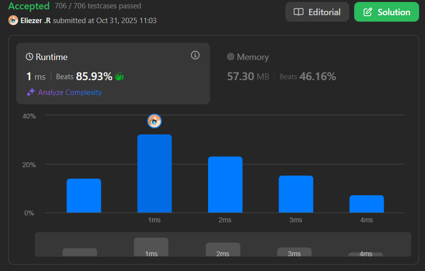

# 3289. The Two Sneaky Numbers of Digitville

## 🧠 Descripción

En el pueblo de Digitville, había una lista de números llamada `nums` que contenía enteros del 0 al n - 1. Se suponía que cada número aparecería exactamente una vez en la lista, sin embargo, dos números traviesos se colaron una vez adicional, haciendo que la lista sea más larga de lo habitual.

Como detective del pueblo, tu tarea es encontrar estos dos números traviesos. Retorna un array de tamaño dos que contenga los dos números (en cualquier orden), para que la paz pueda regresar a Digitville.

**Dificultad:** Easy

---

## 📋 Ejemplos

### Ejemplo 1:

* **Entrada**: `nums = [0,1,1,0]`
* **Salida**: `[0,1]`
* **Explicación**: Los números 0 y 1 aparecen dos veces en el array.

### Ejemplo 2:

* **Entrada**: `nums = [0,3,2,1,3,2]`
* **Salida**: `[2,3]`
* **Explicación**: Los números 2 y 3 aparecen dos veces en el array.

### Ejemplo 3:

* **Entrada**: `nums = [7,1,5,4,3,4,6,0,9,5,8,2]`
* **Salida**: `[4,5]`
* **Explicación**: Los números 4 y 5 aparecen dos veces en el array.

---

## 💭 Estrategia y Enfoque

La estrategia es usar un **objeto como hash map** para rastrear qué números ya hemos visto. La primera vez que vemos un número, lo registramos en el objeto. La segunda vez que lo vemos, sabemos que es uno de los "sneaky numbers" y lo agregamos al resultado.

### 🧩 Pasos del Algoritmo:

1. Crear un array vacío para los resultados y un objeto para tracking.
2. Recorrer el array de números.
3. Si el número ya existe en el objeto, es un duplicado → agregarlo al resultado.
4. Si no existe, registrarlo en el objeto.
5. Terminar cuando encontremos los 2 duplicados.

---

## 💻 Implementación en JavaScript

```js
var getSneakyNumbers = function (nums) {
    // Array para almacenar los dos números duplicados
    const subArr = []
    
    // Objeto para rastrear qué números ya hemos visto
    const obj = {}
    
    // Recorrer todo el array de números
    for (let i = 0; i < nums.length; i++) {
        // Verificar si este número ya existe en nuestro objeto
        // Object.hasOwn() es más moderno que hasOwnProperty()
        if (Object.hasOwn(obj, `${nums[i]}`)) {
            // Si ya existe, es un duplicado → agregarlo al resultado
            subArr.push(nums[i])
        } else {
            // Si no existe, registrarlo como visto
            // El valor 1 es solo un placeholder, lo importante es la clave
            obj[nums[i]] = 1
        }

        // Optimización: si ya encontramos los 2 duplicados, terminar early
        if (subArr.length === 2) break
    }
    
    return subArr
};

console.log(getSneakyNumbers([0,1,1,0]))  // [1,0] o [0,1]
console.log(getSneakyNumbers([0,3,2,1,3,2]))  // [3,2] o [2,3]
console.log(getSneakyNumbers([7,1,5,4,3,4,6,0,9,5,8,2]))  // [4,5] o [5,4]
```

### 📝 Ejemplo paso a paso con `nums = [0,1,1,0]`:

```
Inicio: subArr = [], obj = {}

i=0: nums[0] = 0
  - ¿obj tiene clave "0"? No
  - obj["0"] = 1
  - obj = {"0": 1}

i=1: nums[1] = 1
  - ¿obj tiene clave "1"? No
  - obj["1"] = 1
  - obj = {"0": 1, "1": 1}

i=2: nums[2] = 1
  - ¿obj tiene clave "1"? Sí ✓
  - subArr.push(1)
  - subArr = [1]

i=3: nums[3] = 0
  - ¿obj tiene clave "0"? Sí ✓
  - subArr.push(0)
  - subArr = [1, 0]
  - subArr.length === 2 → break

Resultado: [1, 0]
```

---

## 📊 Análisis de Rendimiento

* **Complejidad temporal**: O(n), recorremos el array una vez.
* **Complejidad espacial**: O(n), en el peor caso almacenamos n-2 números en el objeto.


---

## 🎯 Aprendizajes Clave

* **Hash Map pattern**: Usar objetos para tracking O(1).
* **Object.hasOwn()**: Método moderno para verificar propiedades.
* **Early termination**: Optimizar con break cuando encontramos la respuesta.
* **String conversion**: Convertir números a string para usar como claves.

---

## 🔄 Enfoque Alternativo con Set

```js
var getSneakyNumbersSet = function(nums) {
    const seen = new Set()
    const duplicates = []
    
    for (const num of nums) {
        if (seen.has(num)) {
            duplicates.push(num)
            if (duplicates.length === 2) break
        } else {
            seen.add(num)
        }
    }
    
    return duplicates
}
// Más limpio y eficiente con Set
```

---

## 🏷️ Etiquetas

`Array` `Hash Table` `Math` `Easy`