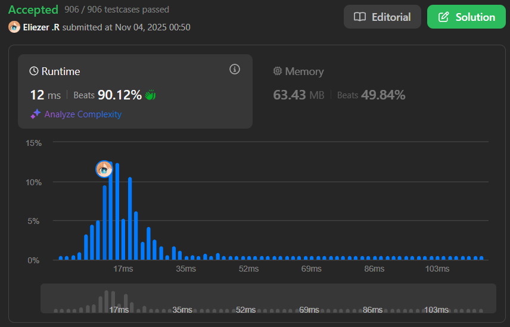

# 3318. Find X-Sum of All K-Long Subarrays I

## 🧠 Descripción

Se te da un array `nums` de `n` enteros y dos enteros `k` y `x`.

El **x-sum** de un array se calcula mediante el siguiente procedimiento:
1. Contar las ocurrencias de todos los elementos en el array.
2. Mantener solo las ocurrencias de los `x` elementos más frecuentes.
3. Si dos elementos tienen el mismo número de ocurrencias, el elemento con el **valor mayor** se considera más frecuente.
4. Calcular la suma de estos elementos multiplicados por sus frecuencias.

**Nota**: Si un array tiene menos de `x` elementos distintos, su x-sum es la suma total del array.

Retorna un array de enteros `answer` de longitud `n - k + 1` donde `answer[i]` es el x-sum del subarray `nums[i..i + k - 1]`.

**Dificultad:** Easy/Medium

---

## 📋 Ejemplos

### Ejemplo 1:

* **Entrada**: `nums = [1,1,2,2,3,4,2,3], k = 6, x = 2`
* **Salida**: `[6,10,12]`
* **Explicación**:
```
Subarray [1,1,2,2,3,4]: 
  Frecuencias: {1:2, 2:2, 3:1, 4:1}
  Top 2: {1:2, 2:2} (empatan en frecuencia, ambos tienen 2)
  x-sum = 1×2 + 2×2 = 2 + 4 = 6

Subarray [1,2,2,3,4,2]:
  Frecuencias: {1:1, 2:3, 3:1, 4:1}
  Top 2: {2:3, 4:1} (2 más frecuente, entre 1,3,4 elegimos 4 por ser mayor)
  x-sum = 2×3 + 4×1 = 6 + 4 = 10

Subarray [2,2,3,4,2,3]:
  Frecuencias: {2:3, 3:2, 4:1}
  Top 2: {2:3, 3:2}
  x-sum = 2×3 + 3×2 = 6 + 6 = 12
```

### Ejemplo 2:

* **Entrada**: `nums = [3,8,7,8,7,5], k = 2, x = 2`
* **Salida**: `[11,15,15,15,12]`

---

## 💭 Estrategia y Enfoque

Este problema usa **Sliding Window** con conteo de frecuencias:

### 🧩 Pasos del Algoritmo:

1. Para cada ventana de tamaño `k`:
   - Contar frecuencias de elementos
   - Si hay menos de `x` distintos → sumar todo
   - Si hay `x` o más distintos → seleccionar top `x` y calcular suma
2. Criterios de selección:
   - Prioridad 1: Mayor frecuencia
   - Prioridad 2: Mayor valor (en caso de empate)

---

## 💻 Implementación en JavaScript

```js
var findXSum = function (nums, k, x) {
    // i: índice de inicio de la ventana deslizante
    let i = 0
    
    // arr: almacena los resultados (x-sums de cada ventana)
    let arr = []

    // Iterar mientras la ventana de tamaño k quepa en el array
    // (i + k) <= nums.length asegura que no nos salgamos de límites
    while ((i + k) <= nums.length) {
        // j: puntero para iterar dentro de la ventana actual
        let j = i
        
        // map: estructura para contar frecuencias
        // clave = número, valor = frecuencia
        let map = new Map()

        // Contar frecuencias de todos los elementos en la ventana [i, i+k)
        while (j < (i + k)) {
            // map.get(nums[j]) obtiene la frecuencia actual (o 0 si no existe)
            // Le sumamos 1 y guardamos el nuevo valor
            map.set(nums[j], (map.get(nums[j]) || 0) + 1)
            j++
        }

        // CASO ESPECIAL: Si hay menos de x elementos distintos
        // En este caso, el x-sum es simplemente la suma de todos
        if (map.size < x) {
            // slice(i, i+k) extrae la ventana actual
            // reduce suma todos los elementos
            const subArr = nums.slice(i, (i + k)).reduce((value, sum) => value + sum, 0)
            arr.push(subArr)
        } else {
            // CASO NORMAL: Hay x o más elementos distintos
            
            // Convertir el Map a un array de objetos para poder ordenar
            const array = []
            for (const [key, value] of map.entries()) {
                // Crear objeto con el número y su frecuencia
                array.push({ num: key, freq: value })
            }
            
            // Ordenar por:
            // 1. Frecuencia descendente (b.freq - a.freq)
            // 2. Si empatan en frecuencia, por valor descendente (b.num - a.num)
            array.sort((a, b) => {
                if (b.freq === a.freq) return b.num - a.num
                return b.freq - a.freq
            })

            // Tomar solo los primeros x elementos (los más frecuentes)
            const topX = array.slice(0, x)

            // Calcular la suma: número × frecuencia para cada uno
            let sum = 0
            for (const { num, freq } of topX) {
                sum += num * freq
            }

            // Agregar el resultado al array de respuestas
            arr.push(sum)
        }

        // Mover la ventana una posición a la derecha
        i++
    }

    return arr
};

console.log(findXSum([1,1,2,2,3,4,2,3], 6, 2))  // [6,10,12]
console.log(findXSum([3,8,7,8,7,5], 2, 2))      // [11,15,15,15,12]
```

### 📝 Ejemplo paso a paso con `nums = [3,8,7,8,7,5], k = 2, x = 2`:

```
Array: [3, 8, 7, 8, 7, 5]
k = 2, x = 2

Ventana 1: [3, 8]
  map = {3: 1, 8: 1}
  map.size = 2, x = 2 → no es menor
  array = [{num:3, freq:1}, {num:8, freq:1}]
  Después de ordenar (empatan en freq, ordenar por valor):
    [{num:8, freq:1}, {num:3, freq:1}]
  topX = [{num:8, freq:1}, {num:3, freq:1}]
  sum = 8×1 + 3×1 = 11 ✓

Ventana 2: [8, 7]
  map = {8: 1, 7: 1}
  map.size = 2, x = 2
  array = [{num:8, freq:1}, {num:7, freq:1}]
  Ordenar: [{num:8, freq:1}, {num:7, freq:1}]
  sum = 8×1 + 7×1 = 15 ✓

Ventana 3: [7, 8]
  map = {7: 1, 8: 1}
  Similar a ventana 2
  sum = 8×1 + 7×1 = 15 ✓

Ventana 4: [8, 7]
  map = {8: 1, 7: 1}
  sum = 8×1 + 7×1 = 15 ✓

Ventana 5: [7, 5]
  map = {7: 1, 5: 1}
  array = [{num:7, freq:1}, {num:5, freq:1}]
  Ordenar: [{num:7, freq:1}, {num:5, freq:1}]
  sum = 7×1 + 5×1 = 12 ✓

Resultado: [11, 15, 15, 15, 12]
```

---

## 📊 Análisis de Rendimiento

* **Complejidad temporal**: O((n - k + 1) × k × log k)
  - Número de ventanas: n - k + 1
  - Por ventana: contar k elementos + ordenar O(k log k)
* **Complejidad espacial**: O(k), para el Map y array temporal.



---

## 🎯 Aprendizajes Clave

* **Sliding window**: Técnica para procesar subarrays consecutivos.
* **Frequency counting**: Usar Map para contar ocurrencias.
* **Custom sorting**: Ordenar con múltiples criterios.
* **Tie-breaking**: Manejar empates en ordenamiento.
* **Conditional logic**: Casos especiales cuando hay pocos elementos.

---

## 🔄 Optimización Posible

Para arrays muy grandes, podríamos optimizar usando un sliding window más inteligente que actualice el Map incrementalmente en lugar de reconstruirlo cada vez:

```js
// Pseudo-código de optimización
// Al mover la ventana:
// 1. Decrementar frecuencia del elemento que sale
// 2. Incrementar frecuencia del elemento que entra
// 3. Mantener estructura ordenada (heap o TreeMap)
```

---

## 🏷️ Etiquetas

`Array` `Hash Table` `Sliding Window` `Sorting` `Easy/Medium`