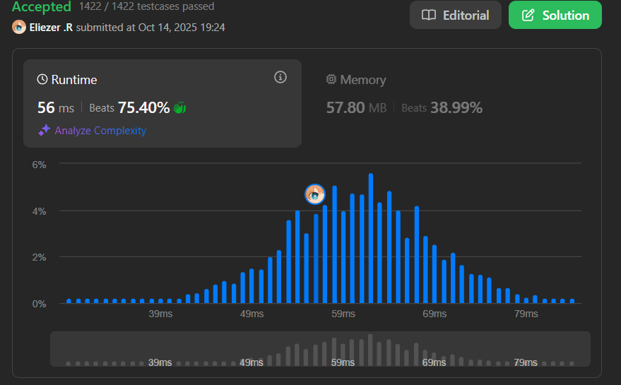

# 3349. Adjacent Increasing Subarrays Detection I

Dado un array `nums` de n enteros y un entero `k`, determina si existen dos subarrays adyacentes de longitud `k` tales que ambos subarrays sean estrictamente crecientes.

Específicamente, verifica si hay dos subarrays comenzando en los índices `a` y `b` (a < b), donde:
- Ambos subarrays `nums[a..a + k - 1]` y `nums[b..b + k - 1]` son estrictamente crecientes.
- Los subarrays deben ser adyacentes, es decir, `b = a + k`.

Retorna `true` si es posible encontrar dos subarrays así, y `false` en caso contrario.

**Dificultad:** Medium

---

## 📋 Ejemplos

**Ejemplo 1:**

- Entrada: `nums = [2,5,7,8,9,2,3,4,3,1], k = 3`
- Salida: `true`
- Explicación:
  - El subarray comenzando en índice 2 es `[7, 8, 9]`, estrictamente creciente.
  - El subarray comenzando en índice 5 es `[2, 3, 4]`, estrictamente creciente.
  - Estos dos subarrays son adyacentes.

**Ejemplo 2:**

- Entrada: `nums = [1,2,3,4,4,4,4,5,6,7], k = 5`
- Salida: `false`

---

## 💭 Enfoque y Estrategia

- **Objetivo**: Encontrar si existe el máximo de dos subarrays adyacentes crecientes de longitud k.
- **Observación clave**: Solo necesitamos encontrar la longitud máxima de subarrays crecientes adyacentes.
- **Variables de tracking**:
  - `cnt`: longitud del subarray creciente actual
  - `precnt`: longitud del subarray creciente anterior
  - `ans`: longitud máxima encontrada de subarrays adyacentes
- **Técnica**: One-pass con tracking de longitudes.

---

## 🔧 Implementación

```js
var hasIncreasingSubarrays = function (nums, k) {
    const n = nums.length
    let cnt = 1,
        precnt = 0,
        ans = 0
        
    for (let i = 1; i < n; ++i) {
        if (nums[i] > nums[i - 1]) {
            ++cnt
        } else {
            precnt = cnt
            cnt = 1
        }
        // Máximo entre: anterior con actual, o mitad del actual
        ans = Math.max(ans, Math.min(precnt, cnt))
        ans = Math.max(ans, Math.floor(cnt / 2))
    }
    
    return ans >= k
}

console.log(hasIncreasingSubarrays([2,5,7,8,9,2,3,4,3,1], 3)) // true
console.log(hasIncreasingSubarrays([1,2,3,4,4,4,4,5,6,7], 5)) // false

/**
 * Explicación del algoritmo:
 * 
 * nums = [2,5,7,8,9,2,3,4,3,1], k = 3
 * 
 * i=1: 5>2 → cnt=2
 * i=2: 7>5 → cnt=3
 * i=3: 8>7 → cnt=4
 * i=4: 9>8 → cnt=5
 * i=5: 2<9 → precnt=5, cnt=1, ans=max(0,min(5,1),floor(1/2))=1
 * i=6: 3>2 → cnt=2, ans=max(1,min(5,2),floor(2/2))=2
 * i=7: 4>3 → cnt=3, ans=max(2,min(5,3),floor(3/2))=3
 * i=8: 3<4 → precnt=3, cnt=1, ans=3
 * i=9: 1<3 → precnt=1, cnt=1, ans=3
 * 
 * ans=3 >= k=3 → true
 */
```

---

## 📊 Análisis de Rendimiento

- **Complejidad temporal**: O(n), un solo recorrido del array.
- **Complejidad espacial**: O(1), solo variables auxiliares.


---

## 🎯 Visualización del Proceso

```
nums = [2,5,7,8,9,2,3,4,3,1]
         ↑---------↑ ↑-----↑
         creciente   creciente
         len=5       len=3

Subarrays adyacentes posibles:
- [7,8,9] y [2,3,4] → ambos de longitud 3 ✓
```

---

## 🔍 Casos Edge

- **k = 1**: Técnicamente no puede ser "estrictamente creciente" con 1 elemento
- **Array corto**: `n < 2*k` → imposible tener dos subarrays de longitud k
- **Todo creciente**: `[1,2,3,4,5,6]` con k=3 → puede dividirse en dos subarrays

---

## 🎯 Aprendizajes Clave

- **Sliding window adaptativo**: No necesitamos ventana fija, solo tracking.
- **Two pointers implicit**: cnt y precnt actúan como punteros virtuales.
- **Optimization**: Calculamos el máximo en cada paso sin necesidad de arrays auxiliares.
- **Mathematical insight**: max(floor(cnt/2), min(precnt, cnt))

---

## 🏷️ Tags

`Array` `Sliding Window` `Two Pointers` `Medium`

---


**Tiempo invertido**: 29 minutos  
**Intentos**: 1  
**Dificultad percibida**: Facil
