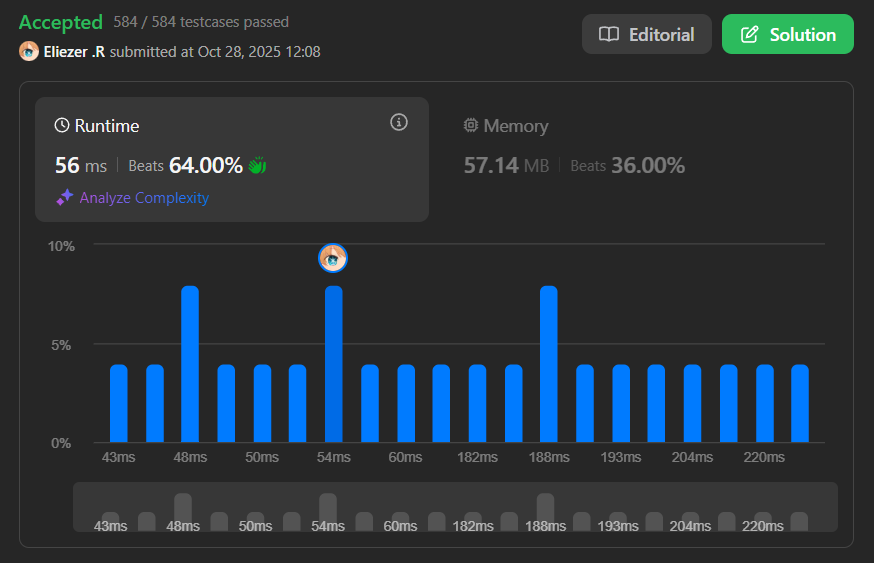

# 3354. Make Array Elements Equal to Zero

## 🧠 Descripción

Se te da un array de enteros `nums`. Comienza seleccionando una posición inicial `curr` tal que `nums[curr] == 0`, y elige una dirección de movimiento: izquierda o derecha.

Después de eso, repites el siguiente proceso:

* Si `curr` está fuera del rango `[0, n - 1]`, este proceso termina.
* Si `nums[curr] == 0`, muévete en la dirección actual incrementando `curr` si te mueves a la derecha, o decrementándolo si te mueves a la izquierda.
* De lo contrario, si `nums[curr] > 0`:
  - Decrementa `nums[curr]` en 1.
  - Invierte tu dirección de movimiento.
  - Da un paso en tu nueva dirección.

Una selección de la posición inicial `curr` y dirección de movimiento se considera **válida** si cada elemento en `nums` se convierte en 0 al final del proceso.

Retorna el número de selecciones válidas posibles.

---

## 📋 Ejemplos

### Ejemplo 1:

* **Entrada**: `nums = [1,0,2,0,3]`
* **Salida**: `2`
* **Explicación**: Las dos selecciones válidas posibles son:
  - Elegir `curr = 3` y dirección izquierda.
  - Elegir `curr = 3` y dirección derecha.

### Ejemplo 2:

* **Entrada**: `nums = [2,3,4,0,4,1,0]`
* **Salida**: `0`
* **Explicación**: No hay selecciones válidas posibles.

---

## 💭 Estrategia y Enfoque

La clave está en observar el **balance** entre los elementos a la izquierda y derecha de cada posición con valor 0.

### 🧩 Observación matemática:

Para que una posición con valor 0 sea válida:

1. **Si la suma izquierda == suma derecha**: Podemos empezar en cualquier dirección → **+2 selecciones**
2. **Si |suma izquierda - suma derecha| == 1**: Solo una dirección funciona → **+1 selección**
3. **Cualquier otra diferencia**: No es válido → **+0 selecciones**

### 🔑 Pasos del Algoritmo:

1. Calcular la suma total del array.
2. Mantener suma acumulada de la izquierda (`left`).
3. La suma derecha es `total - left`.
4. Para cada posición con valor 0, verificar las condiciones.

---

## 💻 Implementación en JavaScript

```js
var countValidSelections = function (nums) {
    let count = 0  // Contador de selecciones válidas
    let left = 0   // Suma de elementos a la izquierda
    
    // Calcular suma total del array (representa la suma derecha inicial)
    let right = nums.reduce((value, sum) => value + sum)

    // Recorrer cada posición del array
    for (let i = 0; i < nums.length; i++) {
        // Actualizar sumas: agregar a left, quitar de right
        left += nums[i]
        right -= nums[i]

        // Si la posición no es 0, continuar (solo los 0 son válidos)
        if (nums[i] !== 0) continue
        
        // CASO 1: Sumas iguales → podemos ir en ambas direcciones
        if (left === right) count += 2
        
        // CASO 2: Diferencia de 1 → solo una dirección funciona
        if (Math.abs(left - right) === 1) count++
    }

    return count
};

console.log(countValidSelections([1,0,2,0,3])) // 2
console.log(countValidSelections([2,3,4,0,4,1,0])) // 0
```

### 📝 Ejemplo paso a paso con `nums = [1,0,2,0,3]`:

```
Suma total: 1 + 0 + 2 + 0 + 3 = 6

i=0: nums[0]=1 (no es 0, continuar)
  left = 1, right = 5

i=1: nums[1]=0 ✓
  left = 1, right = 5
  |1 - 5| = 4 > 1 → no válido
  count = 0

i=2: nums[2]=2 (no es 0, continuar)
  left = 3, right = 3

i=3: nums[3]=0 ✓
  left = 3, right = 3
  3 == 3 → válido en ambas direcciones
  count += 2 → count = 2

i=4: nums[4]=3 (no es 0, continuar)
  left = 6, right = 0

Resultado: 2 selecciones válidas
```

---

## 📊 Análisis de Rendimiento

* **Complejidad temporal**: O(n), un solo recorrido del array.
* **Complejidad espacial**: O(1), solo variables auxiliares.



---

## 🎯 Aprendizajes Clave

* **Balance checking**: Verificar equilibrio entre izquierda y derecha.
* **Prefix sum pattern**: Mantener suma acumulada.
* **Mathematical insight**: La diferencia determina la validez.
* **Optimization**: No necesitamos simular el proceso completo.

---

## 💡 Intuición del Problema

¿Por qué funciona esta estrategia?

* **Suma igual**: Si left == right, el "cursor" puede ir en cualquier dirección y eventualmente equilibrará todo.
* **Diferencia de 1**: Solo yendo hacia el lado más pesado podremos balancear.
* **Diferencia > 1**: Imposible balancear desde esa posición.

---

## 🏷️ Etiquetas

`Array` `Simulation` `Prefix Sum` `Easy`