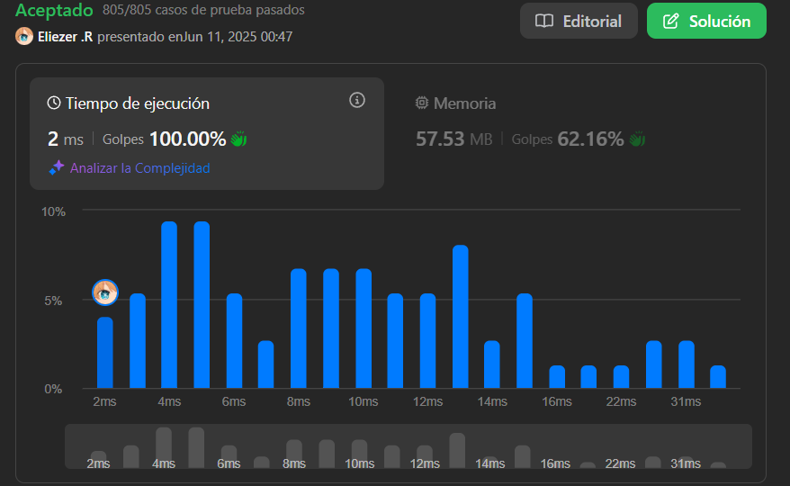

# 3442. Maximum Difference Between Even and Odd Frequency I

Te dan una cuerda `s` que consiste en letras minúsculas en inglés.

Tu tarea es encontrar la máxima diferencia entre la frecuencia de caracteres en la cuerda tal que:

```
diff = freq(a1) - freq(a2)
```

- `a1` tiene una frecuencia **impar** en la cuerda.
- `a2` tiene una frecuencia **par** en la cuerda.

Devuelve esta máxima diferencia.

---

## 📋 Ejemplos

**Ejemplo 1:**

- Entrada: `s = "aaaaabbc"`
- Salida: `3`
- Explicación: El carácter `'a'` tiene frecuencia impar de 5, y `'b'` tiene frecuencia par de 2. La diferencia máxima es `5 - 2 = 3`.

**Ejemplo 2:**

- Entrada: `s = "abcabcab"`
- Salida: `1`
- Explicación: El carácter `'a'` tiene frecuencia impar de 3, y `'c'` tiene frecuencia par de 2. La diferencia máxima es `3 - 2 = 1`.

---

## 💭 Enfoque y Estrategia

### Análisis del problema

- **Objetivo**: Encontrar la máxima diferencia entre la mayor frecuencia impar y la menor frecuencia par de cualquier carácter en la cadena.
- **Restricciones**: Solo considerar frecuencias impares para `a1` y pares para `a2`.
- **Salida**: Un número entero representando la diferencia máxima.

---

## 🔧 Implementación

```js
const maxDifference = function (s) {
  const hashp = new Map() // Iniciamos con un map
  let impar = -Infinity // Inicializamos la variables con un -infinity que quiere decir que es el valor mas bajo posible
  let par = Infinity // Infinity quiere decir que es valor mas alto posible

  for (let i = 0; i < s.length; i++) { // Iteramos y setiamos las veces que aparece una letra
    hashp.set(s[i], (hashp.get(s[i]) || 0) + 1) // Cada vez que aparezca una letra se le suma 1
  }

  hashp.forEach((value, _) => { // Iteramos el resultado de map
    if (value % 2 !== 0 && value > impar) impar = value // Aqui buscamos el impar (Mayor)
    if (value < par && value % 2 === 0) par = value // Aqui buscamos el par (Menor)
  })

  return impar - par // Luego restamos el resultado de cada uno
}

console.log(maxDifference('aaaaabbc')) // 3
console.log(maxDifference('abcabcab')) // 1
console.log(maxDifference('xkxzkkk')) // -1
// Pequeño ejemplo de xkxzkkk
// En el map trendiamos que x = 2, k = 4 y z = 1
// Con el impar -Inifity  value es 1
// Mientras que con el par value sera 2 ya que estamos buscando el value < par y 2 es menor a infinity, ya despues 4 no es menor a 2 aun que sea par

```

---

## 📊 Análisis de Rendimiento

- **Complejidad temporal**: O(n), donde n es la longitud de la cadena.
- **Complejidad espacial**: O(1), ya que el número de caracteres distintos es limitado (26 letras minúsculas).

---

## 🎯 Aprendizajes Clave

- Uso de mapas hash para contar frecuencias de caracteres.
- Identificar y comparar frecuencias pares e impares.
- Buscar máximos y mínimos en una sola pasada.

---

## 🏷️ Tags

`Hash Map` `String` `Counting` `Easy`

---

**Tiempo invertido**: 3 minutos  
**Intentos**: 1  
**Dificultad percibida**: Muy facil