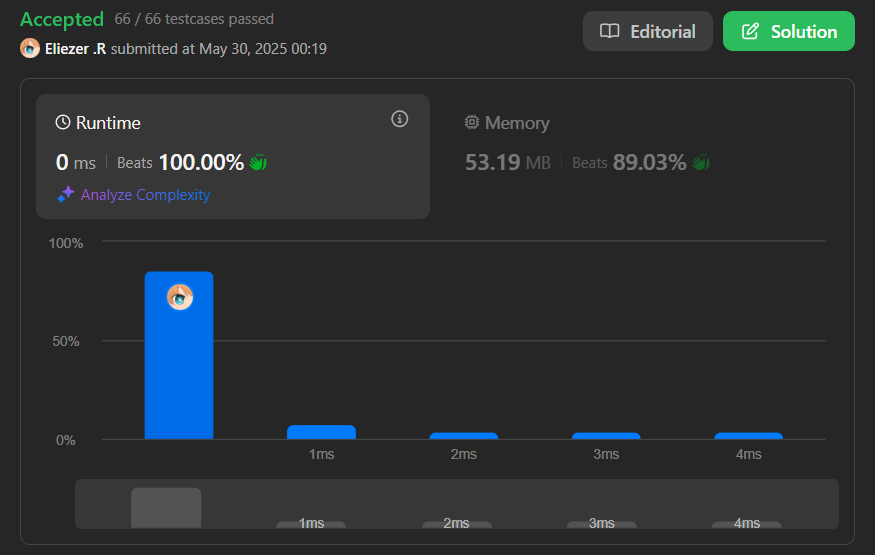

# 35. Search Insert Position

Dado un array ordenado de enteros distintos y un valor objetivo (`target`), devuelve el índice si el objetivo se encuentra. Si no, devuelve el índice donde debería insertarse para mantener el orden.

Debes escribir un algoritmo con complejidad O(log n).

---

## 📋 Ejemplos

**Ejemplo 1:**

- Entrada: `nums = [1,3,5,6]`, `target = 5`
- Salida: `2`

**Ejemplo 2:**

- Entrada: `nums = [1,3,5,6]`, `target = 2`
- Salida: `1`

**Ejemplo 3:**

- Entrada: `nums = [1,3,5,6]`, `target = 7`
- Salida: `4`

---

## 💭 Enfoque y Estrategia

### Análisis del problema

- **Objetivo**: Encontrar el índice del `target` o el índice donde debería insertarse.
- **Restricción**: El array está ordenado y contiene valores distintos.
- **Complejidad requerida**: O(log n), lo que sugiere búsqueda binaria.

### Estrategia implementada: Búsqueda Binaria

1. **Inicialización**: Dos punteros (`inicio` y `fin`) para los extremos del array.
2. **Búsqueda**: Mientras `inicio <= fin`, calcular el punto medio.
3. **Comparación**: 
   - Si `nums[mid] == target`, retornar `mid`.
   - Si `nums[mid] < target`, mover el puntero izquierdo.
   - Si `nums[mid] > target`, mover el puntero derecho.
4. **Retorno**: Si no se encuentra el objetivo, retornar el índice donde debería insertarse (`inicio`).

---

## 🔧 Implementación

```js
const searchInsert = function (nums, target) {
  // Verificamos si el número está dentro del array
  if (nums.includes(target)) {
    // Si está, devolvemos su índice
    return nums.indexOf(target)
  }

  // Usamos dos punteros para la búsqueda binaria
  let init = 0 // Índice inicial
  let final = nums.length - 1 // Índice final

  // Búsqueda binaria
  while (init <= final) {
    // Calculamos el índice del medio
    const mid = Math.floor(init + (final - init) / 2)

    if (nums[mid] === target) {
      // Si encontramos el elemento, retornamos su índice
      return mid
    }

    if (nums[mid] > target) {
      // Si el elemento medio es mayor que target, buscamos en la mitad izquierda
      final = mid - 1
    } else {
      // Si el elemento medio es menor que target, buscamos en la mitad derecha
      init = mid + 1
    }
  }

  // Si no encontramos el elemento, retornamos el índice donde debería insertarse
  return init
}

console.log(searchInsert([1, 3, 5, 6], 2)) // -> 1
```

---

## 📊 Análisis de Rendimiento

### Resultados en LeetCode



---

**Características de la solución:**

- **Algoritmo**: Búsqueda binaria.
- **Complejidad temporal**: O(log n).
- **Complejidad espacial**: O(1).
- **Legibilidad**: Alta, lógica directa y comentarios explicativos.

---

---

## 🎯 Aprendizajes Clave

- **Búsqueda binaria** es ideal para arrays ordenados y permite encontrar o ubicar elementos en tiempo logarítmico.
- El índice de inserción es exactamente el valor de `inicio` cuando termina el ciclo.
- Siempre considerar los casos donde el target es menor que todos o mayor que todos los elementos.

---

> Si quieres saber más sobre el algoritmo de búsqueda binaria, puedes consultar:  
> [https://www.geeksforgeeks.org/binary-search/](https://www.geeksforgeeks.org/binary-search/)

---

## 🏷️ Tags

`Array` `Binary Search` `Logarithmic` `Easy`

---

**Tiempo invertido**: 5 minutos  
**Intentos**: 1  
**Dificultad percibida**: Baja