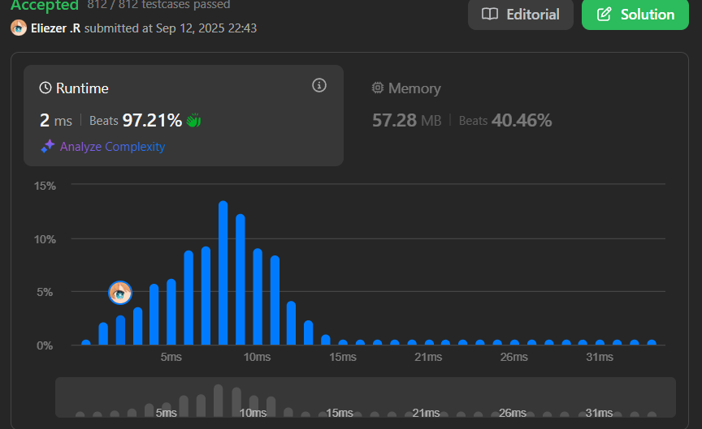

# 3541. Find Most Frequent Vowel and Consonant

Dado un string `s` que consiste en letras minúsculas del inglés (`'a'` a `'z'`), tu tarea es:
- Encontrar la vocal (`'a'`, `'e'`, `'i'`, `'o'`, o `'u'`) con **máxima** frecuencia.
- Encontrar la consonante (todas las otras letras excluyendo vocales) con **máxima** frecuencia.

Devuelve la suma de las dos frecuencias.


**Nota:** Si múltiples vocales o consonantes tienen la misma frecuencia máxima, puedes elegir cualquiera. Si no hay vocales o consonantes en el string, considera su frecuencia como 0.

---

## 📋 Ejemplos

**Ejemplo 1:**

- Entrada: `s = "successes"`
- Salida: `6`
- Explicación: 
  - Las vocales son: `'u'` (frecuencia 1), `'e'` (frecuencia 2). La frecuencia máxima es 2.
  - Las consonantes son: `'s'` (frecuencia 4), `'c'` (frecuencia 2). La frecuencia máxima es 4.
  - La salida es `2 + 4 = 6`.

**Ejemplo 2:**

- Entrada: `s = "aeiaeia"`
- Salida: `3`
- Explicación:
  - Las vocales son: `'a'` (frecuencia 3), `'e'` (frecuencia 2), `'i'` (frecuencia 2). La frecuencia máxima es 3.
  - No hay consonantes en `s`. Por lo tanto, frecuencia máxima de consonantes = 0.
  - La salida es `3 + 0 = 3`.

---

## 💭 Enfoque y Estrategia

- **Objetivo**: Encontrar la frecuencia máxima de vocales y consonantes por separado.
- **Técnica**: Hash Map para contar frecuencias + clasificación de caracteres.
- **Optimización**: Un solo recorrido para contar, otro para encontrar máximos.

La estrategia consiste en primero contar todas las frecuencias usando un Map, luego clasificar cada carácter como vocal o consonante y encontrar la frecuencia máxima en cada categoría.

---

## 🔧 Implementación

```js
const maxFreqSum = function (s) {
    const map = new Map()     // Map para contar frecuencias
    const abc = 'aeiou'       // String con todas las vocales
    let vowel = 0             // Frecuencia máxima de vocales
    let consonant = 0         // Frecuencia máxima de consonantes

    // Primer recorrido: contar frecuencias de cada carácter
    for (let i = 0; i < s.length; i++) {
        map.set(s[i], (map.get(s[i]) || 0) + 1)
    }

    // Segundo recorrido: encontrar frecuencias máximas por categoría
    map.forEach((value, key) => {
        if (abc.includes(key) && value > vowel) {
            vowel = value        // Actualizar máxima frecuencia de vocal
        } else if (value > consonant && !abc.includes(key)) {
            consonant = value    // Actualizar máxima frecuencia de consonante
        }
    });

    return vowel + consonant
}

console.log(maxFreqSum("successes")) // 6

/**
 * Ejemplo paso a paso con s = "successes":
 * 
 * 1. Conteo de frecuencias:
 *    map = {s: 4, u: 1, c: 2, e: 2}
 * 
 * 2. Clasificación y búsqueda de máximos:
 *    's': consonante, 4 > 0 → consonant = 4
 *    'u': vocal, 1 > 0 → vowel = 1  
 *    'c': consonante, 2 < 4 → consonant = 4 (sin cambios)
 *    'e': vocal, 2 > 1 → vowel = 2
 * 
 * 3. Resultado: vowel + consonant = 2 + 4 = 6
 */
```

---

## 📊 Análisis de Rendimiento

- **Complejidad temporal**: O(n + k), donde n es la longitud del string y k es el número de caracteres únicos.
- **Complejidad espacial**: O(k), donde k es el número de caracteres únicos (máximo 26).



*En el peor caso con todos los caracteres únicos: O(n + 26) = O(n).*

---

## 🔄 Enfoque Alternativo con Set

```js
// Versión usando Set para vocales (más eficiente para includes)
const maxFreqSumOptimized = function (s) {
    const map = new Map()
    const vowels = new Set(['a', 'e', 'i', 'o', 'u']) // O(1) lookup
    let maxVowel = 0, maxConsonant = 0

    // Contar frecuencias
    for (const char of s) {
        map.set(char, (map.get(char) || 0) + 1)
    }

    // Encontrar máximos
    for (const [char, freq] of map) {
        if (vowels.has(char)) {
            maxVowel = Math.max(maxVowel, freq)
        } else {
            maxConsonant = Math.max(maxConsonant, freq)
        }
    }

    return maxVowel + maxConsonant
}
```

---

## 🎯 Aprendizajes Clave

- **Map para frecuencias**: Estructura de datos ideal para conteo de elementos.
- **Clasificación de caracteres**: Uso eficiente de `includes()` o `Set.has()` para categorizar.
- **Separación de responsabilidades**: Primer loop para contar, segundo para procesar.
- **Inicialización en 0**: Manejo correcto de casos donde no existen vocales o consonantes.
- **forEach vs for...of**: Ambos son válidos, `for...of` con destructuring es más moderno.

---

## 🔍 Casos Edge

- Solo vocales: `"aeiou"` → vowel > 0, consonant = 0
- Solo consonantes: `"bcdfg"` → vowel = 0, consonant > 0  
- String de un carácter: `"a"` → vowel = 1, consonant = 0
- Caracteres repetidos: `"aaaa"` → vowel = 4, consonant = 0
- Mix equilibrado: `"abab"` → vowel = 2, consonant = 2

---

## 🚀 Optimizaciones Menores

- Usar `Set` en lugar de `string.includes()` para mejor performance en lookups
- Usar `Math.max()` en lugar de comparaciones manuales
- Usar `for...of` con destructuring para mejor legibilidad

---

## 🏷️ Tags

`String` `Hash Table` `Counting` `Easy`

---

**Tiempo invertido**: 15 minutos  
**Intentos**: 1  
**Dificultad percibida**: Easy