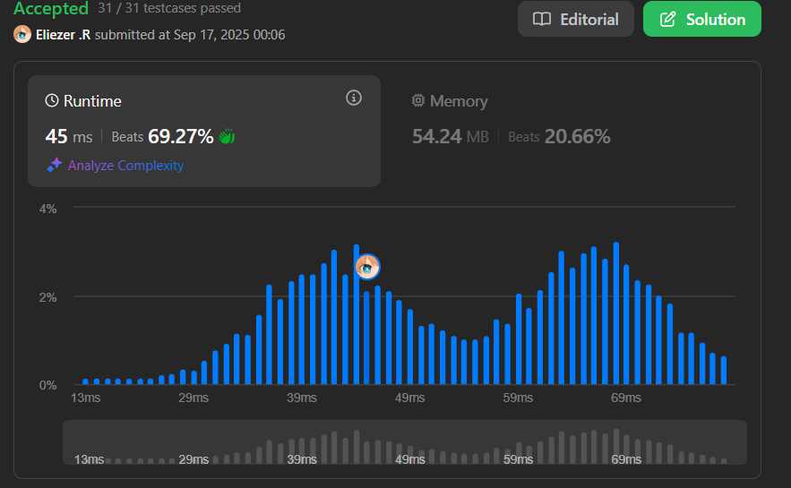

# 509. Fibonacci Number

Los **números de Fibonacci**, comúnmente denotados `F(n)` forman una secuencia, llamada **secuencia de Fibonacci**, tal que cada número es la suma de los dos precedentes, comenzando desde `0` y `1`. Es decir,

```
F(0) = 0, F(1) = 1
F(n) = F(n - 1) + F(n - 2), para n > 1.
```

Dado `n`, calcula `F(n)`.

**Dificultad:** Easy

---

## 📋 Ejemplos

**Ejemplo 1:**

- Entrada: `n = 2`
- Salida: `1`
- Explicación: `F(2) = F(1) + F(0) = 1 + 0 = 1`.

**Ejemplo 2:**

- Entrada: `n = 3`
- Salida: `2`
- Explicación: `F(3) = F(2) + F(1) = 1 + 1 = 2`.

**Ejemplo 3:**

- Entrada: `n = 4`
- Salida: `3`
- Explicación: `F(4) = F(3) + F(2) = 2 + 1 = 3`.

---

## 💭 Enfoque y Estrategia

- **Objetivo**: Calcular el n-ésimo número de Fibonacci de forma eficiente.
- **Insight clave**: Solo necesitamos los dos números anteriores, no toda la secuencia.
- **Técnica**: Iteración con dos variables que van "rodando" los valores.
- **Optimización**: O(n) tiempo y O(1) espacio en lugar de recursión O(2^n).

La estrategia evita la recursión costosa manteniendo solo los dos valores anteriores necesarios para calcular el siguiente número de Fibonacci.

---

## 🔧 Implementación

```js
const fib = function (n) {
    let fib = 0    // Variable para almacenar el resultado
    let n1 = 0     // F(i-2): penúltimo número de Fibonacci
    let n2 = 1     // F(i-1): último número de Fibonacci
    
    // Casos base
    if (n <= 0) return 0
    if (n === 1) return 1
    
    // Calcular iterativamente desde F(2) hasta F(n)
    for (let i = 1; i < n; i++) {
        fib = n1 + n2    // F(i) = F(i-2) + F(i-1)
        n1 = n2          // Actualizar F(i-2) para siguiente iteración
        n2 = fib         // Actualizar F(i-1) para siguiente iteración
    }
    
    return fib
}

console.log(fib(4)) // 3

/**
 * Ejemplo paso a paso con n = 4:
 * 
 * Inicial: n1=0, n2=1, fib=0
 * 
 * i=1: fib = 0+1 = 1, n1=1, n2=1  → F(2) = 1
 * i=2: fib = 1+1 = 2, n1=1, n2=2  → F(3) = 2  
 * i=3: fib = 1+2 = 3, n1=2, n2=3  → F(4) = 3
 * 
 * Secuencia: F(0)=0, F(1)=1, F(2)=1, F(3)=2, F(4)=3
 * Resultado: 3
 */
```

---

## 📊 Análisis de Rendimiento

- **Complejidad temporal**: O(n), donde n es el número de Fibonacci a calcular.
- **Complejidad espacial**: O(1), solo usamos variables auxiliares constantes.


*Comparado con recursión naive O(2^n), esta solución es exponencialmente más eficiente.*

---

## 🔄 Enfoques Alternativos

**Recursión con Memoización:**
```js
const fibMemo = function(n, memo = {}) {
    if (n <= 1) return n
    if (memo[n]) return memo[n]
    
    memo[n] = fibMemo(n-1, memo) + fibMemo(n-2, memo)
    return memo[n]
}
// O(n) tiempo, O(n) espacio
```

**Recursión naive (ineficiente):**
```js
const fibNaive = function(n) {
    if (n <= 1) return n
    return fibNaive(n-1) + fibNaive(n-2)
}
// O(2^n) tiempo - muy lento
```

---

## 🎯 Aprendizajes Clave

- **Optimización iterativa**: Convertir recursión en iteración para mejor performance.
- **Espacio constante**: Solo mantener las variables necesarias para el próximo cálculo.
- **Casos base**: Manejar correctamente F(0)=0 y F(1)=1.
- **Rolling variables**: Técnica de "rodar" variables para secuencias que dependen de valores anteriores.
- **Trade-off tiempo-espacio**: Sacrificar un poco de legibilidad por eficiencia significativa.

---

## 🔍 Casos Edge

- `n = 0`: Debe retornar `0`
- `n = 1`: Debe retornar `1`
- `n = 2`: Primer caso donde se aplica la fórmula F(2) = F(1) + F(0) = 1
- Números grandes: Con n=30, la recursión naive sería impracticable

---

## 🧮 Secuencia de Fibonacci

```
F(0) = 0
F(1) = 1
F(2) = 1
F(3) = 2
F(4) = 3
F(5) = 5
F(6) = 8
F(7) = 13
F(8) = 21
F(9) = 34
F(10) = 55
```

---

## 🏷️ Tags

`Math` `Dynamic Programming` `Recursion` `Easy`

---

**Tiempo invertido**: 10 minutos  
**Intentos**: 2  
**Dificultad percibida**: Easy