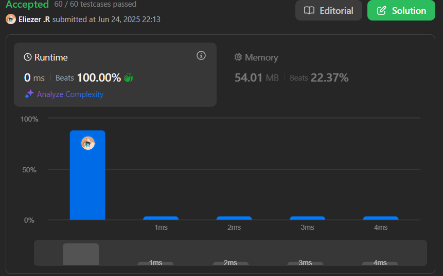

# 58. Length of Last Word

Dada una cadena `s` que consiste en palabras y espacios, devuelve la longitud de la última palabra en la cadena.

Una palabra es una subcadena máxima que consiste solo en caracteres no espaciales.

---

## 📋 Ejemplos

**Ejemplo 1:**

- Entrada: `s = "Hello World"`
- Salida: `5`
- Explicación: La última palabra es `"World"` y su longitud es 5.

**Ejemplo 2:**

- Entrada: `s = "   fly me   to   the moon  "`
- Salida: `4`
- Explicación: La última palabra es `"moon"` y su longitud es 4.

**Ejemplo 3:**

- Entrada: `s = "luffy is still joyboy"`
- Salida: `6`
- Explicación: La última palabra es `"joyboy"` y su longitud es 6.

---

## 💭 Enfoque y Estrategia

### Análisis del problema

- **Objetivo**: Encontrar la longitud de la última palabra en la cadena.
- **Restricción**: Puede haber espacios al inicio, entre palabras y al final.
- **Salida**: Un número entero representando la longitud de la última palabra.

---

## 🔧 Implementación

```js
const lengthOfLastWord = function (s) {
  s = s.trim() // Eliminamos los espacios
  return s.split(' ')[s.split(' ').length - 1].length
  /**  Breve explicacion lo primero que se ve es s.plit(' ') estoy ya nos da una cadena como esta  [
  'fly', 'me',  '',
  '',    'to',  '',
  '',    'the', 'moon'
] */
// luego buscamos la ultima palabra con s.split(' ') ya que con s.length lo que estamos haciendo es cojer la longitud del string entero y no es lo que queremos, luego s.plit(' ').length - 1 no da la ultima posicion gracias al .length - 1
// Luego al final solo nos toca que nos de la longitud con .length
}

console.log(lengthOfLastWord('   fly me   to   the moon  ')) // moon.length = 4
```

---

## 📊 Análisis de Rendimiento

- **Complejidad temporal**: O(n), donde n es la longitud de la cadena.
- **Complejidad espacial**: O(n), por el uso de split.


---

## 🎯 Aprendizajes Clave

- El método `trim()` elimina espacios al inicio y final de la cadena.
- `split(' ')` permite separar las palabras fácilmente.
- Acceder a la última palabra con `array.length - 1` es directo y eficiente.

---

## 🏷️ Tags

`String` 

---

**Tiempo invertido**: 1 min
**Intentos**: 1  
**Dificultad percibida**: Muy fácil