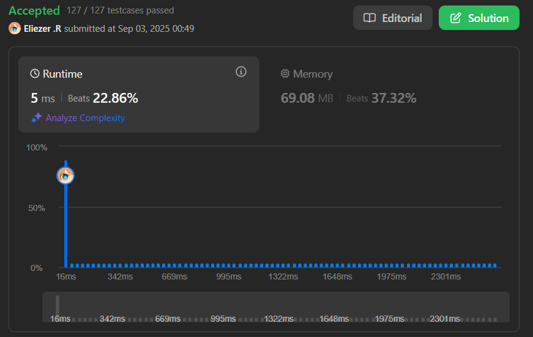

# 643. Maximum Average Subarray I

Dado un array de enteros `nums` y un entero `k`, encuentra el promedio máximo de cualquier subarray contiguo de longitud `k`.

---

## 📋 Ejemplos

**Ejemplo 1:**

- Entrada: `nums = [1,12,-5,-6,50,3]`, `k = 4`
- Salida: `12.75`
- Explicación: El subarray `[12,-5,-6,50]` tiene el promedio máximo: (12 + -5 + -6 + 50) / 4 = 51 / 4 = 12.75

**Ejemplo 2:**

- Entrada: `nums = [5]`, `k = 1`
- Salida: `5.0`

---

## 💭 Enfoque y Estrategia

- **Objetivo**: Encontrar el promedio máximo de cualquier subarray de longitud `k`.
- **Restricción**: El subarray debe ser contiguo.
- **Salida**: Un número decimal representando el promedio máximo.

La estrategia óptima es usar una ventana deslizante (sliding window) para mantener la suma de los últimos `k` elementos y actualizar el promedio máximo en cada paso.

---

## 🔧 Implementación

```js
const findMaxAverage = function (nums, k) {
  // Calculamos la suma de los primeros k elementos
  let sum = nums.slice(0, k).reduce((acc, v) => acc + v, 0)
  let maxSum = sum // Guardamos la suma máxima encontrada hasta ahora
  let left = 0     // Puntero izquierdo de la ventana deslizante

  // Recorremos el array desde el elemento k hasta el final
  for (let i = k; i < nums.length; i++) {
    // Actualizamos la suma: restamos el elemento que sale y sumamos el que entra
    sum = sum - nums[left] + nums[i]
    left++ // Movemos el puntero izquierdo

    // Si la nueva suma es mayor que la máxima, la actualizamos
    if (sum > maxSum) maxSum = sum
  }

  // Devolvemos el promedio máximo encontrado
  return maxSum / k
}

console.log(findMaxAverage([1, 12, -5, -6, 50, 3], 4)) // 12.75

/**
 * Ejemplo paso a paso con nums = [1, 12, -5, -6, 50, 3], k = 4:
 * sum = 1 + 12 + (-5) + (-6) = 2
 * maxSum = 2
 * i=4: sum = 2 - 1 + 50 = 51, left=1, maxSum=51
 * i=5: sum = 51 - 12 + 3 = 42, left=2, maxSum=51
 * Resultado final: maxSum/k = 51/4 = 12.75
 */
```

---

## 📊 Análisis de Rendimiento

- **Complejidad temporal**: O(n), donde n es la longitud del array.
- **Complejidad espacial**: O(1), solo se usan variables auxiliares.



---

## 🎯 Aprendizajes Clave

- El patrón de ventana deslizante es ideal para problemas de subarrays contiguos.
- Actualizar la suma en cada paso evita recalcular desde cero y mejora la eficiencia.
- Es importante comparar y actualizar el máximo en cada iteración.

---

## 🏷️ Tags

`Array` `Sliding Window` `Easy`

---

**Tiempo invertido**: 20 minutos  
**Intentos**: 2  
**Dificultad percibida**: Fácil