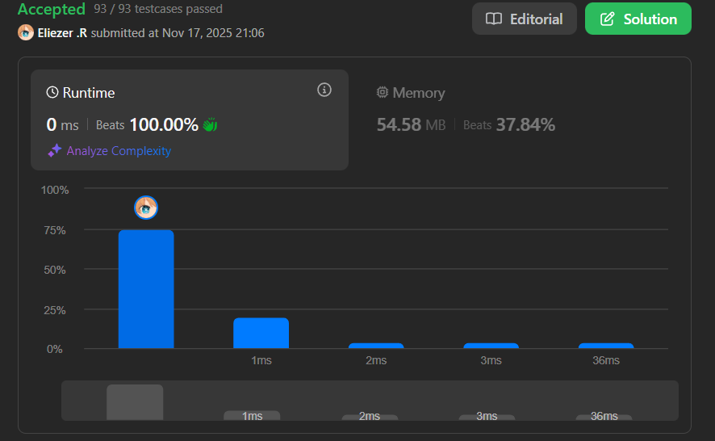

# 717. 1-bit and 2-bit Characters

Tenemos dos caracteres especiales:

- El primer carácter puede representarse con **un bit**: `0`
- El segundo carácter puede representarse con **dos bits**: `10` o `11`

Dada una cadena binaria representada por varios bits, retorna `true` si el **último carácter debe ser un carácter de un bit**.

La cadena dada **siempre terminará con un cero**.

**Dificultad:** Easy

---

## 📋 Ejemplos

**Ejemplo 1:**

- Entrada: `bits = [1, 0, 0]`
- Salida: `true`
- Explicación: La única forma de decodificarlo es: carácter de dos bits (`10`) + carácter de un bit (`0`). Por lo tanto, el último carácter es de un bit.

**Ejemplo 2:**

- Entrada: `bits = [1, 1, 1, 0]`
- Salida: `false`
- Explicación: La única forma de decodificarlo es: carácter de dos bits (`11`) + carácter de dos bits (`10`). Por lo tanto, el último carácter NO es de un bit.

---

## 💭 Enfoque y Estrategia

- **Objetivo**: Determinar si al decodificar la cadena, el último carácter es de 1 bit (solo `0`).
- **Insight clave**: Las reglas de decodificación son determinísticas:
  - Si encontramos `0` → es un carácter de 1 bit, avanzar 1 posición
  - Si encontramos `1` → DEBE ser parte de un carácter de 2 bits, avanzar 2 posiciones
- **Técnica**: Simulación de decodificación desde el inicio hasta el penúltimo elemento.
- **Retos**: Asegurar que terminemos exactamente en el último elemento (no más allá).

La solución simula el proceso de decodificación: si después de procesar todos los caracteres llegamos exactamente al último índice, significa que el último `0` forma su propio carácter de 1 bit.

---

## 🔧 Implementación

```javascript
var isOneBitCharacter = function(bits) {
    let i = 0;
    
    // Procesar todos los bits excepto el último
    while (i < bits.length - 1) {
        if (bits[i] === 0) {
            // Carácter de 1 bit: '0'
            i += 1;
        } else {
            // Carácter de 2 bits: '10' o '11'
            i += 2;
        }
    }
    
    // Si terminamos exactamente en el último índice,
    // el último '0' forma su propio carácter de 1 bit
    return i === bits.length - 1;
};

console.log(isOneBitCharacter([1, 0, 0])); // true

/**
 * Ejemplo paso a paso con bits = [1, 0, 0]:
 * Índices:  0  1  2
 * Array:   [1, 0, 0]
 * 
 * Estado inicial: i = 0
 * 
 * Iteración 1:
 *   i = 0 < 2 ✓
 *   bits[0] = 1 → carácter de 2 bits
 *   Decodificación: "10" (índices 0-1)
 *   i = 0 + 2 = 2
 * 
 * Condición del bucle:
 *   i = 2 < 2 ✗ → salir del bucle
 * 
 * Verificación final:
 *   i === bits.length - 1
 *   2 === 2 ✓
 *   return true
 * 
 * Explicación:
 * - Decodificamos "10" (índices 0-1)
 * - Quedó "0" (índice 2) sin procesar
 * - Como i apunta exactamente al último elemento,
 *   ese "0" es un carácter independiente de 1 bit
 * 
 * 
 * Ejemplo paso a paso con bits = [1, 1, 1, 0]:
 * Índices:  0  1  2  3
 * Array:   [1, 1, 1, 0]
 * 
 * Estado inicial: i = 0
 * 
 * Iteración 1:
 *   i = 0 < 3 ✓
 *   bits[0] = 1 → carácter de 2 bits
 *   Decodificación: "11" (índices 0-1)
 *   i = 0 + 2 = 2
 * 
 * Iteración 2:
 *   i = 2 < 3 ✓
 *   bits[2] = 1 → carácter de 2 bits
 *   Decodificación: "10" (índices 2-3)
 *   i = 2 + 2 = 4
 * 
 * Condición del bucle:
 *   i = 4 < 3 ✗ → salir del bucle
 * 
 * Verificación final:
 *   i === bits.length - 1
 *   4 === 3 ✗
 *   return false
 * 
 * Explicación:
 * - Decodificamos "11" (índices 0-1)
 * - Decodificamos "10" (índices 2-3)
 * - El "0" final formó parte del carácter de 2 bits "10"
 * - Por lo tanto, NO es un carácter independiente de 1 bit
 */
```

---

## 📊 Análisis de Rendimiento

- **Complejidad temporal**: O(n), donde n es la longitud del array.
- **Complejidad espacial**: O(1), solo usamos una variable auxiliar.


*Esta solución es óptima ya que necesitamos procesar cada elemento al menos una vez.*

---

## 🔧 Detalles Técnicos Importantes

**Reglas de Decodificación:**

```
Bit actual → Acción
─────────────────────
    0     → Avanzar 1 posición (carácter de 1 bit)
    1     → Avanzar 2 posiciones (carácter de 2 bits: '10' o '11')
```

**¿Por qué funciona este enfoque?**

La decodificación es **determinística y greedy**:
- Cuando vemos un `1`, SABEMOS que forma parte de un carácter de 2 bits
- Cuando vemos un `0`, SABEMOS que es un carácter completo de 1 bit
- No hay ambigüedad en la decodificación

**Condición de retorno:**

```javascript
return i === bits.length - 1;
```

Verificamos si `i` apunta **exactamente** al último elemento:
- `i === length - 1`: El último `0` es un carácter independiente → `true`
- `i > length - 1`: El último `0` fue consumido por un carácter de 2 bits → `false`
- `i < length - 1`: Imposible, ya que el bucle continúa hasta `i >= length - 1`

**Visualización:**

```
Caso 1: [1, 0, 0]
        ╔══╗  ╔╗
         10    0  ← último '0' es independiente
        └─┬┘  └┬┘
        i=2   length-1=2 → i === length-1 ✓

Caso 2: [1, 1, 1, 0]
        ╔══╗  ╔═══╗
         11    10   ← último '0' es parte de '10'
        └─┬┘  └──┬┘
             i=4, length-1=3 → i > length-1 ✗
```

---

## 🎯 Aprendizajes Clave

- **Decodificación greedy**: Procesar secuencialmente sin necesidad de backtracking.
- **Simulación directa**: No necesitamos almacenar los caracteres decodificados.
- **Condición de parada elegante**: Solo verificar dónde termina el puntero.
- **Determinismo**: Las reglas de decodificación son inequívocas.

---

## 🔍 Casos Edge

- **Array mínimo**: `[0]` → `true` (un solo carácter de 1 bit)
- **Dos elementos**: `[1, 0]` → `false` (forma "10", carácter de 2 bits)
- **Tres elementos**: `[0, 0, 0]` → `true` (tres caracteres de 1 bit)
- **Todos unos excepto último**: `[1, 1, 1, 1, 0]` → `false`
- **Alternados**: `[1, 0, 1, 0]` → `false` ("10" + "10")
- **Solo ceros**: `[0, 0]` → `true` ("0" + "0")

---

## 🧮 Ejemplos Adicionales

```javascript
[0]           → true   (un solo '0')
[1, 0]        → false  (carácter '10')
[0, 0]        → true   ('0' + '0')
[1, 1, 0]     → true   ('11' + '0')
[0, 1, 0]     → false  ('0' + '10')
[1, 0, 1, 0]  → false  ('10' + '10')
```

**Verificación de [0, 1, 0]:**
```
i = 0, bits[0] = 0 → i = 1
i = 1, bits[1] = 1 → i = 3
i = 3 === length - 1? (3 === 2) ✗
return false ✓
```

---

## 🚀 Variante Alternativa: Versión Compacta

Una versión más compacta usando el truco `i += bits[i] + 1`:

```javascript
var isOneBitCharacter = function(bits) {
    let i = 0;
    while (i < bits.length - 1) {
        i += bits[i] + 1;
    }
    return i === bits.length - 1;
};
```

**¿Cómo funciona `i += bits[i] + 1`?**
- Si `bits[i] === 0`: `i += 0 + 1 = i + 1` (avanzar 1)
- Si `bits[i] === 1`: `i += 1 + 1 = i + 2` (avanzar 2)

Esto es más conciso pero menos legible que la versión con `if-else`.

---

## 🔬 Enfoque Alternativo: Desde Atrás

Podemos resolver el problema analizando desde el final:

```javascript
var isOneBitCharacterReverse = function(bits) {
    let i = bits.length - 2; // Empezar desde el penúltimo elemento
    
    // Contar cuántos '1's consecutivos hay antes del último '0'
    while (i >= 0 && bits[i] === 1) {
        i--;
    }
    
    // Si hay un número PAR de '1's, el último '0' es independiente
    // Si hay un número IMPAR de '1's, el último '0' es parte de un par
    return (bits.length - 1 - i) % 2 === 0;
};
```

**Explicación:**
- `[1, 1, 1, 0]`: 3 unos (impar) → el último `0` forma `10` → `false`
- `[1, 1, 0]`: 2 unos (par) → los unos se emparejan (`11`), el `0` es independiente → `true`

Este enfoque es más eficiente cuando hay muchos unos al final, pero menos intuitivo.

---

## 💡 Comparación de Enfoques

| Enfoque | Complejidad | Legibilidad | Cuándo usar |
|---------|-------------|-------------|-------------|
| **Forward Greedy** (presentado) | O(n) | ⭐⭐⭐⭐⭐ | Siempre (más intuitivo) |
| **Compacto** (`bits[i] + 1`) | O(n) | ⭐⭐⭐ | Para código más corto |
| **Reverse Counting** | O(k) donde k = unos al final | ⭐⭐ | Optimización específica |

---

## 🧠 Intuición del Problema

**¿Por qué funciona la simulación forward?**

Imagina que estás leyendo un mensaje codificado:
1. Si ves `0` → es una letra completa
2. Si ves `1` → necesitas leer el siguiente bit también

Al final:
- Si terminaste **justo antes** del último `0` → ese `0` es una letra independiente
- Si terminaste **pasando** el último `0` → ese `0` ya fue leído como parte de una letra de 2 bits

**Analogía:**
```
Mensaje: [1, 0, 0]
Lectura: "Veo un 1, leo siguiente también → '10'"
         "Ahora estoy en posición 2"
         "¿Hay algo más? Sí, un '0' en posición 2"
         "Ese '0' es un mensaje independiente" ✓
```

---

## 🔢 Análisis Matemático

Para un array de longitud `n`:
- Última posición válida: `n - 1`
- Procesamos hasta `i < n - 1`
- Si `i === n - 1`: el último elemento no fue consumido
- Si `i > n - 1`: el último elemento fue consumido

**Invariante del bucle:**
Después del bucle, `i` apunta a:
- La primera posición no procesada, O
- Más allá del array (si el último elemento fue consumido)

---

## 🏷️ Tags

`Array` `Greedy` `Simulation` `Easy`

---