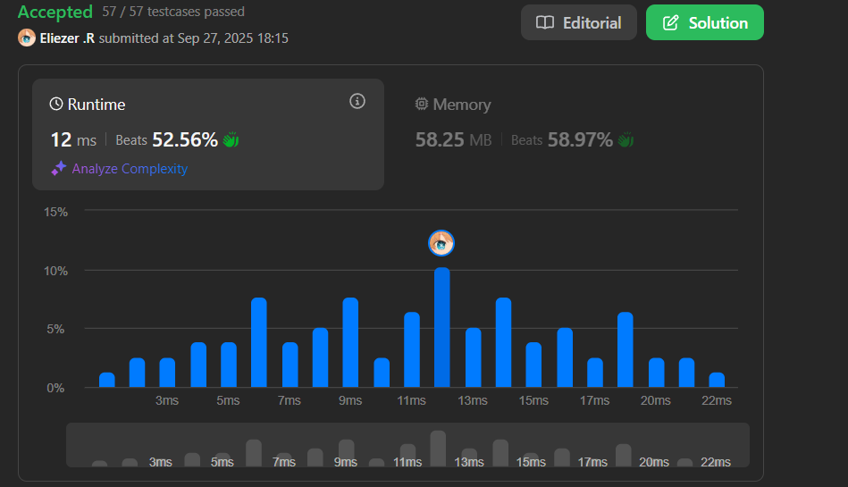

# 812. Largest Triangle Area

Dado un array de puntos en el plano X-Y `points` donde `points[i] = [xi, yi]`, retorna el **área del triángulo más grande** que puede formarse por cualquier tres puntos diferentes.

Las respuestas dentro de `10⁻⁵` de la respuesta actual serán aceptadas.

**Dificultad:** Easy

---

## 📋 Ejemplos

**Ejemplo 1:**

- Entrada: `points = [[0,0],[0,1],[1,0],[0,2],[2,0]]`
- Salida: `2.00000`
- Explicación: Los cinco puntos se muestran en la figura. El triángulo rojo es el más grande.

**Ejemplo 2:**

- Entrada: `points = [[1,0],[0,0],[0,1]]`
- Salida: `0.50000`

---

## 💭 Enfoque y Estrategia

- **Objetivo**: Encontrar el área máxima entre todas las combinaciones posibles de 3 puntos.
- **Técnica**: Fuerza bruta con tres bucles anidados para generar todas las combinaciones.
- **Fórmula del área**: Usar la fórmula del determinante para calcular área de triángulo.
- **Optimización**: Para problemas pequeños (≤50 puntos), fuerza bruta es aceptable.

La estrategia utiliza la fórmula matemática del área de un triángulo basada en coordenadas: `|x₁(y₂-y₃) + x₂(y₃-y₁) + x₃(y₁-y₂)| / 2`

---

## 🔧 Implementación

```js
const largestTriangleArea = function(points) {
    // Función auxiliar para calcular área usando fórmula del determinante
    const calculateArea = function (point1, point2, point3) {
        const [x1, y1] = point1
        const [x2, y2] = point2
        const [x3, y3] = point3

        // Fórmula: |x1(y2-y3) + x2(y3-y1) + x3(y1-y2)| / 2
        return Math.abs(x1 * (y2 - y3) + x2 * (y3 - y1) + x3 * (y1 - y2)) / 2
    }
    
    let max = 0  // Área máxima encontrada

    // Generar todas las combinaciones de 3 puntos
    for (let i = 0; i < points.length - 2; i++) {
        for (let j = i + 1; j < points.length - 1; j++) {
            for (let k = j + 1; k < points.length; k++) {
                const area = calculateArea(points[i], points[j], points[k])
                max = Math.max(area, max)  // Actualizar máximo
            }
        }
    }

    return max
}

console.log(largestTriangleArea([[0,0],[0,1],[1,0],[0,2],[2,0]])) // 2.0

/**
 * Ejemplo paso a paso con points = [[0,0],[0,1],[1,0],[0,2],[2,0]]:
 * 
 * Combinaciones de 3 puntos:
 * 1. [0,0], [0,1], [1,0]:
 *    área = |0*(1-0) + 0*(0-0) + 1*(0-1)| / 2 = |0+0-1| / 2 = 0.5
 * 
 * 2. [0,0], [0,1], [0,2]:
 *    área = |0*(1-2) + 0*(2-0) + 0*(0-1)| / 2 = |0+0+0| / 2 = 0
 *    (puntos colineales = área 0)
 * 
 * 3. [0,0], [0,1], [2,0]:
 *    área = |0*(1-0) + 0*(0-0) + 2*(0-1)| / 2 = |0+0-2| / 2 = 1
 * 
 * 4. [0,0], [1,0], [0,2]:
 *    área = |0*(0-2) + 1*(2-0) + 0*(0-0)| / 2 = |0+2+0| / 2 = 1
 * 
 * 5. [0,0], [1,0], [2,0]:
 *    área = |0*(0-0) + 1*(0-0) + 2*(0-0)| / 2 = |0+0+0| / 2 = 0
 *    (puntos colineales)
 * 
 * 6. [0,0], [0,2], [2,0]:
 *    área = |0*(2-0) + 0*(0-0) + 2*(0-2)| / 2 = |0+0-4| / 2 = 2 ← máximo
 * 
 * 7-10. Otras combinaciones...
 * 
 * Resultado: max = 2.0
 */
```

---

## 📊 Análisis de Rendimiento

- **Complejidad temporal**: O(n³), donde n es el número de puntos (generar todas las combinaciones).
- **Complejidad espacial**: O(1), solo variables auxiliares.


*Para el límite del problema (n ≤ 50), esto resulta en máximo ~20,000 operaciones, totalmente aceptable.*

---

## 🧮 Fórmula Matemática del Área

**Fórmula del Determinante:**
```
Área = |x₁(y₂-y₃) + x₂(y₃-y₁) + x₃(y₁-y₂)| / 2
```

**Derivación de la fórmula:**
- Basada en el producto cruz de vectores
- Equivalente a calcular la mitad del valor absoluto del determinante:
```
|x₁  y₁  1|
|x₂  y₂  1| / 2
|x₃  y₃  1|
```

**Casos especiales:**
- Si el resultado es 0, los puntos son **colineales** (están en línea recta)
- Si es negativo, tomamos valor absoluto (orientación no importa para el área)

---

## 🎯 Aprendizajes Clave

- **Fuerza bruta eficiente**: Para problemas con límites pequeños, la simplicidad vale la pena.
- **Fórmula del determinante**: Método directo para calcular área sin vectores complejos.
- **Combinaciones vs permutaciones**: Solo necesitamos combinaciones, no importa el orden.
- **Precision floating**: Math.abs() maneja correctamente la orientación del triángulo.
- **Optimización innecesaria**: Con n≤50, optimizaciones complejas no agregan valor.

---

## 🔄 Enfoques Alternativos

**Usando Producto Cruz:**
```js
const calculateAreaCross = function(p1, p2, p3) {
    // Vectores desde p1 a p2 y p1 a p3
    const v1 = [p2[0] - p1[0], p2[1] - p1[1]]
    const v2 = [p3[0] - p1[0], p3[1] - p1[1]]
    
    // Producto cruz en 2D = determinante
    const cross = v1[0] * v2[1] - v1[1] * v2[0]
    return Math.abs(cross) / 2
}
```

**Fórmula de Herón (menos eficiente):**
```js
const calculateAreaHeron = function(p1, p2, p3) {
    // Calcular las 3 distancias entre puntos
    const a = Math.sqrt((p2[0]-p3[0])**2 + (p2[1]-p3[1])**2)
    const b = Math.sqrt((p1[0]-p3[0])**2 + (p1[1]-p3[1])**2)  
    const c = Math.sqrt((p1[0]-p2[0])**2 + (p1[1]-p2[1])**2)
    
    // Semi-perímetro
    const s = (a + b + c) / 2
    
    // Fórmula de Herón
    return Math.sqrt(s * (s-a) * (s-b) * (s-c))
}
```

---

## 🔍 Casos Edge

- **3 puntos colineales**: Área = 0 (puntos en línea recta)
- **Solo 3 puntos**: Un solo triángulo posible
- **Puntos duplicados**: El problema garantiza que no hay duplicados
- **Triángulo muy pequeño**: La precisión de 10⁻⁵ maneja casos límite

---

## 🧠 Visualización Geométrica

```
Ejemplo: points = [[0,0],[0,2],[2,0]]

    |
  2 *     
    |     
  1 |     
    |     
  0 *-----*-----
    0  1  2

Triángulo formado: área = base × altura / 2 = 2 × 2 / 2 = 2
Usando fórmula: |0*(2-0) + 0*(0-0) + 2*(0-2)| / 2 = 4/2 = 2 ✓
```

---

## 🏷️ Tags

`Array` `Math` `Geometry` `Easy`

---

**Tiempo invertido**: 20 minutos  
**Intentos**: 1  
**Dificultad percibida**: Easy