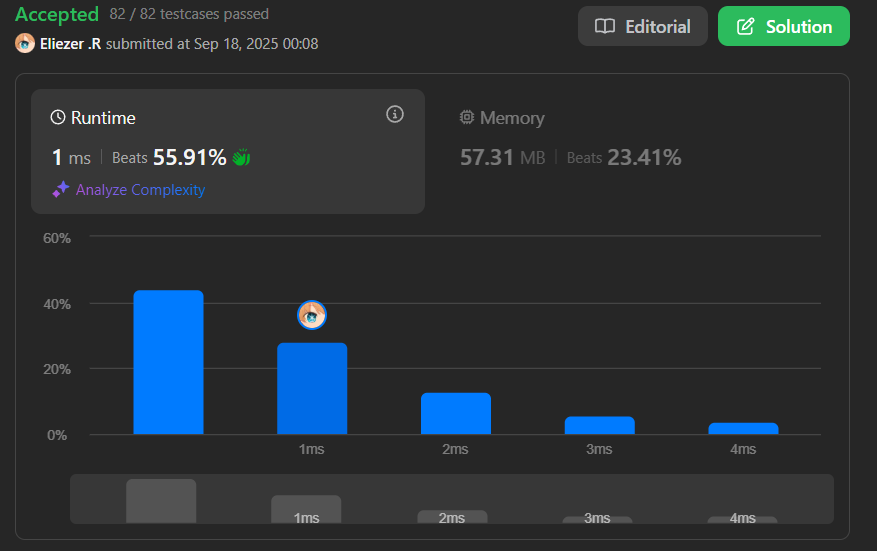

# 832. Flipping an Image

Dada una matriz binaria `n x n` llamada `image`, voltea la imagen **horizontalmente**, luego inviértela, y retorna *la imagen resultante*.

Voltear una imagen horizontalmente significa que cada fila de la imagen se invierte.
- Por ejemplo, voltear `[1,1,0]` horizontalmente resulta en `[0,1,1]`.

Invertir una imagen significa que cada `0` se reemplaza por `1`, y cada `1` se reemplaza por `0`.
- Por ejemplo, invertir `[0,1,1]` resulta en `[1,0,0]`.

**Dificultad:** Easy

---

## 📋 Ejemplos

**Ejemplo 1:**

- Entrada: `image = [[1,1,0],[1,0,1],[0,0,0]]`
- Salida: `[[1,0,0],[0,1,0],[1,1,1]]`
- Explicación: 
  - Primero invertir cada fila: `[[0,1,1],[1,0,1],[0,0,0]]`
  - Luego, invertir la imagen: `[[1,0,0],[0,1,0],[1,1,1]]`

**Ejemplo 2:**

- Entrada: `image = [[1,1,0,0],[1,0,0,1],[0,1,1,1],[1,0,1,0]]`
- Salida: `[[1,1,0,0],[0,1,1,0],[0,0,0,1],[1,0,1,0]]`

---

## 💭 Enfoque y Estrategia

- **Objetivo**: Combinar flip horizontal + inversión de bits en una sola operación.
- **Insight clave**: Podemos hacer ambas operaciones simultáneamente usando XOR y swapping.
- **Técnica**: Dos punteros desde los extremos + operación XOR para inversión.
- **Optimización**: Una sola pasada por cada fila en lugar de dos operaciones separadas.

La estrategia optimiza el proceso combinando el flip (swap de extremos) con la inversión (XOR con 1) en una sola operación por cada par de elementos.

---

## 🔧 Implementación

```js
const flipAndInvertImage = function (image) {
    // Procesar cada fila de la imagen
    for (let i = 0; i < image.length; i++) {
        let end = image[i].length - 1  // Índice del último elemento
        
        // Procesar hasta la mitad de la fila (incluyendo elemento central si existe)
        for (let j = 0; j < Math.ceil(image.length / 2); j++) {
            // Combinar flip + invert en una operación
            const temp = image[i][j] ^ 1        // Invertir elemento izquierdo
            image[i][j] = image[i][end - j] ^ 1 // Mover e invertir elemento derecho
            image[i][end - j] = temp            // Colocar elemento izquierdo invertido
        }
    }
    return image
}

console.log(flipAndInvertImage([[1,1,0],[1,0,1],[0,0,0]]))
// [[1,0,0],[0,1,0],[1,1,1]]

/**
 * Ejemplo paso a paso con image = [[1,1,0],[1,0,1],[0,0,0]]:
 * 
 * Fila 0: [1,1,0]
 * j=0: temp=1^1=0, image[0][0]=0^1=1, image[0][2]=0 → [1,1,1] 
 * j=1: temp=1^1=0, image[0][1]=1^1=0, image[0][1]=0 → [1,0,1]
 * Resultado fila 0: [1,0,0]
 * 
 * Fila 1: [1,0,1] 
 * j=0: temp=1^1=0, image[1][0]=1^1=0, image[1][2]=0 → [0,0,0]
 * j=1: temp=0^1=1, image[1][1]=0^1=1, image[1][1]=1 → [0,1,0]  
 * Resultado fila 1: [0,1,0]
 * 
 * Fila 2: [0,0,0]
 * j=0: temp=0^1=1, image[2][0]=0^1=1, image[2][2]=1 → [1,0,1]
 * j=1: temp=0^1=1, image[2][1]=0^1=1, image[2][1]=1 → [1,1,1]
 * Resultado fila 2: [1,1,1]
 * 
 * Resultado final: [[1,0,0],[0,1,0],[1,1,1]]
 */
```

---

## 📊 Análisis de Rendimiento

- **Complejidad temporal**: O(n²), donde n es el tamaño de la matriz cuadrada.
- **Complejidad espacial**: O(1), modificación in-place sin espacio adicional.


*Operación óptima que combina ambas transformaciones en una sola pasada.*

---

## 🔄 Enfoques Alternativos

**Dos pasos separados:**
```js
const flipAndInvertTwoSteps = function(image) {
    // Paso 1: Flip horizontal
    for (let i = 0; i < image.length; i++) {
        image[i] = image[i].reverse()
    }
    
    // Paso 2: Invert
    for (let i = 0; i < image.length; i++) {
        for (let j = 0; j < image[i].length; j++) {
            image[i][j] = 1 - image[i][j]
        }
    }
    return image
}
```

**Enfoque funcional:**
```js
const flipAndInvertFunctional = function(image) {
    return image.map(row => 
        row.reverse().map(bit => 1 - bit)
    )
}
```

---

## 🔧 Detalles Técnicos

**Operación XOR para inversión:**
```js
// XOR con 1 invierte el bit
0 ^ 1 = 1  // 0 se convierte en 1
1 ^ 1 = 0  // 1 se convierte en 0
```

**Math.ceil para manejar longitud impar:**
```js
// Para fila de longitud impar, procesar elemento central
Math.ceil(3 / 2) = 2  // Procesar índices 0,1 (elemento central incluido)
Math.ceil(4 / 2) = 2  // Procesar índices 0,1 (sin elemento central)
```

---

## 🎯 Aprendizajes Clave

- **Optimización de operaciones**: Combinar múltiples transformaciones en una sola pasada.
- **Bit manipulation**: Usar XOR para inversión eficiente de bits.
- **Two pointers**: Técnica de punteros desde extremos para operaciones simétricas.
- **In-place algorithms**: Modificar la estructura original para optimizar espacio.
- **Ceil para casos impares**: Manejar correctamente matrices con dimensiones impares.

---

## 🔍 Casos Edge

- Matriz 1x1: `[[1]]` → `[[0]]`
- Matriz par: `[[1,0],[0,1]]` → `[[1,0],[0,1]]`
- Matriz impar: `[[1,0,1]]` → `[[0,1,0]]`
- Todos 0s: `[[0,0],[0,0]]` → `[[1,1],[1,1]]`
- Todos 1s: `[[1,1],[1,1]]` → `[[0,0],[0,0]]`

---

## 🚀 Variaciones del Problema

- **Flip vertical**: Invertir filas en lugar de columnas
- **Rotación 180°**: Equivalente a flip horizontal + flip vertical
- **Matrices no cuadradas**: Adaptar para matrices m×n
- **Múltiples operaciones**: Aplicar secuencia de transformaciones

---

## 🏷️ Tags

`Array` `Two Pointers` `Matrix` `Simulation` `Easy`

---

**Tiempo invertido**: 20 minutos  
**Intentos**: 3  
**Dificultad percibida**: Easy-Medium