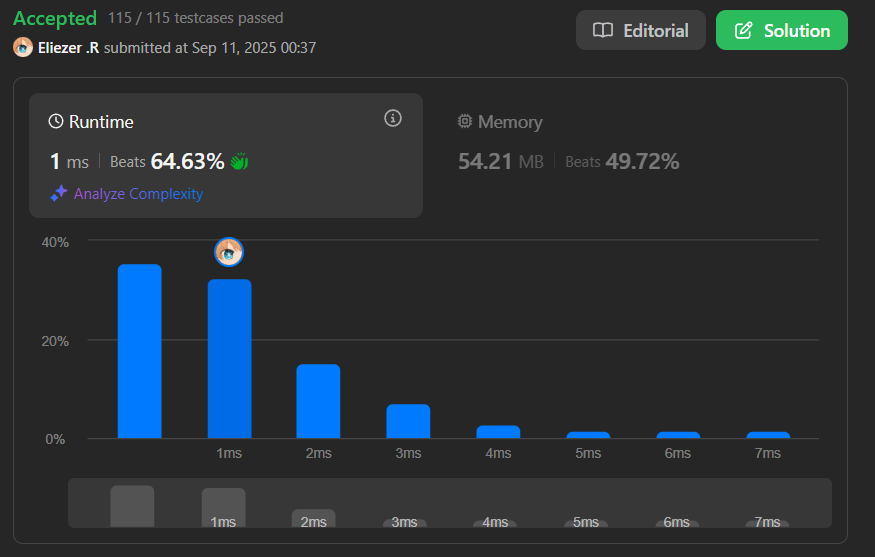

# 844. Backspace String Compare

Dadas dos cadenas `s` y `t`, determina si son iguales después de procesar los caracteres de backspace (`#`). Un `#` elimina el carácter anterior si existe.

---

## 📋 Ejemplos

**Ejemplo 1:**

- Entrada: `s = "ab#c"`, `t = "ad#c"`
- Salida: `true`
- Explicación: Ambos se procesan como `"ac"`.

**Ejemplo 2:**

- Entrada: `s = "ab##"`, `t = "c#d#"`
- Salida: `true`
- Explicación: Ambos se procesan como `""`.

**Ejemplo 3:**

- Entrada: `s = "a#c"`, `t = "b"`
- Salida: `false`
- Explicación: Se procesan como `"c"` y `"b"`.

---

## 💭 Enfoque y Estrategia

- **Objetivo**: Comparar dos cadenas después de aplicar los backspaces.
- **Restricción**: Un `#` elimina el carácter anterior si existe.
- **Salida**: Booleano (`true` si son iguales, `false` si no).

La estrategia óptima es simular el efecto del backspace usando un stack para cada string y luego comparar los resultados.

---

## 🔧 Implementación

```js
const backspaceCompare = function (s, t) {
  const left = []  // Stack para procesar la cadena s aplicando los backspaces
  const left2 = [] // Stack para procesar la cadena t aplicando los backspaces

  // Recorremos hasta la longitud máxima de ambas cadenas
  for (let i = 0; i < Math.max(s.length, t.length); i++) {
    // Procesamos la cadena s si hay carácter en la posición i
    if (s[i]) {
      if (s[i] === '#') left.pop() // Si es '#', eliminamos el último carácter del stack
      else left.push(s[i])         // Si no, agregamos el carácter al stack
    }

    // Procesamos la cadena t si hay carácter en la posición i
    if (t[i]) {
      if (t[i] === '#') left2.pop() // Si es '#', eliminamos el último carácter del stack
      else left2.push(t[i])         // Si no, agregamos el carácter al stack
    }
  }

  // Comparamos los resultados finales de ambos stacks convertidos a string
  return left.join('') === left2.join('')
}

console.log(backspaceCompare('ab#c', 'ad#c')) // true

/**
 * Ejemplo paso a paso con s = "ab#c", t = "ad#c":
 * left:  [] -> ['a'] -> ['a','b'] -> ['a'] (por '#') -> ['a','c']
 * left2: [] -> ['a'] -> ['a','d'] -> ['a'] (por '#') -> ['a','c']
 * Ambos quedan como "ac", por lo tanto retorna true.
 */
```

---

## 📊 Análisis de Rendimiento

- **Complejidad temporal**: O(n + m), donde n y m son las longitudes de `s` y `t`.
- **Complejidad espacial**: O(n + m) en el peor caso, ya que cada stack puede almacenar todos los caracteres no backspace de cada string.

---

## 🎯 Aprendizajes Clave

- El uso de un stack es ideal para simular operaciones de backspace.
- Procesar ambos strings por separado y comparar los resultados es directo y eficiente.
- Este patrón es útil para problemas de edición de texto y simulación de operaciones.

---

## 🏷️ Tags

`String` `Stack` `Easy`

---

**Tiempo invertido**: 20 minutos  
**Intentos**: 3  
**Dificultad percibida**: Fácil