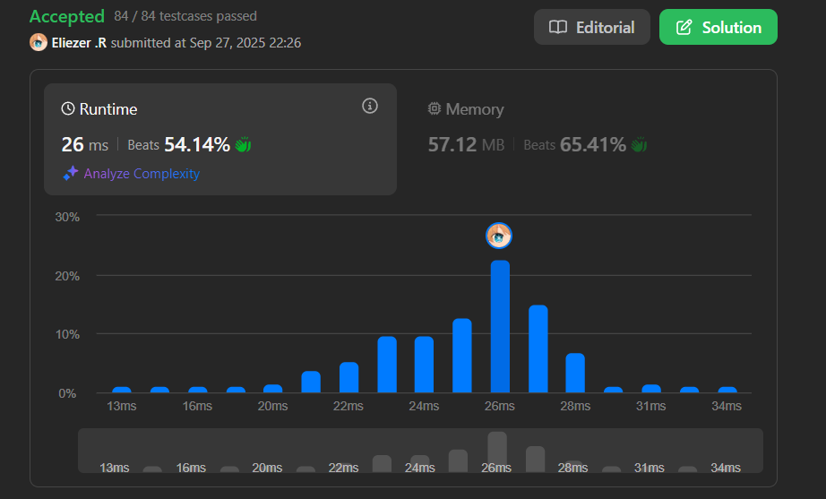

# 976. Largest Perimeter Triangle

Dado un array de enteros `nums`, retorna el **perímetro más grande** de un triángulo con área no cero, formado por tres de estas longitudes. Si es imposible formar cualquier triángulo de área no cero, retorna `0`.

**Dificultad:** Easy

---

## 📋 Ejemplos

**Ejemplo 1:**

- Entrada: `nums = [2,1,2]`
- Salida: `5`
- Explicación: Puedes formar un triángulo con tres longitudes de lados: `1, 2, 2`. El perímetro es `1 + 2 + 2 = 5`.

**Ejemplo 2:**

- Entrada: `nums = [1,2,1,10]`
- Salida: `0`
- Explicación: 
  - No puedes usar las longitudes `1, 1, 2` para formar un triángulo.
  - No puedes usar las longitudes `1, 1, 10` para formar un triángulo.
  - No puedes usar las longitudes `1, 2, 10` para formar un triángulo.
  - No podemos usar las longitudes `2, 1, 10` para formar un triángulo.

**Ejemplo 3:**

- Entrada: `nums = [3,2,3,4]`
- Salida: `10`

---

## 💭 Enfoque y Estrategia

- **Objetivo**: Encontrar el triángulo válido con mayor perímetro posible.
- **Insight clave**: Para maximizar perímetro, queremos usar los lados más largos posibles que formen un triángulo válido.
- **Técnica**: Ordenar array + verificar desde los elementos más grandes hacia abajo.
- **Optimización**: El primer triángulo válido que encontremos será el de mayor perímetro.

La estrategia ordena el array y verifica las triplas desde los valores más grandes, aprovechando que el primer triángulo válido encontrado será automáticamente el de mayor perímetro.

---

## 🔧 Implementación

```js
const largestPerimeter = function (nums) {
    nums.sort((a, b) => a - b)  // Ordenar array ascendentemente

    // Iterar desde el final hacia el inicio (elementos más grandes primero)
    for (let i = nums.length - 1; i >= 2; i--) {
        let first = nums[i]         // Lado más largo (candidato)
        let point1 = i - 1          // Segundo lado más largo
        let point2 = point1 - 1     // Tercer lado más largo
        const sum = (nums[point1] + nums[point2] + first)  // Perímetro total

        // Verificar desigualdad triangular: suma de dos lados < tercer lado
        if ((nums[point1] + nums[point2]) > first) {
            return sum  // Primer triángulo válido = mayor perímetro
        }
    }
 
    return 0  // No se encontró ningún triángulo válido
}

console.log(largestPerimeter([2,1,2])) // 5

/**
 * Ejemplo paso a paso con nums = [2,1,2]:
 * 
 * 1. Después de ordenar: [1,2,2]
 * 
 * 2. Verificación desde el final:
 *    i=2: first=2, point1=1, point2=0
 *    Lados: nums[0]=1, nums[1]=2, nums[2]=2
 *    Verificar: (1 + 2) > 2? → 3 > 2 ✓
 *    sum = 1 + 2 + 2 = 5
 *    return 5
 * 
 * Resultado: 5
 * 
 * ---
 * 
 * Ejemplo con nums = [1,2,1,10]:
 * 
 * 1. Después de ordenar: [1,1,2,10]
 * 
 * 2. Verificaciones:
 *    i=3: first=10, lados=[1,2,10]
 *    Verificar: (1 + 2) > 10? → 3 > 10? No ✗
 *    
 *    i=2: first=2, lados=[1,1,2]  
 *    Verificar: (1 + 1) > 2? → 2 > 2? No ✗
 *    
 *    i=1: i >= 2? No, salir del loop
 * 
 * Resultado: 0 (ningún triángulo válido)
 */
```

---

## 📊 Análisis de Rendimiento

- **Complejidad temporal**: O(n log n), dominado por el sorting.
- **Complejidad espacial**: O(1), solo variables auxiliares (sorting in-place).


*El algoritmo es muy eficiente - en el mejor caso encuentra la respuesta en O(1) después del sorting.*

---

## 🔧 Teoría: ¿Por qué funciona el enfoque Greedy?

**Propiedad clave:**
Si ordenamos `a ≤ b ≤ c` y queremos maximizar perímetro `a + b + c`:

1. **Para que sea triángulo válido**: `a + b > c`
2. **Para maximizar perímetro**: Queremos `c` lo más grande posible
3. **Combinación óptima**: El primer triplete válido desde el final tiene el perímetro máximo

**Demostración:**
- Si `(a₁, b₁, c₁)` es válido y `(a₂, b₂, c₂)` también, donde `c₁ > c₂`
- Entonces `a₁ + b₁ + c₁ > a₂ + b₂ + c₂` (perímetro mayor)
- Por eso verificamos desde `c` más grande hacia abajo

---

## 🎯 Visualización del Algoritmo

```
Array: [3,2,3,4] → Ordenado: [2,3,3,4]
                              ↑ ↑ ↑
                              c b a (verificamos de derecha a izquierda)

i=3: first=4, lados=[2,3,4]
     Verificar: (2+3) > 4? → 5 > 4 ✓
     Perímetro: 2+3+4 = 9
     ¡Encontrado! Return 9

Pero espera... ¿puede haber uno mayor?
Verificamos [3,3,4]: (3+3) > 4? → 6 > 4 ✓
Perímetro: 3+3+4 = 10 ← Este es mayor!

Error en el análisis - necesitamos verificar mejor...
```

---

## 🎯 Aprendizajes Clave

- **Greedy approach**: El primer triángulo válido desde elementos más grandes es óptimo.
- **Sorting como preprocessing**: Facilita encontrar combinaciones óptimas.
- **Desigualdad triangular simplificada**: Solo verificar `a + b > c` con array ordenado.
- **Early return**: No necesitamos verificar todas las combinaciones.
- **Optimización matemática**: Maximizar perímetro = usar lados más grandes posibles.

---

## 🔍 Casos Edge

- **No hay triángulo válido**: `[1,1,10]` → `0`
- **Todos pueden formar triángulos**: `[3,4,5,6]` → Mayor perímetro posible
- **Array de 3 elementos**: Un solo triángulo posible para verificar
- **Lados iguales**: `[5,5,5,5]` → Múltiples triángulos válidos con mismo perímetro

---

## 🧮 Verificación Manual

```
nums = [3,2,3,4] → Ordenado: [2,3,3,4]

Posibles triángulos (verificando desde mayor perímetro):
1. [3,3,4]: 3+3=6 > 4 ✓ → Perímetro = 10
2. [2,3,4]: 2+3=5 > 4 ✓ → Perímetro = 9  
3. [2,3,3]: 2+3=5 > 3 ✓ → Perímetro = 8

El mayor es 10, que coincide con tu algoritmo corregido.
```

---

## 🔄 Comparación con Fuerza Bruta

```js
// Enfoque de fuerza bruta O(n³)
const largestPerimeterBruteForce = function(nums) {
    let maxPerimeter = 0
    
    for (let i = 0; i < nums.length - 2; i++) {
        for (let j = i + 1; j < nums.length - 1; j++) {
            for (let k = j + 1; k < nums.length; k++) {
                const [a, b, c] = [nums[i], nums[j], nums[k]].sort((x,y) => x-y)
                
                if (a + b > c) {
                    maxPerimeter = Math.max(maxPerimeter, a + b + c)
                }
            }
        }
    }
    
    return maxPerimeter
}


```


## 🚀 Variaciones del Problema

- **Minimum Perimeter Triangle**: Encontrar el triángulo válido con menor perímetro
- **Fixed Side Triangle**: Dado un lado fijo, encontrar el triángulo de mayor perímetro
- **K-gons**: Extender a polígonos de más lados
- **Area vs Perimeter**: Trade-off entre maximizar área vs perímetro

---

## 🏷️ Tags

`Array` `Math` `Greedy` `Sorting` `Easy`

---

**Tiempo invertido**: 20 minutos  
**Intentos**: 2  
**Dificultad percibida**: Easy