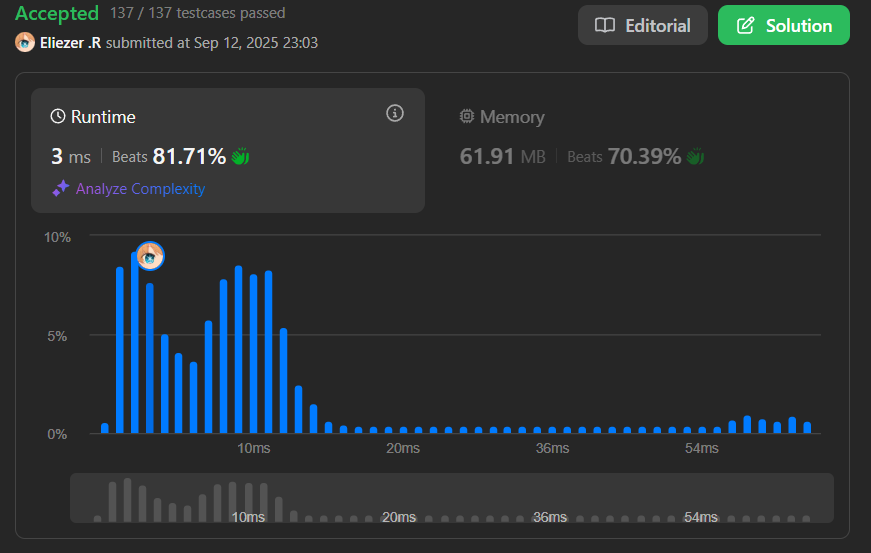

# 977. Squares of a Sorted Array

Dado un array de enteros `nums` ordenado en orden **no decreciente**, devuelve *un array de ****los cuadrados de cada número**** ordenado en orden no decreciente*.

---

## 📋 Ejemplos

**Ejemplo 1:**

- Entrada: `nums = [-4,-1,0,3,10]`
- Salida: `[0,1,9,16,100]`
- Explicación: Después de elevar al cuadrado, el array se convierte en `[16,1,0,9,100]`. Después de ordenar, se convierte en `[0,1,9,16,100]`.

**Ejemplo 2:**

- Entrada: `nums = [-7,-3,2,3,11]`
- Salida: `[4,9,9,49,121]`
- Explicación: Los cuadrados son `[49,9,4,9,121]`, que ordenados quedan `[4,9,9,49,121]`.

---

## 💭 Enfoque y Estrategia

- **Objetivo**: Obtener los cuadrados ordenados sin usar sorting explícito.
- **Insight clave**: Los valores más grandes (en valor absoluto) están en los extremos del array.
- **Técnica**: Dos punteros comparando desde los extremos hacia el centro.
- **Optimización**: Llenar el resultado desde la posición más grande hacia la más pequeña.

La estrategia aprovecha que el array original está ordenado. Los cuadrados más grandes siempre estarán en los extremos (números negativos grandes o positivos grandes), por lo que podemos usar dos punteros para construir el resultado de mayor a menor.

---

## 🔧 Implementación

```js
const sortedSquares = function (nums) {
    const subArr = [...nums] // Array resultado del mismo tamaño
    let left = 0             // Puntero al inicio del array
    let right = nums.length - 1 // Puntero al final del array
    
    // Llenamos el array desde la última posición hacia la primera
    for (let i = nums.length - 1; i >= 0; i--) {
        // Comparamos los cuadrados de los extremos
        if ((nums[right] ** 2) > (nums[left] ** 2)) {
            subArr[i] = nums[right] ** 2 // El extremo derecho es mayor
            right-- // Movemos puntero derecho hacia adentro
        } else {
            subArr[i] = nums[left] ** 2  // El extremo izquierdo es mayor
            left++  // Movemos puntero izquierdo hacia adentro
        }
    }
    
    return subArr
}

console.log(sortedSquares([-4,-1,0,3,10])) // [0,1,9,16,100]

/**
 * Ejemplo paso a paso con nums = [-4,-1,0,3,10]:
 * 
 * i=4: (-4)²=16 vs (10)²=100 → subArr[4]=100, right=3
 * i=3: (-4)²=16 vs (3)²=9   → subArr[3]=16,  left=1
 * i=2: (-1)²=1  vs (3)²=9   → subArr[2]=9,   right=2
 * i=1: (-1)²=1  vs (0)²=0   → subArr[1]=1,   left=2
 * i=0: (0)²=0   vs (0)²=0   → subArr[0]=0,   left=3
 * 
 * Resultado: [0,1,9,16,100]
 */
```

---

## 📊 Análisis de Rendimiento

- **Complejidad temporal**: O(n), donde n es la longitud del array nums.
- **Complejidad espacial**: O(n), para el array resultado (O(1) sin contar el espacio de salida).


*Comparado con el enfoque trivial de O(n log n) por sorting, esta solución es óptima.*

---

## 🔄 Enfoques Alternativos

**Enfoque Trivial:**
```js
// O(n log n) - No óptimo
const sortedSquaresTrivial = function(nums) {
    return nums.map(x => x * x).sort((a, b) => a - b)
}
```

---

## 🎯 Aprendizajes Clave

- **Aprovechamiento de propiedades**: El array ya ordenado nos da información valiosa sobre dónde están los valores extremos.
- **Dos punteros desde extremos**: Técnica efectiva cuando necesitamos comparar valores de los bordes.
- **Construcción inversa**: Llenar el resultado de mayor a menor simplifica la lógica.
- **Comparación de cuadrados**: Los valores absolutos más grandes producen los cuadrados más grandes.
- **Optimización O(n)**: Evitar sorting innecesario aprovechando la estructura del problema.

---

## 🔍 Casos Edge

- Array con solo números positivos: `[1,2,3]` → `[1,4,9]`
- Array con solo números negativos: `[-3,-2,-1]` → `[1,4,9]`
- Array con ceros: `[-2,0,2]` → `[0,4,4]`
- Array de un elemento: `[5]` → `[25]`

---

## 🏷️ Tags

`Array` `Two Pointers` `Sorting` `Easy`

---

**Tiempo invertido**: 20 minutos  
**Intentos**: 2  
**Dificultad percibida**: Easy