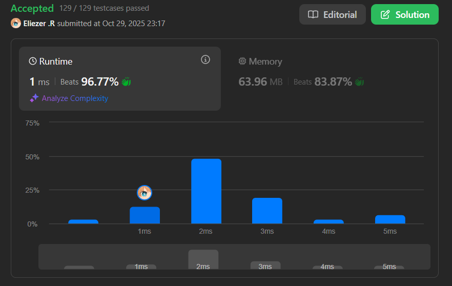

# 1526. Minimum Number of Increments on Subarrays to Form a Target Array

## 🧠 Descripción

Se te da un array de enteros `target`. Tienes un array de enteros `initial` del mismo tamaño que `target` con todos los elementos inicialmente en ceros.

En una operación puedes elegir **cualquier subarray** de `initial` e **incrementar cada valor en uno**.

Retorna el **número mínimo de operaciones** para formar el array `target` desde `initial`.

**Dificultad:** Hard

---

## 📋 Ejemplos

### Ejemplo 1:

* **Entrada**: `target = [1,2,3,2,1]`
* **Salida**: `3`
* **Explicación**: Necesitamos al menos 3 operaciones:
```
[0,0,0,0,0] → incrementar índices 0-4 → [1,1,1,1,1]
[1,1,1,1,1] → incrementar índices 1-3 → [1,2,2,2,1]
[1,2,2,2,1] → incrementar índice 2   → [1,2,3,2,1]
```

### Ejemplo 2:

* **Entrada**: `target = [3,1,1,2]`
* **Salida**: `4`
* **Explicación**:
```
[0,0,0,0] → [1,1,1,1] → [1,1,1,2] → [2,1,1,2] → [3,1,1,2]
```

### Ejemplo 3:

* **Entrada**: `target = [3,1,5,4,2]`
* **Salida**: `7`

### Ejemplo 4:

* **Entrada**: `target = [1,1,1,1]`
* **Salida**: `1`

---

## 💭 Estrategia y Enfoque

Este problema tiene una solución **increíblemente elegante** basada en una observación geométrica:

### 🏗️ Analogía visual: Construir con bloques

Imagina que el array `target` representa **columnas de bloques** donde cada número es la altura de esa columna:

```
target = [3,1,5,4,2]

Representación visual:
    □
□   □ □
□   □ □
□ □ □ □ □

Altura: 3 1 5 4 2
```

### 💡 Observación clave:

Cada operación de "incrementar un subarray" es como **colocar una fila horizontal de bloques**. El número mínimo de operaciones es igual al número de "bordes izquierdos" de estas filas.

### 🧮 Regla simple:

Solo necesitamos contar las **subidas** (cuando el valor aumenta respecto al anterior):

* Si `target[i] > target[i-1]`: necesitamos `target[i] - target[i-1]` operaciones adicionales
* Si `target[i] <= target[i-1]`: podemos **reutilizar** las operaciones anteriores (no necesitamos más)

---

## 💻 Implementación en JavaScript

```js
var minNumberOperations = function (target) {
    // El primer elemento siempre necesita ese número de operaciones
    // (partimos de 0, así que necesitamos target[0] operaciones)
    let operations = target[0]
    
    // Recorrer el resto del array comparando elementos consecutivos
    for (let i = 1; i < target.length; i++) {
        // Solo sumamos si el valor actual es MAYOR que el anterior
        // Si es menor o igual, podemos reutilizar operaciones previas
        // Math.max(..., 0) asegura que nunca restemos (solo sumamos diferencias positivas)
        operations += Math.max((target[i] - target[i - 1]), 0)
    }
    
    return operations
};

console.log(minNumberOperations([1,2,3,2,1]))  // 3
console.log(minNumberOperations([3,1,1,2]))    // 4
console.log(minNumberOperations([3,1,5,4,2]))  // 7
console.log(minNumberOperations([1,1,1,1]))    // 1
```

### 📝 Ejemplo paso a paso con `target = [3,1,5,4,2]`:

```
Visualización de columnas:
    □
□   □ □
□   □ □
□ □ □ □ □
3 1 5 4 2

operations = target[0] = 3

i=1: target[1]=1, target[0]=3
  1 - 3 = -2
  max(-2, 0) = 0
  operations = 3 + 0 = 3
  (Bajamos, no necesitamos operaciones extra)

i=2: target[2]=5, target[1]=1
  5 - 1 = 4
  max(4, 0) = 4
  operations = 3 + 4 = 7
  (Subimos 4 niveles, necesitamos 4 operaciones más)

i=3: target[3]=4, target[2]=5
  4 - 5 = -1
  max(-1, 0) = 0
  operations = 7 + 0 = 7
  (Bajamos, no necesitamos operaciones extra)

i=4: target[4]=2, target[3]=4
  2 - 4 = -2
  max(-2, 0) = 0
  operations = 7 + 0 = 7
  (Bajamos, no necesitamos operaciones extra)

Resultado: 7 operaciones
```

### 🎨 Visualización con filas horizontales:

```
target = [3,1,5,4,2]

Operación 1-3: Construir columna de altura 3 en posición 0
□ □ □ □ □  ← Fila 3
□ □ □ □ □  ← Fila 2
□ □ □ □ □  ← Fila 1

Operación 4-7: Construir la torre alta en posición 2
    □      ← Fila 7
    □      ← Fila 6
    □      ← Fila 5
    □      ← Fila 4

Resultado final:
    □
□   □ □
□   □ □
□ □ □ □ □
```

---

## 📊 Análisis de Rendimiento

* **Complejidad temporal**: O(n), un solo recorrido del array.
* **Complejidad espacial**: O(1), solo una variable auxiliar.



---

## 🎯 Aprendizajes Clave

* **Greedy approach**: La solución óptima local es óptima globalmente.
* **Geometric intuition**: Visualizar el problema como construcción con bloques.
* **Reusability**: Cuando bajamos, podemos reutilizar operaciones previas.
* **Incremental counting**: Solo contamos las diferencias positivas.
* **Edge detection**: Contar "bordes izquierdos" de filas horizontales.

---

## 💡 ¿Por qué funciona?

**Intuición matemática:**

1. Cada "subida" en el array requiere operaciones adicionales.
2. Cada "bajada" o "meseta" no requiere operaciones nuevas porque podemos reutilizar.
3. El total es la suma de todas las subidas + el valor inicial.

**Prueba informal:**
- Para alcanzar `target[i]`, necesitamos al menos `target[i]` operaciones.
- Si `target[i] > target[i-1]`, necesitamos `target[i] - target[i-1]` operaciones **adicionales**.
- Si `target[i] <= target[i-1]`, las operaciones previas ya cubren este valor.

---

## 🔄 Solución Alternativa (Pythonic)

```js
// Versión más compacta
var minNumberOperationsCompact = function(target) {
    return target[0] + target.slice(1).reduce((ops, curr, i) => {
        return ops + Math.max(0, curr - target[i])
    }, 0)
}
```

---

## 🧮 Más Ejemplos

### Ejemplo: Array plano
```
target = [5,5,5,5]
operations = 5 + 0 + 0 + 0 = 5

Visual:
□ □ □ □
□ □ □ □
□ □ □ □
□ □ □ □
□ □ □ □

Solo necesitamos 5 filas horizontales completas
```

### Ejemplo: Escalera ascendente
```
target = [1,2,3,4,5]
operations = 1 + 1 + 1 + 1 + 1 = 5

Visual:
        □
      □ □
    □ □ □
  □ □ □ □
□ □ □ □ □

Cada paso hacia arriba necesita 1 operación adicional
```

### Ejemplo: Montaña
```
target = [1,3,2]
operations = 1 + 2 + 0 = 3

Visual:
  □
□ □ □

Subimos 2, luego bajamos (gratis)
```

---

## 🔍 Casos Edge

* **Array de un elemento**: `[5]` → `5`
* **Array todo ceros**: `[0,0,0]` → `0`
* **Array descendente**: `[5,4,3,2,1]` → `5` (solo el primer valor)
* **Array ascendente**: `[1,2,3,4,5]` → `5` (suma de diferencias)

---

## 🏷️ Etiquetas

`Array` `Greedy` `Stack` `Dynamic Programming` `Hard`