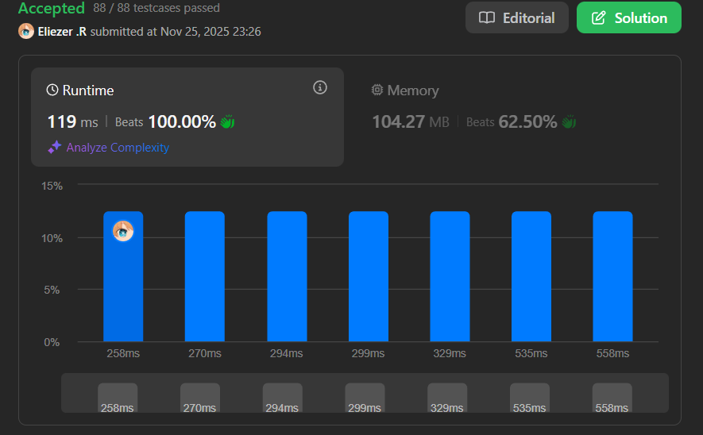

# 2435. Paths in Matrix Whose Sum Is Divisible by K

Se te da una matriz entera **grid** de tamaño **m × n** indexada desde 0 y un entero **k**. Actualmente estás en la posición `(0, 0)` y quieres llegar a la posición `(m - 1, n - 1)` moviéndote **solo hacia abajo o hacia la derecha**.

Retorna el **número de caminos** donde la suma de los elementos en el camino sea **divisible por k**.

Como la respuesta puede ser muy grande, retórnala **módulo 10⁹ + 7**.

**Dificultad:** Hard

---

## 📋 Ejemplos

**Ejemplo 1:**

- Entrada: `grid = [[5,2,4],[3,0,5],[0,7,2]]`, `k = 3`
- Salida: `2`
- Explicación: Hay dos caminos donde la suma de los elementos es divisible por k:
  - Primer camino (rojo): 5 + 2 + 4 + 5 + 2 = 18 (divisible por 3)
  - Segundo camino (azul): 5 + 3 + 0 + 5 + 2 = 15 (divisible por 3)

**Ejemplo 2:**

- Entrada: `grid = [[0,0]]`, `k = 5`
- Salida: `1`
- Explicación: El camino tiene suma 0 + 0 = 0, que es divisible por 5.

**Ejemplo 3:**

- Entrada: `grid = [[7,3,4,9],[2,3,6,2],[2,3,7,0]]`, `k = 1`
- Salida: `10`
- Explicación: Todo entero es divisible por 1, así que la suma en cada camino posible es divisible por k.

---

## 💭 Enfoque y Estrategia

- **Objetivo**: Contar caminos desde `(0,0)` hasta `(m-1,n-1)` cuya suma sea divisible por k.
- **Insight clave**: Usar **Dynamic Programming 3D** donde `dp[j][r]` representa el número de caminos que llegan a la columna `j` con suma que tiene resto `r` al dividir por k.
- **Técnica**: Optimización de espacio usando solo dos filas (anterior y actual) en lugar de matriz 3D completa.
- **Retos**: Manejar los restos correctamente y aplicar módulo 10⁹+7 para evitar overflow.

La estrategia usa DP con estados basados en restos modulares, permitiendo rastrear todas las posibles sumas de caminos sin calcular las sumas completas.

---

## 🔧 Implementación

```javascript
var numberOfPaths = function(grid, k) {
    const MOD = 1e9 + 7;
    const m = grid.length, n = grid[0].length;

    // prev[j][r] = número de caminos a columna j con resto r
    let prev = Array.from({ length: n }, () => Array(k).fill(0));
    // curr[j][r] = número de caminos a columna j con resto r (fila actual)
    let curr = Array.from({ length: n }, () => Array(k).fill(0));

    // Inicializar la primera fila
    let sum = 0;
    for (let j = 0; j < n; j++) {
        sum = (sum + grid[0][j]) % k;
        prev[j][sum] = 1; // Solo hay un camino a cada celda de la primera fila
    }

    // Resetear sum para la primera columna
    sum = grid[0][0] % k;

    // Procesar cada fila desde la segunda
    for (let i = 1; i < m; i++) {
        // Actualizar suma para la primera celda de esta fila
        sum = (sum + grid[i][0]) % k;
        curr[0].fill(0);
        curr[0][sum] = 1; // Solo hay un camino a la primera columna

        // Procesar cada columna
        for (let j = 1; j < n; j++) {
            curr[j].fill(0);
            const val = grid[i][j];
            
            // Para cada posible resto anterior
            for (let r = 0; r < k; r++) {
                // Calcular el nuevo resto después de agregar val
                const nr = (r + val) % k;
                
                // Agregar caminos desde arriba (prev[j][r]) 
                // y desde la izquierda (curr[j-1][r])
                curr[j][nr] = (prev[j][r] + curr[j - 1][r]) % MOD;
            }
        }

        // Intercambiar prev y curr para la siguiente iteración
        const temp = prev;
        prev = curr;
        curr = temp;
    }

    // Retornar caminos que llegan a (m-1, n-1) con resto 0
    return prev[n - 1][0];
};

console.log(numberOfPaths([[5,2,4],[3,0,5],[0,7,2]], 3)); // 2

/**
 * Ejemplo paso a paso con grid = [[5,2,4],[3,0,5],[0,7,2]], k = 3:
 * 
 * Grid visualizado:
 *   5  2  4
 *   3  0  5
 *   0  7  2
 * 
 * PASO 1: Inicializar primera fila
 * 
 * j=0: sum = 5 % 3 = 2, prev[0][2] = 1
 * j=1: sum = (2 + 2) % 3 = 1, prev[1][1] = 1
 * j=2: sum = (1 + 4) % 3 = 2, prev[2][2] = 1
 * 
 * prev después de fila 0:
 * prev[0] = [0, 0, 1]  // llegamos con resto 2
 * prev[1] = [0, 1, 0]  // llegamos con resto 1
 * prev[2] = [0, 0, 1]  // llegamos con resto 2
 * 
 * PASO 2: Procesar fila 1 (i=1)
 * 
 * Columna 0 (j=0):
 *   sum = (5 + 3) % 3 = 2
 *   curr[0][2] = 1
 * 
 * Columna 1 (j=1):
 *   val = 0
 *   Para r=0: nr = (0+0)%3 = 0
 *     curr[1][0] = (prev[1][0] + curr[0][0]) % MOD = (0 + 0) = 0
 *   Para r=1: nr = (1+0)%3 = 1
 *     curr[1][1] = (prev[1][1] + curr[0][1]) % MOD = (1 + 0) = 1
 *   Para r=2: nr = (2+0)%3 = 2
 *     curr[1][2] = (prev[1][2] + curr[0][2]) % MOD = (0 + 1) = 1
 * 
 * Columna 2 (j=2):
 *   val = 5
 *   Para r=0: nr = (0+5)%3 = 2
 *     curr[2][2] = (prev[2][0] + curr[1][0]) % MOD = (0 + 0) = 0
 *   Para r=1: nr = (1+5)%3 = 0
 *     curr[2][0] = (prev[2][1] + curr[1][1]) % MOD = (0 + 1) = 1
 *   Para r=2: nr = (2+5)%3 = 1
 *     curr[2][1] = (prev[2][2] + curr[1][2]) % MOD = (1 + 1) = 2
 * 
 * curr después de fila 1:
 * curr[0] = [0, 0, 1]
 * curr[1] = [0, 1, 1]
 * curr[2] = [1, 2, 0]
 * 
 * prev = curr (intercambiar)
 * 
 * PASO 3: Procesar fila 2 (i=2)
 * [Similar proceso...]
 * 
 * Resultado final: prev[2][0] = 2
 * 
 * Explicación: Hay 2 caminos que llegan a (2,2) con suma divisible por 3
 */
```

---

## 📊 Análisis de Rendimiento

- **Complejidad temporal**: O(m × n × k), donde m y n son las dimensiones de la matriz.
  - Para cada celda (m×n), iteramos sobre k posibles restos
- **Complejidad espacial**: O(n × k), usando solo dos filas de DP.
  - Se puede optimizar a O(k) con más cuidado, pero esta versión es más clara
  

*Esta solución es eficiente considerando que exploramos todos los estados necesarios.*

---

## 🔧 Detalles Técnicos Importantes

**Estructura del DP:**

```javascript
prev[j][r] = número de caminos que llegan a columna j con resto r
```

**Estados y Transiciones:**

Para llegar a `(i, j)` con resto `nr`:
1. Desde arriba `(i-1, j)` con resto `r`: nuevo resto = `(r + grid[i][j]) % k`
2. Desde la izquierda `(i, j-1)` con resto `r`: nuevo resto = `(r + grid[i][j]) % k`

```javascript
curr[j][nr] += prev[j][r]       // desde arriba
curr[j][nr] += curr[j-1][r]     // desde la izquierda
```

**¿Por qué funciona con restos?**

Solo nos interesa si la suma es divisible por k (resto = 0), no la suma completa:
- Mantener restos evita overflow
- Propiedad: `(a + b) % k = ((a % k) + (b % k)) % k`

**Optimización de Espacio:**

En lugar de mantener una matriz 3D `dp[i][j][r]`, solo mantenemos:
- `prev`: Estado de la fila anterior
- `curr`: Estado de la fila actual

Esto reduce espacio de O(m×n×k) a O(n×k).

---

## 🎯 Aprendizajes Clave

- **DP con estados modulares**: Rastrear restos en lugar de sumas completas.
- **Optimización de espacio**: Usar solo dos filas reduce memoria significativamente.
- **Grafos acíclicos dirigidos (DAG)**: La matriz representa un DAG donde solo podemos movernos abajo/derecha.
- **Combinación de caminos**: En cada celda, sumamos caminos desde arriba y desde la izquierda.

---

## 🔍 Casos Edge

- **Matriz 1×1**: `[[5]]`, `k=3` → `0` (solo un camino, 5 no es divisible por 3)
- **Matriz 1×n**: Solo hay un camino (toda la primera fila)
- **Matriz m×1**: Solo hay un camino (toda la primera columna)
- **k=1**: Todos los caminos son válidos (todo es divisible por 1)
- **Todos ceros**: `[[0,0],[0,0]]`, `k=5` → Todos los caminos suman 0 (divisible por cualquier k)

---

## 🧮 Ejemplos Adicionales

```javascript
[[5,2,4],[3,0,5],[0,7,2]], k=3  → 2
[[0,0]], k=5                     → 1
[[7,3,4,9],[2,3,6,2],[2,3,7,0]], k=1  → 10
[[1]], k=2                       → 0
[[2,2],[2,2]], k=2               → 6 (todos los caminos suman par)
```

---

## 🚀 Solución Alternativa: DP 3D Completa

Versión más intuitiva usando matriz 3D completa:

```javascript
var numberOfPathsDP3D = function(grid, k) {
    const MOD = 1e9 + 7;
    const m = grid.length, n = grid[0].length;
    
    // dp[i][j][r] = número de caminos a (i,j) con resto r
    const dp = Array.from({ length: m }, () =>
        Array.from({ length: n }, () => Array(k).fill(0))
    );
    
    // Caso base
    dp[0][0][grid[0][0] % k] = 1;
    
    for (let i = 0; i < m; i++) {
        for (let j = 0; j < n; j++) {
            if (i === 0 && j === 0) continue;
            
            for (let r = 0; r < k; r++) {
                const nr = (r + grid[i][j]) % k;
                
                if (i > 0) {
                    dp[i][j][nr] = (dp[i][j][nr] + dp[i-1][j][r]) % MOD;
                }
                if (j > 0) {
                    dp[i][j][nr] = (dp[i][j][nr] + dp[i][j-1][r]) % MOD;
                }
            }
        }
    }
    
    return dp[m-1][n-1][0];
};
```

**Ventaja**: Más fácil de entender
**Desventaja**: Usa O(m×n×k) espacio en lugar de O(n×k)

---

## 🔬 Comparación de Enfoques

| Enfoque | Tiempo | Espacio | Legibilidad | Cuándo usar |
|---------|--------|---------|-------------|-------------|
| **DP 2 filas** (presentado) | O(m×n×k) | O(n×k) | ⭐⭐⭐⭐ | Optimización de espacio |
| **DP 3D** | O(m×n×k) | O(m×n×k) | ⭐⭐⭐⭐⭐ | Más intuitivo |
| **DFS + Memo** | O(m×n×k) | O(m×n×k) | ⭐⭐⭐ | Enfoque top-down |

---

## 💡 Visualización del Algoritmo

Para `grid = [[5,2,4],[3,0,5]]`, `k = 3`:

```
Grid:
  5  2  4
  3  0  5

Estados DP (mostrando solo restos):

Fila 0:
[0][resto 2] = 1  → llegamos a (0,0) con suma 5%3=2
[1][resto 1] = 1  → llegamos a (0,1) con suma 7%3=1
[2][resto 2] = 1  → llegamos a (0,2) con suma 11%3=2

Fila 1:
[0][resto 2] = 1  → llegamos a (1,0) con suma 8%3=2
[1][resto 1] = 1, [resto 2] = 1  → dos formas de llegar
[2][resto 0] = 1, [resto 1] = 2  → caminos válidos con resto 0
```

---

## 🧠 Intuición del Problema

**¿Por qué DP con restos?**

Imagina que estás caminando por la matriz sumando valores:
- No necesitas saber la suma exacta, solo su resto módulo k
- Cada celda "hereda" los restos posibles de sus vecinos (arriba, izquierda)
- Al final, solo cuentas los caminos con resto 0

**Analogía:**
Es como un contador módulo k que se actualiza mientras caminas. Solo te importa si el contador muestra 0 al final del camino.

---

## 🏷️ Tags

`Array` `Dynamic Programming` `Matrix` `Hard`

---