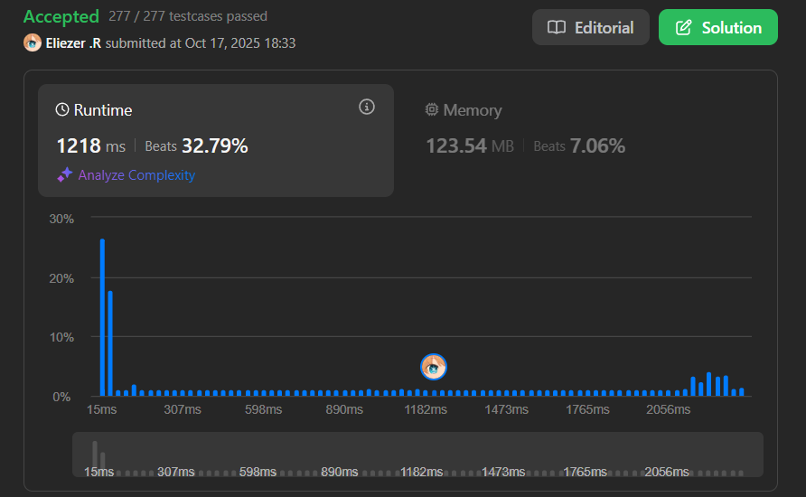

# 3003. Maximize the Number of Partitions After Operations

Se te da un string `s` y un entero `k`.

Primero, puedes cambiar **como máximo un índice** en `s` a otra letra minúscula en inglés.

Después de eso, realiza la siguiente operación de particionamiento hasta que `s` esté vacío:

- Elige el **prefijo más largo** de `s` que tenga como máximo `k` caracteres distintos.
- Elimina el prefijo de `s` y incrementa el número de particiones en 1. Los caracteres restantes (si los hay) en `s` mantienen su orden inicial.

Retorna un entero que denota el **número máximo** de particiones resultantes después de la operación (opcional) de cambio y la operación de particionamiento.

**Dificultad:** Hard

---

## 📋 Ejemplos

**Ejemplo 1:**

- Entrada: `s = "accca", k = 2`
- Salida: `3`
- Explicación:
```
La mejor manera de maximizar particiones:
1. Cambiar s[2] a 'b': s = "acbca"
2. Primera partición: "acb" (2 caracteres distintos)
3. Segunda partición: "ca" (2 caracteres distintos)
4. Tercera partición: "a" (1 carácter distinto)
Total: 3 particiones
```

**Ejemplo 2:**

- Entrada: `s = "aabaab", k = 3`
- Salida: `1`
- Explicación:
```
Sin realizar cambios:
- Toda la string tiene solo 2 caracteres distintos (a, b)
- Solo necesitamos 1 partición
```

**Ejemplo 3:**

- Entrada: `s = "xxyz", k = 1`
- Salida: `4`
- Explicación:
```
Sin realizar cambios, cada carácter es una partición:
"x", "x", "y", "z"
```

---

## 💭 Enfoque y Estrategia

- **Problema de optimización**: Elegir óptimamente si cambiar un carácter y cuál cambiar.
- **Programación Dinámica con estados**:
  - `i`: posición actual en el string
  - `canChange`: si aún podemos hacer un cambio
  - `mask`: bitmask de caracteres distintos en la partición actual
- **Decisiones en cada posición**:
  1. No cambiar el carácter actual
  2. Si `canChange` es true, probar cambiar a cada una de las 26 letras
- **Memoización**: Usar Map para cachear estados visitados.

---

## 🔧 Implementación

```js
var maxPartitionsAfterOperations = function(s, k) {
    const n = s.length
    const memo = new Map()
    
    function dp(i, canChange, mask) {
        // Caso base: llegamos al final
        if (i === n) return 0
        
        // Verificar si ya calculamos este estado
        const key = `${i},${canChange},${mask}`
        if (memo.has(key)) return memo.get(key)
        
        // Obtener el bit del carácter actual
        const currentBit = 1 << (s.charCodeAt(i) - 97)
        let res = getResult(i, canChange, mask, currentBit, canChange)
        
        // Si aún podemos cambiar, probar cambiar a cada letra
        if (canChange) {
            for (let j = 0; j < 26; j++) {
                const newBit = 1 << j
                res = Math.max(res, getResult(i, canChange, mask, newBit, false))
            }
        }
        
        memo.set(key, res)
        return res
    }
    
    function getResult(i, canChange, mask, newBit, nextCanChange) {
        const nextMask = mask | newBit
        const distinctCount = countBits(nextMask)
        
        if (distinctCount > k) {
            // Excedimos k caracteres distintos, crear nueva partición
            return 1 + dp(i + 1, nextCanChange, newBit)
        } else {
            // Continuar con la partición actual
            return dp(i + 1, nextCanChange, nextMask)
        }
    }
    
    function countBits(n) {
        let count = 0
        while (n) {
            count += n & 1
            n >>= 1
        }
        return count
    }
    
    // Iniciar DP + 1 para contar la última partición
    return dp(0, true, 0) + 1
}

console.log(maxPartitionsAfterOperations("accca", 2)) // 3
console.log(maxPartitionsAfterOperations("aabaab", 3)) // 1
console.log(maxPartitionsAfterOperations("xxyz", 1)) // 4

/**
 * Ejemplo paso a paso con s = "accca", k = 2:
 * 
 * Mejor solución: cambiar s[2] = 'c' → 'b'
 * String resultante: "acbca"
 * 
 * Estados del DP:
 * 
 * dp(0, true, 0):
 *   - Probar 'a': mask = 0001, distinctCount = 1 ≤ 2
 *     → dp(1, true, 0001)
 *   
 * dp(1, true, 0001):
 *   - Probar 'c': mask = 0101, distinctCount = 2 ≤ 2
 *     → dp(2, true, 0101)
 *   
 * dp(2, true, 0101):
 *   - Opción 1: No cambiar 'c': mask = 0101, distinctCount = 2
 *   - Opción 2: Cambiar a 'b': mask = 0111, distinctCount = 3 > 2
 *     → Nueva partición! 1 + dp(3, false, 0010)
 *   
 * dp(3, false, 0010):
 *   - 'c': mask = 0110, distinctCount = 2 ≤ 2
 *     → dp(4, false, 0110)
 *   
 * dp(4, false, 0110):
 *   - 'a': mask = 0111, distinctCount = 3 > 2
 *     → Nueva partición! 1 + dp(5, false, 0001)
 *   
 * dp(5, false, 0001):
 *   - i = n, retornar 0
 * 
 * Conteo: 1 + 1 + 0 + 1 (partición final) = 3 particiones
 */
```

---

## 📊 Análisis de Rendimiento

- **Complejidad temporal**: O(n × 2^26 × 26) en el peor caso.
  - Estados únicos: O(n × 2 × 2^26) aproximadamente
  - Por cada estado con canChange=true, probamos 26 opciones
  - En práctica, la poda reduce significativamente los estados
- **Complejidad espacial**: O(n × 2^26), para la memoización.
  - En práctica, solo visitamos una fracción pequeña de estados


---

## 🎯 Visualización del DP

```
s = "accca", k = 2

Estado: (posición, canChange, mask)

                  (0, true, 0)
                       |
                  proceso 'a'
                       |
                  (1, true, {a})
                       |
                  proceso 'c'
                       |
                  (2, true, {a,c})
                    /         \
        no cambiar 'c'      cambiar 'c' a 'b'
              |                    |
        continuar          ¡Nueva partición!
         misma             contador++
      partición             |
                       (3, false, {b})
                            |
                      proceso 'c'
                            |
                       (4, false, {b,c})
                            |
                      proceso 'a'
                            |
                     ¡Nueva partición!
                        contador++
                            |
                       (5, false, {a})
                            |
                          FIN
                          
Total particiones: 3
```

---

## 🔄 Detalles del Bitmask

```js
// Bitmask para representar conjunto de caracteres
// Ejemplo: "abc" → 0000...0111 (bits 0, 1, 2 activados)

const charToMask = (char) => 1 << (char.charCodeAt(0) - 97)

// 'a' → 1 << 0 → 00000001
// 'b' → 1 << 1 → 00000010
// 'c' → 1 << 2 → 00000100

// Combinar: mask | newBit
// "ac" → 00000001 | 00000100 → 00000101

// Contar bits activados (caracteres distintos):
const countBits = (mask) => {
    let count = 0
    while (mask) {
        count += mask & 1  // Verificar último bit
        mask >>= 1          // Shift derecha
    }
    return count
}
```

---

## 🔍 Casos Edge

- **k = 1**: Cada carácter distinto es una partición nueva
- **k = 26**: Nunca excedemos k, resultado = 1
- **String homogéneo**: `"aaaa"` con cualquier k → 1 partición
- **Todos distintos**: `"abcd"` con k=1 → n particiones

---

## 🎯 Aprendizajes Clave

- **DP con múltiples estados**: Manejar posición, flag de cambio, y conjunto de caracteres.
- **Bitmask optimization**: Representar conjuntos de caracteres eficientemente.
- **Memoization with composite keys**: Usar strings o tuplas como claves.
- **Branching decisions**: Explorar todas las opciones de cambio posibles.
- **Greedy doesn't work**: No podemos usar greedy, necesitamos exploración completa.

---

## 💡 Optimización de Búsqueda

En lugar de probar las 26 letras cuando `canChange = true`, podríamos:

```js
// Solo probar letras que realmente mejoran el resultado
// (letters que fuerzan una nueva partición antes)
if (canChange) {
    // Probar solo letras no en el mask actual
    for (let j = 0; j < 26; j++) {
        const newBit = 1 << j
        if (!(mask & newBit)) { // Solo si no está en mask
            res = Math.max(res, getResult(i, canChange, mask, newBit, false))
        }
    }
}
```

---

## 🧮 Análisis del Problema

Este problema combina:
1. **Greedy local**: Tomar el prefijo más largo posible en cada partición
2. **DP global**: Decidir óptimamente dónde hacer el cambio opcional
3. **Bitmask**: Rastrear eficientemente los caracteres distintos

La clave es que cambiar un carácter puede:
- Forzar una partición más temprano (incrementando el conteo)
- Permitir extender una partición más allá
- El cambio óptimo depende del contexto global

---

## 🏷️ Tags

`String` `Dynamic Programming` `Bit Manipulation` `Greedy` `Memoization` `Hard`

---

**Complejidad Final:**
- ⏱️ Tiempo: O(n × 2^k × 26) en teoría, O(n × 26²) en práctica
- 💾 Espacio: O(n × 2^k)