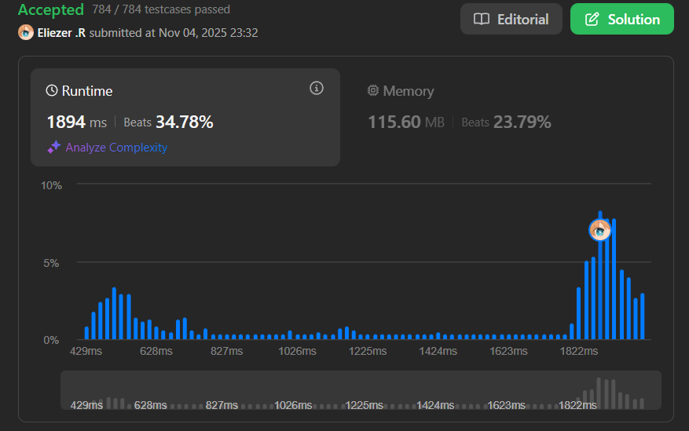

# 3321. Find X-Sum of All K-Long Subarrays II

## 🧠 Descripción

Igual que el problema 3318, pero optimizado para arrays **muy grandes** (hasta 10^5 elementos).

Se te da un array `nums` de `n` enteros y dos enteros `k` y `x`.

El **x-sum** de un array se calcula manteniendo los `x` elementos más frecuentes y sumando `número × frecuencia` de cada uno.

**Diferencia clave**: Esta versión requiere optimización con estructuras de datos avanzadas debido a las restricciones más grandes.

**Dificultad:** Hard

---

## 💭 Estrategia y Enfoque

La versión Hard usa **dos Priority Queues** (heaps) para mantener eficientemente los top-x elementos:

### 🏗️ Estructuras de datos:

1. **`hot` (Min Heap)**: Contiene los x elementos elegidos (los más frecuentes).
2. **`pool` (Max Heap)**: Contiene los candidatos que no están en hot.
3. **`chosen` (Set)**: Track de qué elementos están en hot.
4. **`freq` (Map)**: Frecuencias actuales de cada elemento.

### 🔄 Operaciones clave:

- **`addOne(v)`**: Agregar un elemento a la ventana
- **`removeOne(v)`**: Remover un elemento de la ventana
- **`clean()`**: Limpiar heaps de elementos obsoletos
- **`promoteWhileNeeded()`**: Promocionar elementos de pool a hot
- **`demoteIfChosen(v)`**: Degradar un elemento si está en hot

---

## 💻 Implementación en JavaScript

```js
var findXSum = function(nums, k, x) {
    // PARTE 1: IMPLEMENTACIÓN DE PRIORITY QUEUE (HEAP)
    
    class _PQ {
        constructor(cmp){ 
            this.a = [];  // Array interno del heap
            this.cmp = cmp;  // Función de comparación
        }
        size(){ return this.a.length; }
        peek(){ return this.a[0]; }  // Ver el top sin removerlo
        
        // push: Agregar elemento y hacer bubble-up
        push(v){ 
            this.a.push(v); 
            this._up(this.size()-1); 
        }
        
        // pop: Remover el top y hacer bubble-down
        pop(){
            const n = this.size(); 
            if (!n) return undefined;
            // Swap primero con último
            [this.a[0], this.a[n-1]] = [this.a[n-1], this.a[0]];
            const v = this.a.pop(); 
            this._down(0); 
            return v;
        }
        
        // _up: Bubble up (heapify hacia arriba)
        _up(i){
            while (i){
                const p = (i-1)>>1;  // Padre = (i-1)/2
                // Si el padre es menor/igual, terminamos
                if (this.cmp(this.a[p], this.a[i]) <= 0) break;
                // Swap con padre
                [this.a[p], this.a[i]] = [this.a[i], this.a[p]];
                i = p;
            }
        }
        
        // _down: Bubble down (heapify hacia abajo)
        _down(i){
            const n = this.size();
            for(;;){
                let l = i*2+1, r = l+1, b = i;
                // Encontrar el menor/mayor entre nodo actual e hijos
                if (l < n && this.cmp(this.a[b], this.a[l]) > 0) b = l;
                if (r < n && this.cmp(this.a[b], this.a[r]) > 0) b = r;
                if (b === i) break;  // Ya está en posición correcta
                [this.a[b], this.a[i]] = [this.a[i], this.a[b]];
                i = b;
            }
        }
    }
    
    // PARTE 2: FUNCIONES DE COMPARACIÓN
    
    // minCmp: Para Min Heap (hot) - menor frecuencia primero
    // Si empatan en frecuencia, menor valor primero
    const minCmp = (a,b)=> a[0]!==b[0]? a[0]-b[0] : a[1]-b[1];
    
    // maxCmp: Para Max Heap (pool) - mayor frecuencia primero
    // Si empatan en frecuencia, mayor valor primero
    const maxCmp = (a,b)=> a[0]!==b[0]? b[0]-a[0] : b[1]-a[1];

    // PARTE 3: INICIALIZACIÓN DE ESTRUCTURAS
    
    const n = nums.length;
    const ans = new Array(n - k + 1);

    const freq = new Map();  // elemento → frecuencia
    const chosen = new Set();  // elementos en hot
    const hot = new _PQ(minCmp);  // Min heap de elegidos
    const pool = new _PQ(maxCmp);  // Max heap de candidatos
    let sum = 0n;  // Suma actual (BigInt para evitar overflow)

    // PARTE 4: FUNCIONES AUXILIARES
    
    // clean: Limpiar heaps de elementos obsoletos
    const clean = () => {
        // Limpiar hot: remover elementos que ya no están elegidos o cuya frecuencia cambió
        while (hot.size()){
            const [f, v] = hot.peek();
            // Si el elemento está en chosen Y su frecuencia es correcta, paramos
            if (chosen.has(v) && (freq.get(v)||0) === f) break;
            hot.pop();  // Remover elemento obsoleto
        }
        // Limpiar pool: similar pero para candidatos
        while (pool.size()){
            const [f, v] = pool.peek();
            // Verificar que no esté en chosen, frecuencia sea correcta y > 0
            if (!chosen.has(v) && (freq.get(v)||0) === f && f > 0) break;
            pool.pop();
        }
    };
    
    // demoteIfChosen: Si v está en hot, removerlo
    const demoteIfChosen = (v) => {
        if (chosen.has(v)) {
            chosen.delete(v);
            const f = freq.get(v) || 0;
            sum -= BigInt(v) * BigInt(f);  // Restar del sum
        }
    };
    
    // promoteWhileNeeded: Promocionar elementos de pool a hot hasta tener x
    const promoteWhileNeeded = () => {
        clean();
        // Mientras hot tenga menos de x elementos y haya candidatos
        while (chosen.size < x && pool.size()){
            const [f, v] = pool.pop();
            // Validar que el elemento sea válido
            if ((freq.get(v)||0) !== f || chosen.has(v) || f === 0) continue;
            // Promocionar
            chosen.add(v);
            sum += BigInt(v) * BigInt(f);
            hot.push([f, v]);
            clean();
        }
    };

    // PARTE 5: FUNCIONES DE MODIFICACIÓN DE VENTANA
    
    // addOne: Agregar elemento v a la ventana
    const addOne = (v) => {
        // Si v ya estaba en hot, degradarlo (su frecuencia va a cambiar)
        demoteIfChosen(v);
        
        // Incrementar frecuencia
        const f = (freq.get(v)||0) + 1;
        freq.set(v, f);
        
        // Agregar a pool con la nueva frecuencia
        pool.push([f, v]);
        
        if (chosen.size < x) {
            // Si hot no está lleno, promocionar lo que podamos
            promoteWhileNeeded();
        } else {
            // hot está lleno, verificar si el nuevo elemento debería entrar
            clean();
            if (pool.size() && hot.size()){
                const [bf, bv] = pool.peek();  // Mejor candidato
                const [wf, wv] = hot.peek();   // Peor elegido
                
                // Si el candidato es mejor que el peor elegido, intercambiar
                // Mejor = mayor frecuencia, o si empatan, mayor valor
                if (bf > wf || (bf === wf && bv > wv)) {
                    pool.pop();
                    chosen.add(bv);
                    sum += BigInt(bv) * BigInt(bf);
                    hot.push([bf, bv]);
                    clean();
                    
                    // Degradar el peor
                    const [df, dv] = hot.pop();
                    if (chosen.has(dv) && (freq.get(dv)||0) === df) {
                        chosen.delete(dv);
                        sum -= BigInt(dv) * BigInt(df);
                        pool.push([df, dv]);
                    }
                    clean();
                }
            }
        }
    };
    
    // removeOne: Remover elemento v de la ventana
    const removeOne = (v) => {
        // Si está en hot, degradarlo
        demoteIfChosen(v);
        
        // Decrementar frecuencia
        const f = (freq.get(v)||0) - 1;
        if (f <= 0) freq.delete(v);
        else { 
            freq.set(v, f); 
            pool.push([f, v]); 
        }
        
        // Intentar llenar hot si quedó hueco
        promoteWhileNeeded();
    };

    // PARTE 6: PROCESAR ARRAY CON SLIDING WINDOW
    
    // Llenar la primera ventana
    for (let i = 0; i < k; ++i) addOne(nums[i]);
    ans[0] = Number(sum);
    
    // Deslizar la ventana
    for (let i = k; i < n; ++i){
        removeOne(nums[i-k]);  // Remover el que sale
        addOne(nums[i]);       // Agregar el que entra
        ans[i-k+1] = Number(sum);
    }
    
    return ans;
};

console.log(findXSum([1,1,2,2,3,4,2,3], 6, 2))  // [6,10,12]
```

---

## 📊 Análisis de Rendimiento

* **Complejidad temporal**: O(n log k)
  - Por cada elemento: O(log k) operaciones de heap
  - Total: O(n log k)
* **Complejidad espacial**: O(k), para heaps y estructuras auxiliares.



---

## 🎯 Comparación versión I vs II

| Aspecto | Versión I (Easy) | Versión II (Hard) |
|---------|------------------|-------------------|
| Complejidad | O(n×k×log k) | O(n log k) |
| Estructura | Map + Array | Dual Heaps |
| Por ventana | Recalcular todo | Actualización incremental |
| Mejor para | Arrays pequeños | Arrays grandes |

---

## 🏷️ Etiquetas

`Array` `Hash Table` `Sliding Window` `Heap (Priority Queue)` `Hard`