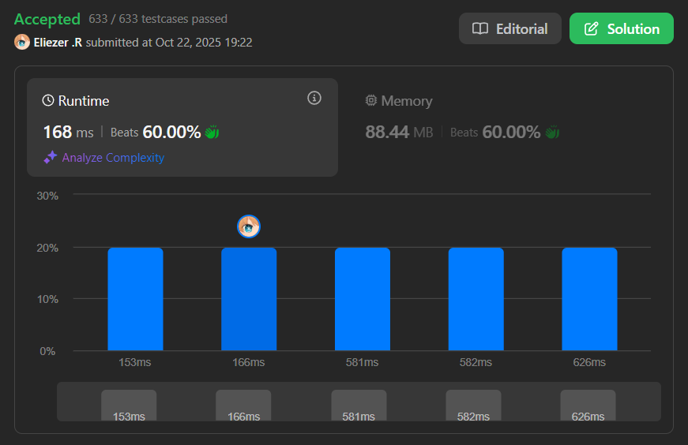

# 3347. Maximum Frequency of an Element After Performing Operations II

Se te da un array de enteros `nums` y dos enteros `k` y `numOperations`.

Debes realizar una operación `numOperations` veces en `nums`, donde en cada operación:
- Seleccionas un índice `i` que no fue seleccionado en ninguna operación anterior.
- Sumas un entero en el rango `[-k, k]` a `nums[i]`.

Retorna la **frecuencia máxima** posible de cualquier elemento en `nums` después de realizar las operaciones.

**Dificultad:** Hard

---

## 📋 Ejemplos

**Ejemplo 1:**

- Entrada: `nums = [1,4,5], k = 1, numOperations = 2`
- Salida: `2`
- Explicación:
```
Podemos lograr una frecuencia máxima de dos:
- Sumar 0 a nums[1], después de lo cual nums se convierte en [1, 4, 5]
- Sumar -1 a nums[2], después de lo cual nums se convierte en [1, 4, 4]
Ahora tenemos dos elementos con valor 4
```

**Ejemplo 2:**

- Entrada: `nums = [5,11,20,20], k = 5, numOperations = 1`
- Salida: `2`
- Explicación:
```
Podemos lograr una frecuencia máxima de dos:
- Sumar 0 a nums[1]
Ya hay dos elementos con valor 20
```

---

## 💭 Enfoque y Estrategia

- **Problema clave**: Maximizar la frecuencia de algún valor objetivo transformando hasta `numOperations` elementos.
- **Observación**: Para cada valor objetivo `v`, podemos contar:
  1. Cuántos elementos ya son iguales a `v`
  2. Cuántos elementos están en el rango `[v-k, v+k]` y pueden convertirse a `v`
- **Dos enfoques**:
  1. **Para valores existentes**: Usar sorting + binary search para contar elementos en rango
  2. **Para ventana deslizante**: Encontrar la ventana más grande donde `max - min ≤ 2k`

---

## 🔧 Implementación

```js
var maxFrequency = function(nums, k, numOperations) {
    const n = nums.length
    if (n === 0) return 0
    nums.sort((a,b) => a - b)

    const freq = new Map()
    for (const x of nums) freq.set(x, (freq.get(x) || 0) + 1)

    let ans = 1

    // Funciones de búsqueda binaria
    const lowerBound = (arr, target) => {
        let l = 0, r = arr.length
        while (l < r) {
            const mid = (l + r) >> 1
            if (arr[mid] < target) l = mid + 1
            else r = mid
        }
        return l
    }
    
    const upperBound = (arr, target) => {
        let l = 0, r = arr.length
        while (l < r) {
            const mid = (l + r) >> 1
            if (arr[mid] <= target) l = mid + 1
            else r = mid
        }
        return l
    }

    // Enfoque 1: Verificar cada valor único existente
    for (const [v, already] of freq.entries()) {
        const lowVal = v - k
        const highVal = v + k
        const L = lowerBound(nums, lowVal)
        const R = upperBound(nums, highVal)
        const totalInRange = R - L
        const need = totalInRange - already
        const canFix = Math.min(need, numOperations)
        ans = Math.max(ans, already + canFix)
    }

    // Enfoque 2: Sliding window para encontrar la ventana más grande
    let l = 0
    for (let r = 0; r < n; ++r) {
        while (l <= r && nums[r] - nums[l] > 2 * k) l++
        const w = r - l + 1
        ans = Math.max(ans, Math.min(w, numOperations))
    }

    return ans
}

console.log(maxFrequency([1,4,5], 1, 2)) // 2
console.log(maxFrequency([5,11,20,20], 5, 1)) // 2

/**
 * Ejemplo paso a paso con nums = [1,4,5], k = 1, numOperations = 2:
 * 
 * Después de ordenar: [1, 4, 5]
 * Frecuencias: {1: 1, 4: 1, 5: 1}
 * 
 * Verificar v = 1:
 *   Rango: [0, 2]
 *   L = lowerBound([1,4,5], 0) = 0
 *   R = upperBound([1,4,5], 2) = 1
 *   totalInRange = 1 - 0 = 1
 *   need = 1 - 1 = 0
 *   canFix = min(0, 2) = 0
 *   frecuencia = 1 + 0 = 1
 * 
 * Verificar v = 4:
 *   Rango: [3, 5]
 *   L = lowerBound([1,4,5], 3) = 1
 *   R = upperBound([1,4,5], 5) = 3
 *   totalInRange = 3 - 1 = 2
 *   need = 2 - 1 = 1
 *   canFix = min(1, 2) = 1
 *   frecuencia = 1 + 1 = 2 ✓
 * 
 * Verificar v = 5:
 *   Rango: [4, 6]
 *   L = lowerBound([1,4,5], 4) = 1
 *   R = upperBound([1,4,5], 6) = 3
 *   totalInRange = 3 - 1 = 2
 *   need = 2 - 1 = 1
 *   canFix = min(1, 2) = 1
 *   frecuencia = 1 + 1 = 2
 * 
 * Sliding Window:
 *   l=0, r=0: [1], w=1, ans=max(2, min(1,2))=2
 *   l=0, r=1: [1,4], 4-1=3 > 2*1=2, mover l
 *   l=1, r=1: [4], w=1, ans=2
 *   l=1, r=2: [4,5], 5-4=1 ≤ 2, w=2, ans=max(2, min(2,2))=2
 * 
 * Resultado: 2
 */
```

---

## 📊 Análisis de Rendimiento

- **Complejidad temporal**: O(n log n + m log n), donde n es la longitud de nums y m es el número de valores únicos.
  - Ordenar: O(n log n)
  - Para cada valor único, búsqueda binaria: O(log n)
  - Sliding window: O(n)
- **Complejidad espacial**: O(m), para el Map de frecuencias.


---

## 🎯 Visualización del Proceso

```
nums = [1,4,5], k = 1, numOperations = 2

Después de ordenar: [1, 4, 5]

Para valor objetivo = 4:
Rango alcanzable: [3, 5]

   1       4   5
   |-------|---|
   ↓       ↓   ↓
  fuera   ya  puede
          es  ser 4

Elementos en rango [3,5]: {4, 5} = 2 elementos
Ya tenemos: 1 (el 4)
Podemos convertir: 1 (el 5 a 4)
Total posible: 1 + 1 = 2
```

---

## 🔄 Enfoque Alternativo con Prefix Sum

```js
var maxFrequencyAlt = function(nums, k, numOperations) {
    const maxVal = Math.max(...nums) + k + 2
    const count = new Array(maxVal).fill(0)

    // Crear prefix sum
    for (const v of nums)
        count[v]++

    for (let i = 1; i < maxVal; i++)
        count[i] += count[i - 1]

    let res = 0
    for (let i = 0; i < maxVal; i++) {
        const left = Math.max(0, i - k)
        const right = Math.min(maxVal - 1, i + k)
        const total = count[right] - (left ? count[left - 1] : 0)
        const freq = count[i] - (i ? count[i - 1] : 0)
        res = Math.max(res, freq + Math.min(numOperations, total - freq))
    }

    return res
}
// O(n + maxVal) tiempo, útil cuando k y valores son pequeños
```

---

## 🔍 Casos Edge

- **Todos iguales**: `[5,5,5,5]` → Frecuencia ya máxima
- **numOperations = 0**: No se pueden hacer cambios, retornar frecuencia máxima actual
- **k muy grande**: Casi todos los elementos pueden convertirse al valor objetivo
- **Array de un elemento**: Retornar 1

---

## 🎯 Aprendizajes Clave

- **Binary Search optimization**: Contar elementos en rango eficientemente.
- **Frequency mapping**: Agrupar valores idénticos antes de procesar.
- **Range queries**: Usar sorting para facilitar consultas de rango.
- **Sliding window variant**: Encontrar ventanas donde la diferencia es pequeña.
- **Greedy selection**: Elegir los elementos más cercanos al valor objetivo.

---

## 🧮 Comparación de Enfoques

| Enfoque | Complejidad Tiempo | Complejidad Espacio | Mejor para |
|---------|-------------------|---------------------|------------|
| Binary Search + Map | O(n log n) | O(n) | Valores dispersos |
| Prefix Sum | O(n + maxVal) | O(maxVal) | Valores pequeños |
| Sliding Window | O(n log n) | O(n) | Encontrar ventanas óptimas |

---

## 💡 Intuición del Problema

El problema se reduce a:
1. **Elegir un valor objetivo** `v`
2. **Contar cuántos elementos** pueden alcanzar `v` sumando valores en `[-k, k]`
3. **Maximizar** entre todas las opciones de `v`

La clave es que un elemento en posición `x` puede transformarse a cualquier valor en `[x-k, x+k]`.

---

## 🏷️ Tags

`Array` `Binary Search` `Sliding Window` `Sorting` `Prefix Sum` `Hard`

---

**Complejidad Final:**
- ⏱️ Tiempo: O(n log n)
- 💾 Espacio: O(n)