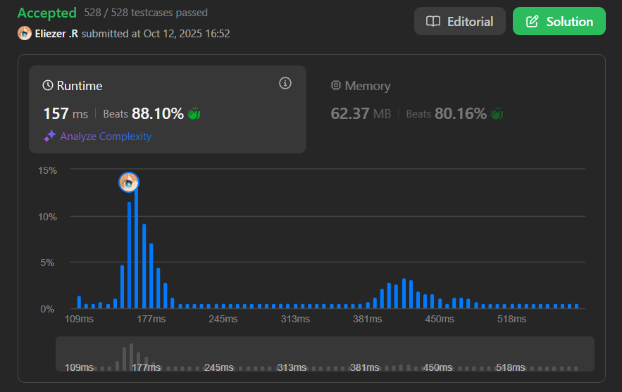

# 3539. Find Sum of Array Product of Magical Sequences

## 🧠 Descripción

Se te da un array de enteros `nums`, y dos enteros `m` y `k`.

Una secuencia **mágica** es una secuencia de longitud `m` formada eligiendo exactamente `m` elementos de `nums` (se pueden repetir). El **producto de array** de una secuencia es el producto de todos los elementos en la secuencia.

Una secuencia mágica es **válida** si la representación binaria del producto de array tiene exactamente `k` bits '1'.

Retorna la **suma de productos de array** de todas las secuencias mágicas válidas. Dado que la respuesta puede ser muy grande, retórnala módulo `10^9 + 7`.

---

## 📋 Ejemplos

### Ejemplo 1:

* **Entrada**: `m = 2, k = 2, nums = [1,2,3]`
* **Salida**: `39`
* **Explicación**: Hay 9 secuencias mágicas posibles de longitud 2.

### Ejemplo 2:

* **Entrada**: `m = 3, k = 1, nums = [4]`
* **Salida**: `64`
* **Explicación**: Solo hay una secuencia: [4,4,4], producto = 64 = 1000000₂ (1 bit '1').

---

## 💭 Estrategia y Enfoque

Este es un problema **extremadamente complejo** de Programación Dinámica con las siguientes características:

### 🧩 Desafíos del problema:

1. **Explosión combinatoria**: Hay `n^m` secuencias posibles.
2. **Productos grandes**: Los productos pueden exceder límites numéricos.
3. **Bits en producto**: Necesitamos rastrear cuántos bits '1' tiene el producto.
4. **Coeficientes binomiales**: Necesitamos elegir cuántas veces usar cada número.

### 🔑 Ideas clave:

1. **DP con estados complejos**: `dp[remaining][carry][onesCount]`
   - `remaining`: cuántos elementos aún debemos elegir
   - `carry`: acarreo de bits en la suma binaria
   - `onesCount`: cuántos bits '1' tenemos hasta ahora
   
2. **Coeficientes binomiales**: Para elegir `t` elementos de `m` disponibles.

3. **Potencias precalculadas**: `powA[i][t]` = `nums[i]^t mod MOD`

4. **Suma binaria**: Al multiplicar números, sus representaciones binarias se "suman" con acarreo.

---

## 💻 Implementación en JavaScript

```js
var magicalSum = function(m, k, nums) {
    const MOD = BigInt(1000000007);
    const n = nums.length;
    
    // Paso 1: Precalcular coeficientes binomiales C(n,k)
    // C[i][j] = número de formas de elegir j elementos de i elementos
    const C = Array.from({length: m+1}, () => Array(m+1).fill(0n));
    for(let i=0;i<=m;i++){
        C[i][0] = 1n;  // C(i,0) = 1
        C[i][i] = 1n;  // C(i,i) = 1
        // Fórmula de Pascal: C(i,j) = C(i-1,j-1) + C(i-1,j)
        for(let j=1;j<i;j++){
            C[i][j] = (C[i-1][j-1] + C[i-1][j]) % MOD;
        }
    }
    
    // Paso 2: Precalcular potencias de cada número
    // powA[i][t] = nums[i]^t mod MOD
    const powA = Array.from({length: n}, () => Array(m+1).fill(1n));
    for(let i=0;i<n;i++){
        powA[i][0] = 1n;  // Cualquier número^0 = 1
        const a = BigInt(nums[i]) % MOD;
        for(let t=1;t<=m;t++){
            powA[i][t] = (powA[i][t-1] * a) % MOD;
        }
    }
    
    // Paso 3: Programación Dinámica
    const M = m;
    
    // cur[r][carry][ones] = número de formas de llegar a este estado
    // r: elementos restantes por elegir
    // carry: acarreo actual en la suma binaria
    // ones: número de bits '1' contados hasta ahora
    let cur = Array.from({length: M+1}, () =>
        Array.from({length: M+1}, () =>
            Array(M+1).fill(0n)
        )
    );
    
    // Estado inicial: tenemos M elementos por elegir, sin carry, sin ones
    cur[M][0][0] = 1n;

    // Paso 4: Procesar cada número del array
    for(let i=0;i<n;i++){
        // Crear nueva tabla DP para esta iteración
        let nxt = Array.from({length: M+1}, () =>
            Array.from({length: M+1}, () =>
                Array(M+1).fill(0n)
            )
        );
        
        // Para cada estado posible actual
        for(let r=0;r<=M;r++){
            for(let carry=0; carry<=M; carry++){
                for(let ones=0; ones<=M; ones++){
                    let val = cur[r][carry][ones];
                    if(val === 0n) continue;  // Skip estados vacíos
                    
                    // Decidir cuántas veces usar nums[i]: t veces (0 a r)
                    for(let t=0;t<=r;t++){
                        let newr = r - t;  // Elementos restantes después de usar t
                        let sum = carry + t;  // Nueva suma en esta posición binaria
                        let bit = sum & 1;  // Bit menos significativo (0 o 1)
                        let newones = ones + bit;  // Actualizar conteo de '1's
                        
                        // Si excedemos k bits '1', este camino no es válido
                        if(newones > M) continue;
                        
                        let newcarry = sum >>> 1;  // Nuevo acarreo (shift derecha)
                        
                        // Multiplicador combinatorio: C(r,t) * nums[i]^t
                        let mult = (C[r][t] * powA[i][t]) % MOD;
                        
                        // Sumar a la nueva tabla
                        let add = (val * mult) % MOD;
                        nxt[newr][newcarry][newones] = (nxt[newr][newcarry][newones] + add) % MOD;
                    }
                }
            }
        }
        cur = nxt;  // Actualizar tabla para próxima iteración
    }

    // Paso 5: Recolectar resultados
    let ans = 0n;
    
    // Solo estados donde elegimos todos los elementos (r=0)
    for(let carry=0; carry<=M; carry++){
        for(let ones=0; ones<=M; ones++){
            let val = cur[0][carry][ones];
            if(val === 0n) continue;
            
            // Contar bits '1' adicionales en el carry final
            let extra = popcount(carry);
            
            // Si el total de bits '1' es exactamente k
            if(ones + extra === k){
                ans = (ans + val) % MOD;
            }
        }
    }
    
    return Number(ans);

    // Función auxiliar: contar bits '1' en un número
    function popcount(x){
        let c = 0;
        while(x > 0){
            c += x & 1;  // Sumar el bit menos significativo
            x >>>= 1;    // Shift derecha
        }
        return c;
    }
};

console.log(magicalSum(2, 2, [1,2,3]))  // 39
console.log(magicalSum(3, 1, [4]))      // 64
```

### 📝 Explicación conceptual del DP:

```
Estado: dp[r][carry][ones]
  r = elementos restantes por elegir
  carry = acarreo de la suma binaria actual
  ones = cantidad de bits '1' encontrados

Transición:
Para cada número nums[i], decidir usarlo t veces (0 ≤ t ≤ r)
  - Nuevo r: r - t
  - Nueva suma: carry + t
  - Nuevo bit: (carry + t) & 1
  - Nuevos ones: ones + bit
  - Nuevo carry: (carry + t) >> 1
  - Multiplicar por: C(r,t) × nums[i]^t

Ejemplo con m=2, nums=[2,3]:
Elegir [2,3]:
  Producto = 2 × 3 = 6 = 110₂
  Bits '1' = 2 ✓
```

---

## 📊 Análisis de Rendimiento

* **Complejidad temporal**: O(n × m³ × m) ≈ O(n × m⁴)
  - Por cada número: O(n)
  - Estados DP: O(m³)
  - Transiciones: O(m)
* **Complejidad espacial**: O(m³), para la tabla DP.



---

## 🎯 Aprendizajes Clave

* **DP multi-dimensional**: Manejar estados con 3+ dimensiones.
* **Coeficientes binomiales**: Precálculo con triángulo de Pascal.
* **Aritmética modular**: Usar BigInt para evitar overflow.
* **Bit manipulation**: Rastrear bits en productos sin calcular productos reales.
* **Binary addition simulation**: Simular suma binaria con carry.
* **Combinatorics**: Usar C(n,k) para contar selecciones.

---

## 🔍 Intuición del Algoritmo

**¿Por qué funciona?**

En lugar de calcular productos enormes y contar sus bits:
1. **Simulamos la suma binaria** bit por bit
2. **Rastreamos el carry** en cada posición binaria
3. **Contamos '1's** conforme los encontramos
4. Usamos **coeficientes binomiales** para contar combinaciones

Es como sumar números en binario, pero rastreando estadísticas en lugar de calcular el resultado final.

---

## 💡 Ejemplo Simplificado

```
m=2, k=1, nums=[2]

Secuencias posibles: [2,2]
Producto: 2×2 = 4 = 100₂
Bits '1': 1 ✓

DP:
Estado inicial: dp[2][0][0] = 1
Procesar nums[0]=2:
  t=0: no usar 2
  t=1: usar 2 una vez → dp[1][1][1]
  t=2: usar 2 dos veces → dp[0][2][0]
  
Carry final = 2 = 10₂
Extra ones = 1
Total ones = 0 + 1 = 1 ✓

Contribución: C(2,2) × 2^2 = 1 × 4 = 4
```

---

## 🏷️ Etiquetas

`Dynamic Programming` `Math` `Combinatorics` `Bit Manipulation` `Hard`