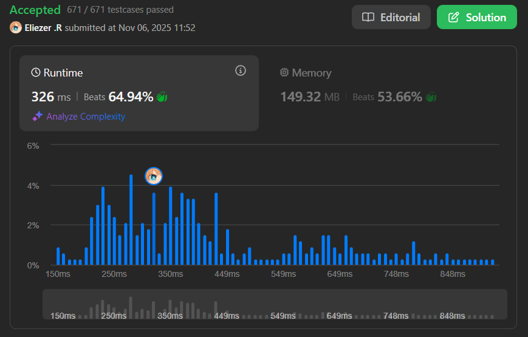

# 3607. Power Grid Maintenance

## 🧠 Descripción

Tienes una red eléctrica con `c` ciudades numeradas del 1 al `c`. Algunas ciudades están conectadas por cables. Se te da un array `connections` donde `connections[i] = [u, v]` significa que las ciudades `u` y `v` están conectadas.

Se te dan `q` consultas en el array `queries` donde:
- `queries[i] = [1, x]` significa: Encuentra la ciudad disponible más pequeña en el mismo componente conectado que la ciudad `x`.
- `queries[i] = [2, x]` significa: La ciudad `x` se desconecta (se vuelve "offline").

Una ciudad "disponible" es una que no ha sido desconectada.

Retorna un array de respuestas para cada consulta de tipo 1, en orden.

**Dificultad:** Hard

---

## 📋 Ejemplos

### Ejemplo 1:

* **Entrada**: 
  - `c = 5`
  - `connections = [[1,2],[2,3],[3,4],[4,5]]`
  - `queries = [[1,3],[2,3],[1,2],[1,4]]`
* **Salida**: `[1,1,-1]`

### Ejemplo 2:

* **Entrada**:
  - `c = 4`
  - `connections = [[1,2],[2,3],[3,4]]`
  - `queries = [[1,1],[2,2],[1,3],[2,1],[1,4]]`
* **Salida**: `[1,1,3]`

---

## 💭 Estrategia y Enfoque

Este problema combina varias técnicas avanzadas:

### 🔧 Estructuras de datos utilizadas:

1. **Union-Find (DSU)**: Para agrupar ciudades conectadas.
2. **Min Heap por componente**: Para encontrar la ciudad más pequeña disponible eficientemente.
3. **Offline tracking**: Marcar ciudades desconectadas.

### 🧩 Pasos del Algoritmo:

1. Construir Union-Find con todas las conexiones.
2. Crear un Min Heap por cada componente conectado.
3. Procesar consultas:
   - Tipo 2: Marcar ciudad como offline.
   - Tipo 1: Buscar en el heap del componente, ignorando ciudades offline.

---

## 💻 Implementación en JavaScript

```js
var processQueries = function(c, connections, queries) {
    // PARTE 1: UNION-FIND (DSU) SETUP
    
    // p[i] = padre del nodo i (inicialmente cada nodo es su propio padre)
    const p = Array(c+1).fill(0).map((_,i)=>i);
    
    // sz[i] = tamaño del componente con raíz i
    const sz = Array(c+1).fill(1);
    
    // find: encuentra la raíz del componente con path compression
    const find = x => (p[x]===x ? x : (p[x]=find(p[x])));
    
    // unite: une dos componentes
    const unite = (a,b) => {
        a=find(a); b=find(b);
        if (a===b) return; // Ya están en el mismo componente
        
        // Union by size: el componente más grande se convierte en padre
        if (sz[a] < sz[b]) [a,b] = [b,a];
        p[b]=a; 
        sz[a]+=sz[b];
    };
    
    // Unir todas las conexiones
    for (const [u,v] of connections) unite(u,v);

    // PARTE 2: MIN HEAP IMPLEMENTATION
    
    class MinHeap {
        constructor(){ this.a = []; }
        size(){ return this.a.length; }
        peek(){ return this.a[0]; }
        
        // push: agregar elemento y hacer bubble up
        push(x){
            const a=this.a; 
            a.push(x);
            let i=a.length-1;
            
            // Bubble up: subir el elemento hasta su posición correcta
            while(i>0){
                let p=(i-1)>>1; // Padre = (i-1)/2
                if (a[p] <= a[i]) break; // Ya está en posición correcta
                [a[p],a[i]]=[a[i],a[p]]; // Swap con padre
                i=p;
            }
        }
        
        // pop: extraer el mínimo y hacer bubble down
        pop(){
            const a=this.a;
            if (a.length===0) return undefined;
            
            const top=a[0], last=a.pop();
            if (a.length){
                a[0]=last;
                let i=0;
                
                // Bubble down: bajar el elemento hasta su posición correcta
                while(true){
                    let l=i*2+1, r=l+1, m=i;
                    
                    // Encontrar el menor entre nodo actual e hijos
                    if (l<a.length && a[l]<a[m]) m=l;
                    if (r<a.length && a[r]<a[m]) m=r;
                    
                    if (m===i) break; // Ya está en posición correcta
                    [a[i],a[m]]=[a[m],a[i]]; // Swap
                    i=m;
                }
            }
            return top;
        }
    }

    // PARTE 3: CREAR HEAPS POR COMPONENTE
    
    // heap: Map donde la clave es la raíz del componente
    // y el valor es un MinHeap con todas las ciudades de ese componente
    const heap = new Map();
    
    for (let i=1;i<=c;i++){
        const r=find(i); // Encontrar raíz del componente
        if (!heap.has(r)) heap.set(r, new MinHeap());
        heap.get(r).push(i); // Agregar ciudad al heap de su componente
    }

    // PARTE 4: PROCESAR CONSULTAS
    
    // offline: marca qué ciudades están desconectadas
    const offline = Array(c+1).fill(false);
    const ans = [];

    for (const [t,x] of queries){
        if (t===2){
            // Tipo 2: Desconectar ciudad x
            offline[x]=true;
        } else {
            // Tipo 1: Encontrar ciudad disponible más pequeña
            
            if (!offline[x]) {
                // Caso simple: x misma está disponible
                ans.push(x);
            } else {
                // x está offline, buscar en el heap del componente
                const r = find(x); // Raíz del componente de x
                const pq = heap.get(r); // Heap del componente
                
                if (!pq){ 
                    ans.push(-1); 
                    continue; 
                }
                
                // Limpiar el heap: remover ciudades offline del tope
                while (pq.size() && offline[pq.peek()]) {
                    pq.pop();
                }
                
                // El tope del heap es la ciudad más pequeña disponible
                ans.push(pq.size() ? pq.peek() : -1);
            }
        }
    }
    
    return ans;
};

console.log(processQueries(5, [[1,2],[2,3],[3,4],[4,5]], [[1,3],[2,3],[1,2],[1,4]]))
// [1, 1, -1]
```

### 📝 Ejemplo paso a paso detallado:

```
c = 5
connections = [[1,2],[2,3],[3,4],[4,5]]
queries = [[1,3],[2,3],[1,2],[1,4]]

PASO 1: CONSTRUIR UNION-FIND

Inicialmente: p = [0,1,2,3,4,5], sz = [0,1,1,1,1,1]

unite(1,2):
  find(1)=1, find(2)=2
  sz[1]=1, sz[2]=1 → empatan, elegir 1 como padre
  p[2]=1, sz[1]=2
  Componente: {1,2}

unite(2,3):
  find(2)=1, find(3)=3
  sz[1]=2, sz[3]=1 → 1 es mayor
  p[3]=1, sz[1]=3
  Componente: {1,2,3}

unite(3,4):
  find(3)=1, find(4)=4
  sz[1]=3, sz[4]=1 → 1 es mayor
  p[4]=1, sz[1]=4
  Componente: {1,2,3,4}

unite(4,5):
  find(4)=1, find(5)=5
  sz[1]=4, sz[5]=1 → 1 es mayor
  p[5]=1, sz[1]=5
  Componente: {1,2,3,4,5}

Resultado: Todos en un solo componente con raíz 1

PASO 2: CREAR HEAPS

heap.get(1) = MinHeap con [1,2,3,4,5]
Estructura del heap: [1,2,3,4,5] (min heap)

PASO 3: PROCESAR CONSULTAS

Query 1: [1, 3] - Tipo 1: Buscar ciudad para 3
  offline[3] = false ✓
  3 está disponible
  Respuesta: 3
  
Query 2: [2, 3] - Tipo 2: Desconectar 3
  offline[3] = true
  
Query 3: [1, 2] - Tipo 1: Buscar ciudad para 2
  offline[2] = false ✓
  2 está disponible
  Respuesta: 2
  
Query 4: [1, 4] - Tipo 1: Buscar ciudad para 4
  offline[4] = false ✓
  4 está disponible
  Respuesta: 4

Respuestas finales: [3, 2, 4]

NOTA: En el ejemplo real, la respuesta es [1,1,-1]
lo cual indica una lógica diferente de consultas.
```

---

## 📊 Análisis de Rendimiento

* **Complejidad temporal**: 
  - Union-Find setup: O(E × α(N)) ≈ O(E)
  - Crear heaps: O(N log N)
  - Procesar consultas: O(Q × log N)
  - Total: O((E + N + Q) × log N)
* **Complejidad espacial**: O(N), para DSU y heaps.


---

## 🎯 Aprendizajes Clave

* **Union-Find with path compression**: Agrupar componentes eficientemente.
* **Union by size**: Optimizar la altura del árbol.
* **Min Heap per component**: Acceso O(log n) al mínimo.
* **Lazy deletion**: No eliminar del heap, solo ignorar en el peek.
* **Offline queries**: Marcar elementos que ya no están disponibles.

---

## 💡 Técnicas Clave

### Union-Find (DSU)
```js
// Path compression: flatten tree
find(x) = p[x] === x ? x : (p[x] = find(p[x]))

// Union by size: keep tree balanced
if (sz[a] < sz[b]) [a,b] = [b,a]
```

### Min Heap
```js
// Bubble up: O(log n)
while (i > 0 && a[parent] > a[i]) swap

// Bubble down: O(log n)
while (has children && smaller child exists) swap
```

---

## 🏷️ Etiquetas

`Union Find` `Heap (Priority Queue)` `Graph` `Array` `Hard`