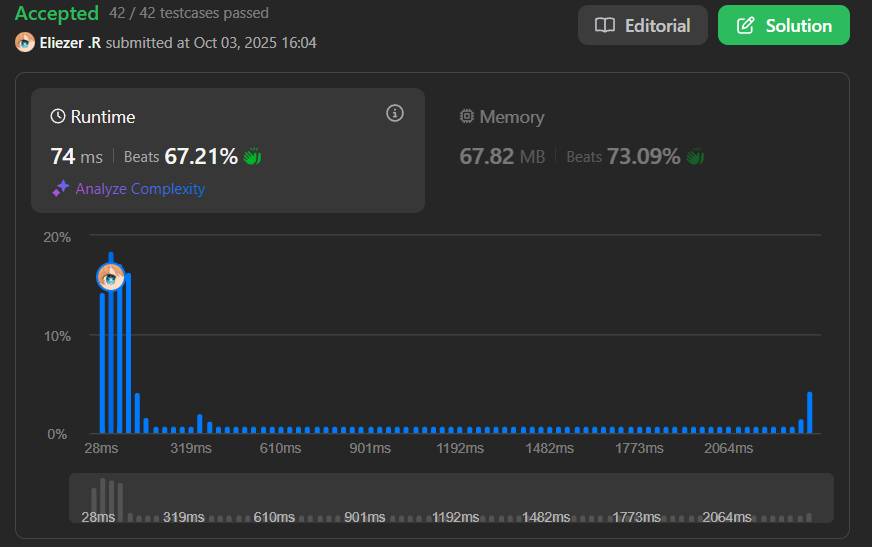

# 407. Trapping Rain Water II

## 🧠 Descripción

Se te da una matriz de enteros `m x n` llamada `heightMap` que representa la altura de cada unidad de celda en un mapa 2D. Cada celda tiene altura `heightMap[i][j]`.

En un día lluvioso, el agua se queda atrapada en este mapa 2D. Retorna el volumen total de agua de lluvia que puede ser atrapada.

**Nota**: La elevación dentro de cada celda debe ser estrictamente mayor que la elevación de cualquiera de sus 4 celdas adyacentes para que el agua pueda ser atrapada.

---

## 📋 Ejemplos

### Ejemplo 1:

* **Entrada**: `heightMap = [[1,4,3,1,3,2],[3,2,1,3,2,4],[2,3,3,2,3,1]]`
* **Salida**: `4`
* **Explicación**: Después de la lluvia, el agua queda atrapada entre los bloques.

### Ejemplo 2:

* **Entrada**: `heightMap = [[3,3,3,3,3],[3,2,3,2,3],[3,2,3,2,3],[3,2,3,2,3],[3,3,3,3,3]]`
* **Salida**: `10`

---

## 💭 Estrategia y Enfoque

Este problema es una extensión 2D del clásico "Trapping Rain Water" 1D. La estrategia es:

### 🧩 Idea clave:

1. El agua atrapada en una celda está limitada por la **barrera más baja** que la rodea.
2. Usamos un **Min Heap (Priority Queue)** para procesar celdas desde la más baja hacia adentro.
3. Comenzamos desde los **bordes** (que actúan como límites externos).

### 🌊 Algoritmo:

1. Añadir todas las celdas del **borde** al Min Heap y marcarlas como visitadas.
2. Procesar celdas desde el heap (siempre la de menor altura primero).
3. Para cada celda procesada, verificar sus vecinos no visitados:
   - Si el vecino es más bajo, el agua se atrapa: `waterTrapped += (currentHeight - neighborHeight)`
   - Añadir el vecino al heap con la altura **máxima** entre `currentHeight` y `neighborHeight`.
4. Continuar hasta procesar todas las celdas.

---

## 💻 Implementación en JavaScript

```js
var trapRainWater = function (heightMap) {
    const m = heightMap.length,
        n = heightMap[0].length;
    
    // Si la matriz es muy pequeña, no puede atrapar agua
    if (m < 3 || n < 3) return 0;

    // Min Heap (Priority Queue) ordenado por altura
    // Usamos la implementación de LeetCode: MinPriorityQueue
    const pq = new MinPriorityQueue((cell) => cell.height);
    
    // Matriz para rastrear celdas visitadas
    const visited = Array.from({ length: m }, () => Array(n).fill(false));

    // Paso 1: Añadir todas las celdas del BORDE al heap
    
    // Añadir columnas izquierda y derecha (todas las filas)
    for (let i = 0; i < m; i++) {
        // Columna izquierda
        pq.enqueue({ height: heightMap[i][0], x: i, y: 0 });
        // Columna derecha
        pq.enqueue({ height: heightMap[i][n - 1], x: i, y: n - 1 });
        // Marcar como visitadas
        visited[i][0] = visited[i][n - 1] = true;
    }
    
    // Añadir filas superior e inferior (todas las columnas)
    for (let j = 0; j < n; j++) {
        // Fila superior
        pq.enqueue({ height: heightMap[0][j], x: 0, y: j });
        // Fila inferior
        pq.enqueue({ height: heightMap[m - 1][j], x: m - 1, y: j });
        // Marcar como visitadas
        visited[0][j] = visited[m - 1][j] = true;
    }

    let result = 0; // Agua total atrapada
    
    // Direcciones: derecha, abajo, izquierda, arriba
    const directions = [
        [0, 1],
        [1, 0],
        [0, -1],
        [-1, 0],
    ];

    // Paso 2: Procesar celdas desde la más baja (Min Heap)
    while (!pq.isEmpty()) {
        // Sacar la celda con menor altura
        const { height, x, y } = pq.dequeue();

        // Paso 3: Explorar los 4 vecinos de esta celda
        for (const [dx, dy] of directions) {
            const nx = x + dx,  // Nueva fila
                ny = y + dy;    // Nueva columna
            
            // Verificar si el vecino es válido y no ha sido visitado
            if (nx >= 0 && ny >= 0 && nx < m && ny < n && !visited[nx][ny]) {
                // CLAVE: Si el vecino es más bajo que la altura actual (barrera),
                // se atrapa agua = diferencia de alturas
                result += Math.max(0, height - heightMap[nx][ny]);
                
                // Añadir el vecino al heap con la altura MÁXIMA
                // Esto es porque el agua llenará hasta el nivel de la barrera
                pq.enqueue({
                    height: Math.max(height, heightMap[nx][ny]),
                    x: nx,
                    y: ny,
                });
                
                // Marcar como visitado
                visited[nx][ny] = true;
            }
        }
    }

    return result;
};

console.log(trapRainWater([[1,4,3,1,3,2],[3,2,1,3,2,4],[2,3,3,2,3,1]])) // 4
console.log(trapRainWater([[3,3,3,3,3],[3,2,3,2,3],[3,2,3,2,3],[3,2,3,2,3],[3,3,3,3,3]])) // 10
```

### 📝 Ejemplo paso a paso simplificado:

```
heightMap = [[3,3,3],
             [3,1,3],
             [3,3,3]]

Paso 1: Añadir bordes al heap
PQ = [(3,0,0), (3,0,1), (3,0,2), (3,1,0), (3,1,2), (3,2,0), (3,2,1), (3,2,2)]
visited = borde completo

Paso 2: Procesar desde el heap
- Sacar (3,0,0), altura = 3
  - Vecinos: (1,0) ya visitado, (0,1) ya visitado
  
- Sacar (3,0,1), altura = 3
  - Vecinos: (0,0), (0,2), (1,1)
  - (1,1) no visitado, altura = 1
  - Agua atrapada: max(0, 3-1) = 2
  - Añadir (3,1,1) al heap (max(3,1)=3)
  
- Continuar...

Celda (1,1):
- Rodeada por paredes de altura 3
- Su altura es 1
- Agua atrapada = 3 - 1 = 2

Total agua atrapada: 2 unidades
```

### 🎨 Visualización del proceso:

```
Matriz original:
  3  3  3
  3  1  3
  3  3  3

Después de la lluvia:
  3  3  3
  3 [3] 3  ← El 1 se llena hasta altura 3
  3  3  3

Agua atrapada en (1,1) = 3 - 1 = 2
```

---

## 📊 Análisis de Rendimiento

* **Complejidad temporal**: O(m × n × log(m × n)), donde m y n son las dimensiones.
  - Cada celda se procesa una vez
  - Operaciones de heap: O(log(m × n))
* **Complejidad espacial**: O(m × n), para el heap y la matriz visited.



---

## 🎯 Aprendizajes Clave

* **Min Heap Strategy**: Procesar desde las barreras más bajas primero.
* **Border-first approach**: Comenzar desde los bordes hacia adentro.
* **Water level propagation**: El nivel del agua se propaga usando `max(currentHeight, neighborHeight)`.
* **Greedy approach**: Siempre procesar la celda con menor altura disponible.
* **2D extension**: Generalización del problema 1D de trapping rain water.

---

## 🔍 Diferencia con Trapping Rain Water 1D

| Aspecto | 1D | 2D |
|---------|----|----|
| Estructura | Array | Matriz |
| Límites | Izquierda y Derecha | 4 direcciones |
| Algoritmo | Two Pointers | Min Heap + BFS |
| Complejidad | O(n) | O(m×n log(m×n)) |
| Dificultad | Medium | Hard |

---

## 💡 Intuición del Algoritmo

**¿Por qué funciona?**

1. El agua siempre se desbordará por la **barrera más baja**.
2. Al procesar desde los bordes hacia adentro, garantizamos que conocemos la barrera mínima.
3. Cuando visitamos una celda, ya conocemos el nivel máximo de agua que puede tener.
4. Si la celda es más baja que ese nivel, se llena de agua.

**Analogía:**
Imagina que vas llenando una piscina irregular desde los bordes. El agua subirá hasta encontrar el punto más bajo por donde se puede desbordar.

---

## 🔄 Paso a Paso Detallado

```
Grid:
  4  4  4
  4  1  4
  4  4  4

1. Añadir bordes al Min Heap:
   PQ = [todas las celdas con 4]
   
2. Sacar primera celda: (altura=4, pos=algún borde)
   - Verificar vecinos
   - Encontrar (1,1) con altura=1
   - Agua = 4 - 1 = 3
   - Añadir (1,1) con altura=4 al heap
   
3. Resultado: 3 unidades de agua atrapadas
```

---

## 🧮 Ejemplo Complejo

```
heightMap = [[12,13,1,12],
             [13,4,13,12],
             [13,8,10,12],
             [12,13,12,12]]

Bordes (altura mínima = 12):
  12  13   1  12
  13  .   .   12
  13  .   .   12
  12  13  12  12

Procesamiento:
- La celda (0,2)=1 es la barrera más baja
- Desde (0,2), el agua puede fluir hacia (1,2)
- Nivel de agua en (1,2) = max(1, heightMap[1][2]) = max(1,13) = 13
- No se atrapa agua porque 13 > 1

Celdas internas:
- (1,1)=4: rodeada por 12s, agua hasta 12, atrapa 12-4=8
- (1,2)=13: más alta que bordes, no atrapa
- (2,1)=8: rodeada por 12s+, agua hasta 12, atrapa 12-8=4
- (2,2)=10: similar, atrapa 12-10=2

Total: 8 + 4 + 2 = 14 unidades
```

---

## 🏷️ Etiquetas

`Array` `BFS` `Heap (Priority Queue)` `Matrix` `Hard`