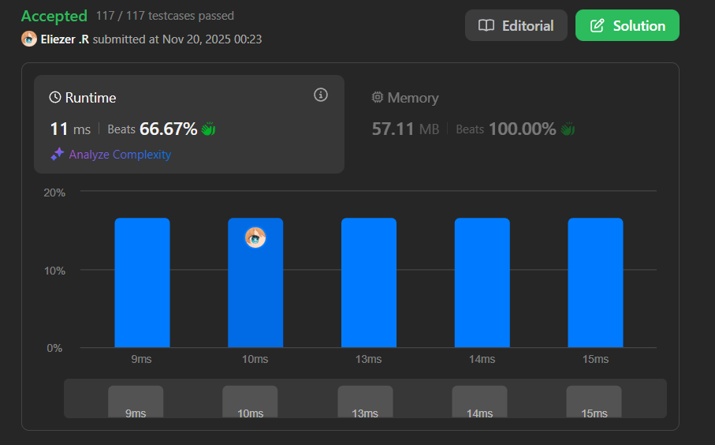

# 757. Set Intersection Size At Least Two

Se te da un arreglo 2D de enteros **intervals** donde `intervals[i] = [startᵢ, endᵢ]` representa todos los enteros desde `startᵢ` hasta `endᵢ` inclusivamente.

Un **conjunto contenedor** es un arreglo `nums` donde cada intervalo de `intervals` tiene **al menos dos enteros** en `nums`.

Por ejemplo, si `intervals = [[1,3], [3,7], [8,9]]`, entonces `[1,2,4,7,8,9]` y `[2,3,4,8,9]` son conjuntos contenedores.

Retorna el **tamaño mínimo posible** de un conjunto contenedor.

**Dificultad:** Hard

---

## 📋 Ejemplos

**Ejemplo 1:**

- Entrada: `intervals = [[1,3],[3,7],[8,9]]`
- Salida: `5`
- Explicación: Sea `nums = [2, 3, 4, 8, 9]`. Se puede demostrar que no puede haber un arreglo contenedor de tamaño 4.

**Ejemplo 2:**

- Entrada: `intervals = [[1,3],[1,4],[2,5],[3,5]]`
- Salida: `3`
- Explicación: Sea `nums = [2, 3, 4]`. Se puede demostrar que no puede haber un arreglo contenedor de tamaño 2.

**Ejemplo 3:**

- Entrada: `intervals = [[1,2],[2,3],[2,4],[4,5]]`
- Salida: `5`
- Explicación: Sea `nums = [1, 2, 3, 4, 5]`. Se puede demostrar que no puede haber un arreglo contenedor de tamaño 4.

---

## 💭 Enfoque y Estrategia

- **Objetivo**: Encontrar el conjunto mínimo de números que tenga al menos 2 elementos de cada intervalo.
- **Insight clave**: Enfoque greedy ordenando por punto final. Al procesar intervalos por su final, maximizamos la probabilidad de que los números seleccionados cubran intervalos futuros.
- **Técnica**: Ordenamiento + greedy con seguimiento de los dos últimos números agregados.
- **Retos**: Decidir cuántos números agregar según la intersección con números ya seleccionados.

La estrategia greedy funciona porque al ordenar por punto final y seleccionar siempre los números más grandes posibles de cada intervalo, maximizamos la cobertura para intervalos futuros.

---

## 🔧 Implementación

```javascript
var intersectionSizeTwo = function (intervals) {
    // Ordenar intervalos por punto final (ascendente)
    // Si los puntos finales son iguales, ordenar por punto inicial (descendente)
    intervals.sort((a, b) => a[1] - b[1] || b[0] - a[0]);

    let a = -Infinity;  // Penúltimo número agregado al conjunto
    let b = -Infinity;  // Último número agregado al conjunto
    let ans = 0;        // Tamaño del conjunto

    for (const [l, r] of intervals) {
        // Caso 1: Ninguno de los dos últimos números está en el intervalo actual
        if (b < l) {
            // Necesitamos agregar 2 números nuevos
            // Elegimos los dos números más grandes: r-1 y r
            a = r - 1;
            b = r;
            ans += 2;
        }
        // Caso 2: Solo b está en el intervalo (a < l && b >= l)
        else if (a < l && b >= l) {
            // Solo necesitamos agregar 1 número nuevo
            // Actualizamos: a toma el valor de b, b toma r
            a = b;
            b = r;
            ans += 1;
        }
        // Caso 3: Ambos a y b están en el intervalo (a >= l y b >= l)
        // No necesitamos hacer nada, el intervalo ya está cubierto
    }

    return ans;
};

console.log(intersectionSizeTwo([[1,3],[3,7],[8,9]])); // 5

/**
 * Ejemplo paso a paso con intervals = [[1,3],[3,7],[8,9]]:
 * 
 * PASO 1: Ordenar intervalos
 * Original: [[1,3],[3,7],[8,9]]
 * Después de ordenar por final: [[1,3],[3,7],[8,9]]
 * (Ya están ordenados por punto final)
 * 
 * PASO 2: Procesar cada intervalo
 * 
 * Estado inicial: a = -∞, b = -∞, ans = 0
 * 
 * Intervalo 1: [1, 3]
 *   l = 1, r = 3
 *   ¿b < l? → -∞ < 1 ✓ (Caso 1)
 *   Agregar 2 números: r-1=2 y r=3
 *   a = 2, b = 3, ans = 2
 *   Conjunto actual: {2, 3}
 * 
 * Intervalo 2: [3, 7]
 *   l = 3, r = 7
 *   ¿b < l? → 3 < 3 ✗
 *   ¿a < l && b >= l? → 2 < 3 ✓ y 3 >= 3 ✓ (Caso 2)
 *   Agregar 1 número: r=7
 *   a = 3, b = 7, ans = 3
 *   Conjunto actual: {2, 3, 7}
 * 
 * Intervalo 3: [8, 9]
 *   l = 8, r = 9
 *   ¿b < l? → 7 < 8 ✓ (Caso 1)
 *   Agregar 2 números: r-1=8 y r=9
 *   a = 8, b = 9, ans = 5
 *   Conjunto actual: {2, 3, 7, 8, 9}
 * 
 * Resultado final: ans = 5
 * 
 * Verificación:
 * - Intervalo [1,3]: contiene {2, 3} ✓ (2 números)
 * - Intervalo [3,7]: contiene {3, 7} ✓ (2 números)
 * - Intervalo [8,9]: contiene {8, 9} ✓ (2 números)
 * 
 * 
 * Ejemplo paso a paso con intervals = [[1,3],[1,4],[2,5],[3,5]]:
 * 
 * PASO 1: Ordenar
 * Original: [[1,3],[1,4],[2,5],[3,5]]
 * Después de ordenar:
 *   - [1,3] (final=3)
 *   - [1,4] (final=4)
 *   - [3,5] (final=5)
 *   - [2,5] (final=5, pero inicio 2 > 3, así que va después)
 * Resultado: [[1,3],[1,4],[3,5],[2,5]]
 * 
 * PASO 2: Procesar
 * 
 * Intervalo 1: [1, 3]
 *   Caso 1: agregar {2, 3}
 *   a = 2, b = 3, ans = 2
 * 
 * Intervalo 2: [1, 4]
 *   l = 1, r = 4
 *   a = 2 >= 1 ✓, b = 3 >= 1 ✓ (Caso 3)
 *   Ya está cubierto, no agregar nada
 *   ans = 2
 * 
 * Intervalo 3: [3, 5]
 *   l = 3, r = 5
 *   a = 2 < 3 ✓, b = 3 >= 3 ✓ (Caso 2)
 *   Agregar 1 número: 5
 *   a = 3, b = 5, ans = 3
 * 
 * Intervalo 4: [2, 5]
 *   l = 2, r = 5
 *   a = 3 >= 2 ✓, b = 5 >= 2 ✓ (Caso 3)
 *   Ya está cubierto
 *   ans = 3
 * 
 * Resultado final: ans = 3
 * Conjunto: {2, 3, 5} (o equivalente)
 */
```

---

## 📊 Análisis de Rendimiento

- **Complejidad temporal**: O(n log n), donde n es el número de intervalos (dominado por el ordenamiento).
- **Complejidad espacial**: O(1), solo usamos variables auxiliares.

*El ordenamiento es el cuello de botella, pero el procesamiento greedy es O(n).*

---

## 🔧 Detalles Técnicos Importantes

**Criterio de Ordenamiento:**

```javascript
intervals.sort((a, b) => a[1] - b[1] || b[0] - a[0]);
```

Este ordenamiento es crucial:
1. **Primario**: Por punto final ascendente (`a[1] - b[1]`)
   - Procesar intervalos que terminan primero
2. **Secundario**: Por punto inicial descendente (`b[0] - a[0]`)
   - Si dos intervalos terminan igual, procesamos primero el que empieza después
   - Esto asegura que intervalos más "contenidos" se procesen primero

**¿Por qué este ordenamiento?**

Al ordenar por punto final, garantizamos que cuando seleccionamos números del final de un intervalo, maximizamos la probabilidad de cubrir intervalos futuros.

**Tres Casos de Intersección:**

```javascript
// Caso 1: Sin intersección (b < l)
// [...a, b]      [l...r]
//   Agregar 2 números: r-1, r

// Caso 2: Una intersección (a < l, b >= l)
// [a, ...b...]  [l...r]
//   Agregar 1 número: r

// Caso 3: Dos intersecciones (a >= l, b >= l)
// [...a, b]
//    [l...r]
//   No agregar nada
```

**¿Por qué elegir r-1 y r?**

Al elegir los dos números más grandes del intervalo (r-1 y r), maximizamos la probabilidad de que estos números también estén en intervalos futuros que se superponen.

---

## 🎯 Aprendizajes Clave

- **Greedy funciona**: Ordenar por punto final y seleccionar números greedily es óptimo.
- **Ordenamiento estratégico**: El orden de procesamiento afecta dramáticamente la solución.
- **Rastreo mínimo**: Solo necesitamos los dos últimos números, no el conjunto completo.
- **Casos de intersección**: Analizar cuántos números ya están en el intervalo determina cuántos agregar.

---

## 🔍 Casos Edge

- **Un intervalo**: `[[1,3]]` → `2` (agregar {2, 3})
- **Sin superposición**: `[[1,2],[4,5],[7,8]]` → `6` (2 números por intervalo)
- **Superposición completa**: `[[1,5],[2,4],[3,5]]` → `2` (todos comparten números)
- **Intervalos idénticos**: `[[1,3],[1,3],[1,3]]` → `2` (un par sirve para todos)
- **Intervalos consecutivos**: `[[1,2],[2,3],[3,4]]` → `4` ({1,2,3,4})

---

## 🧮 Ejemplos Adicionales

```javascript
[[1,3]]                    → 2  ({2, 3})
[[1,2],[2,3],[3,4]]        → 4  ({1, 2, 3, 4})
[[1,10],[2,9],[3,8]]       → 2  ({8, 9} cubre todos)
[[1,2],[3,4],[5,6]]        → 6  (sin superposición)
[[1,5],[2,6],[3,7]]        → 2  ({5, 6})
```

---

## 🚀 Comparación: Greedy vs Brute Force

**Solución Greedy (presentada):**
```javascript
// O(n log n) tiempo, O(1) espacio
// Eficiente y óptima
```

**Solución Brute Force (TLE):**
```javascript
// Generar todas las combinaciones de números
// Verificar cuál es el conjunto mínimo válido
// O(2^m) donde m es el rango total de números
// Imposible para entradas grandes
```

---

## 🔬 Visualización del Algoritmo

Para `intervals = [[1,3],[3,7],[8,9]]`:

```
Después de ordenar:
Intervalo 1: [1=====3]
Intervalo 2:       [3=======7]
Intervalo 3:                  [8===9]

Procesamiento:
Paso 1: [1=====3]  → Agregar {2, 3}
          ⬆  ⬆
          a  b

Paso 2:       [3=======7]  → Agregar {7} (3 ya está)
               ⬆      ⬆
               a      b

Paso 3:                  [8===9]  → Agregar {8, 9}
                          ⬆  ⬆
                          a  b

Conjunto final: {2, 3, 7, 8, 9} → tamaño 5
```

---

## 💡 Optimización: ¿Por qué funciona Greedy?

**Lema**: Si ordenamos por punto final y siempre seleccionamos los números más grandes posibles, obtenemos la solución óptima.

**Prueba intuitiva**:
1. Procesar primero intervalos que terminan antes asegura decisiones correctas
2. Seleccionar números grandes maximiza cobertura futura
3. Si un intervalo ya tiene 2+ números, no necesitamos más (greedy choice)

---

## 🧠 Intuición del Problema

**¿Por qué ordenar por punto final?**

Imagina que estás colocando puntos en intervalos que aparecen en orden de su final:
- Si colocas puntos al final del primer intervalo, es más probable que cubran el inicio de intervalos futuros
- Si ordenaras por inicio, podrías desperdiciar puntos al principio que no ayudan con intervalos futuros

**Analogía:**
Piensa en cerrar ventanas que aparecen en secuencia. Si cierras primero las que se cierran antes, puedes usar las mismas herramientas para ventanas que se superponen.

---

## 🏷️ Tags

`Array` `Greedy` `Sorting` `Hard`

---