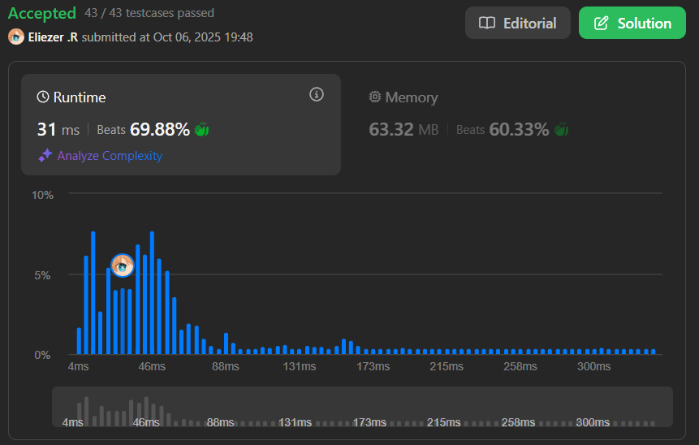

# 778. Swim in Rising Water

## 🧠 Descripción

Se te da una matriz de enteros `n x n` llamada `grid` donde cada valor `grid[i][j]` representa la elevación en ese punto `(i, j)`.

La lluvia comienza a caer. En el tiempo `t`, la profundidad del agua en todas partes es `t`. Puedes nadar de un cuadrado a otro adyacente en 4 direcciones (arriba, abajo, izquierda, derecha) si y solo si la elevación de ambos cuadrados es como máximo `t`. Puedes nadar distancias infinitas en tiempo cero. Por supuesto, debes permanecer dentro de los límites de la cuadrícula durante tu nado.

Comienzas en el cuadrado superior izquierdo `(0, 0)`. Retorna el **tiempo mínimo** que debe pasar hasta que puedas alcanzar el cuadrado inferior derecho `(n-1, n-1)`.

---

## 📋 Ejemplos

### Ejemplo 1:

* **Entrada**: `grid = [[0,2],[1,3]]`
* **Salida**: `3`
* **Explicación**:
```
En el tiempo 0, estás en (0,0).
No puedes ir a ningún lugar porque no puedes ir a (0,1) porque 2 > 0,
ni a (1,0) porque 1 > 0.

En el tiempo 3, puedes ir a cualquier lugar porque la profundidad del agua es 3,
que es >= max(2, 1, 3).
```

### Ejemplo 2:

* **Entrada**: `grid = [[0,1,2,3,4],[24,23,22,21,5],[12,13,14,15,16],[11,17,18,19,20],[10,9,8,7,6]]`
* **Salida**: `16`
* **Explicación**: El camino final es pasar por [0,1,2,3,4,5,6,7,8,...,16].

---

## 💭 Estrategia y Enfoque

Este problema se puede resolver con **Binary Search + BFS**:

### 🧩 Idea clave:

1. Si podemos alcanzar el destino con tiempo `t`, también podemos alcanzarlo con cualquier tiempo `t' > t`.
2. Por lo tanto, podemos usar **búsqueda binaria** sobre el tiempo.
3. Para cada tiempo `mid`, usamos **BFS** para verificar si podemos llegar desde `(0,0)` hasta `(n-1, n-1)`.

### 🔍 Pasos del Algoritmo:

1. **Búsqueda binaria** sobre el tiempo: `left = 0`, `right = n * n - 1`.
2. Para cada `mid`, usar **BFS** para ver si podemos llegar al destino.
3. Si podemos llegar, intentar con un tiempo menor (`right = mid - 1`).
4. Si no podemos, necesitamos más tiempo (`left = mid + 1`).
5. El resultado es el tiempo mínimo encontrado.

---

## 💻 Implementación en JavaScript

```js
var swimInWater = function(grid) {
    const n = grid.length;

    // Función que verifica si podemos llegar al destino con tiempo t
    function canReach(t) {
        // Si el punto de inicio tiene elevación mayor a t, no podemos empezar
        if (grid[0][0] > t) return false;

        // Direcciones: abajo, arriba, derecha, izquierda
        const directions = [[1,0], [-1,0], [0,1], [0,-1]];
        
        // Matriz para rastrear celdas visitadas
        const visited = Array.from({ length: n }, () => Array(n).fill(false));
        
        // Cola para BFS: empezamos en (0, 0)
        const queue = [[0, 0]];
        visited[0][0] = true;

        // BFS para encontrar si podemos llegar a (n-1, n-1)
        while (queue.length > 0) {
            const [x, y] = queue.shift();

            // Si llegamos al destino, retornamos true
            if (x === n - 1 && y === n - 1) return true;

            // Explorar las 4 direcciones
            for (const [dx, dy] of directions) {
                const nx = x + dx;
                const ny = y + dy;

                // Verificar si la nueva posición es válida:
                // 1. Dentro de los límites
                // 2. No visitada
                // 3. Elevación <= t (podemos nadar ahí)
                if (
                    nx >= 0 && ny >= 0 && nx < n && ny < n &&
                    !visited[nx][ny] && grid[nx][ny] <= t
                ) {
                    visited[nx][ny] = true;
                    queue.push([nx, ny]);
                }
            }
        }

        // No pudimos llegar al destino
        return false;
    }

    // Búsqueda binaria sobre el tiempo
    let left = 0;
    let right = n * n - 1;
    let answer = right;

    while (left <= right) {
        const mid = Math.floor((left + right) / 2);

        // Si podemos llegar con tiempo mid
        if (canReach(mid)) {
            answer = mid;  // Guardamos este tiempo como posible respuesta
            right = mid - 1;  // Intentamos con menos tiempo
        } else {
            left = mid + 1;  // Necesitamos más tiempo
        }
    }

    return answer;
};

console.log(swimInWater([[0,2],[1,3]])) // 3
console.log(swimInWater([[0,1,2,3,4],[24,23,22,21,5],[12,13,14,15,16],[11,17,18,19,20],[10,9,8,7,6]])) // 16
```

### 📝 Ejemplo paso a paso con `grid = [[0,2],[1,3]]`:

```
Grid:
  0  2
  1  3

Búsqueda binaria:
left = 0, right = 3

Iteración 1: mid = 1
  canReach(1)?
  - Empezar en (0,0), elevación = 0 <= 1 ✓
  - Intentar (0,1): elevación = 2 > 1 ✗
  - Intentar (1,0): elevación = 1 <= 1 ✓
  - Desde (1,0), intentar (1,1): elevación = 3 > 1 ✗
  - No llegamos a (1,1)
  - Retorna false
  left = 2

Iteración 2: mid = 2
  canReach(2)?
  - Empezar en (0,0), elevación = 0 <= 2 ✓
  - Intentar (0,1): elevación = 2 <= 2 ✓
  - Desde (0,1), intentar (1,1): elevación = 3 > 2 ✗
  - Intentar (1,0): elevación = 1 <= 2 ✓
  - Desde (1,0), intentar (1,1): elevación = 3 > 2 ✗
  - No llegamos a (1,1)
  - Retorna false
  left = 3

Iteración 3: mid = 3
  canReach(3)?
  - Todas las elevaciones <= 3
  - Podemos llegar a (1,1) ✓
  - Retorna true
  answer = 3
  right = 2

left > right, terminamos
Resultado: 3
```

---

## 📊 Análisis de Rendimiento

* **Complejidad temporal**: O(n² × log(n²)), donde n es el tamaño de la matriz.
  - Búsqueda binaria: O(log(n²))
  - BFS por cada búsqueda binaria: O(n²)
* **Complejidad espacial**: O(n²), para la matriz visited y la cola BFS.

---

## 🎯 Aprendizajes Clave

* **Binary Search on Answer**: Cuando la respuesta tiene una propiedad monótona.
* **BFS para alcanzabilidad**: Verificar si podemos llegar de A a B con restricciones.
* **Optimización con Binary Search**: Evitar probar todos los tiempos de 0 a n²-1.
* **Condición de navegación**: Solo podemos movernos a celdas con elevación <= tiempo actual.

---

## 🔄 Enfoque Alternativo: Dijkstra/Priority Queue

```js
// Usando Dijkstra con Priority Queue (más eficiente)
var swimInWaterDijkstra = function(grid) {
    const n = grid.length;
    const pq = new MinPriorityQueue({ priority: x => x.time });
    const visited = Array.from({ length: n }, () => Array(n).fill(false));
    
    pq.enqueue({ x: 0, y: 0, time: grid[0][0] });
    const directions = [[0,1],[1,0],[0,-1],[-1,0]];
    
    while (!pq.isEmpty()) {
        const { x, y, time } = pq.dequeue().element;
        
        if (visited[x][y]) continue;
        visited[x][y] = true;
        
        if (x === n - 1 && y === n - 1) return time;
        
        for (const [dx, dy] of directions) {
            const nx = x + dx, ny = y + dy;
            if (nx >= 0 && ny >= 0 && nx < n && ny < n && !visited[nx][ny]) {
                pq.enqueue({ 
                    x: nx, 
                    y: ny, 
                    time: Math.max(time, grid[nx][ny]) 
                });
            }
        }
    }
};
// O(n² log n) tiempo, más eficiente
```

---

## 🏷️ Etiquetas

`Array` `Binary Search` `BFS` `Matrix` `Heap (Priority Queue)` `Hard`