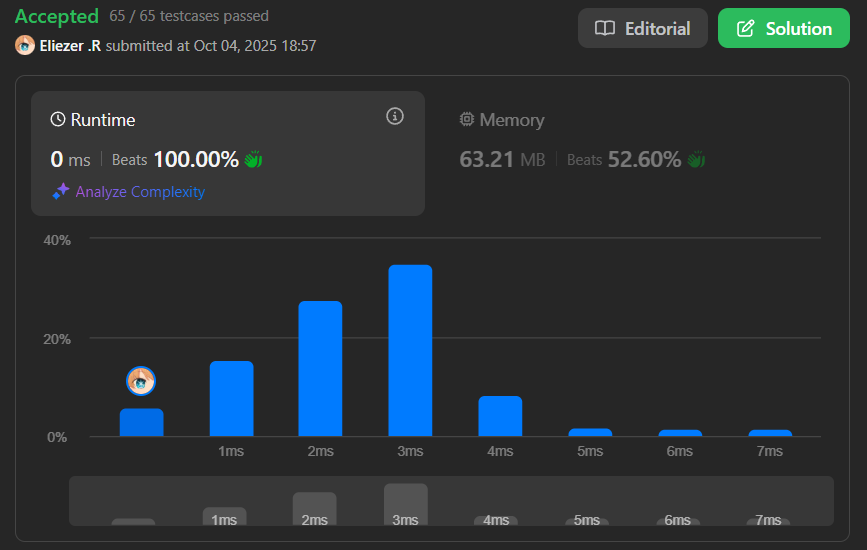

# 11. Container With Most Water

Se te da un array de enteros `height` de longitud `n`. Hay `n` líneas verticales dibujadas de tal manera que los dos puntos finales de la línea `i` están en `(i, 0)` y `(i, height[i])`.

Encuentra dos líneas que junto con el eje x formen un contenedor, de tal manera que el contenedor contenga **la mayor cantidad de agua**.

Retorna la **cantidad máxima de agua** que puede almacenar un contenedor.

**Nota:** No puedes inclinar el contenedor.

**Dificultad:** Medium

---

## 📋 Ejemplos

**Ejemplo 1:**

- Entrada: `height = [1,8,6,2,5,4,8,3,7]`
- Salida: `49`
- Explicación: Las líneas verticales están representadas por el array `[1,8,6,2,5,4,8,3,7]`. En este caso, el área máxima de agua que el contenedor puede contener es `49` (entre las líneas en índices 1 y 8).

**Ejemplo 2:**

- Entrada: `height = [1,1]`
- Salida: `1`

---

## 💭 Enfoque y Estrategia

- **Objetivo**: Encontrar dos líneas que maximicen el área del contenedor formado.
- **Fórmula del área**: `área = ancho × altura = (j - i) × min(height[i], height[j])`
- **Insight clave**: Usar two pointers desde los extremos para explorar eficientemente.
- **Greedy approach**: Mover el puntero de la línea más corta para buscar mayor área.

La estrategia utiliza dos punteros que comienzan en los extremos del array. En cada paso, calculamos el área actual y movemos el puntero que apunta a la línea más corta, buscando potencialmente una línea más alta.

---

## 🔧 Implementación

```js
const maxArea = function (height) {
    let num = 0              // Área máxima encontrada
    let j = height.length - 1  // Puntero derecho (final)
    let i = 0                // Puntero izquierdo (inicio)

    while (j > i) {
        // Calcular área actual: ancho × altura mínima
        const formul = (j - i) * Math.min(height[i], height[j])
        num = Math.max(formul, num)  // Actualizar máximo

        // Mover el puntero de la línea más corta
        if (height[i] < height[j]) {
            i++  // Línea izquierda es más corta, mover hacia derecha
        } else {
            j--  // Línea derecha es más corta (o igual), mover hacia izquierda
        }
    }

    return num
}

console.log(maxArea([1,8,6,2,5,4,8,3,7])) // 49

/**
 * Ejemplo paso a paso con height = [1,8,6,2,5,4,8,3,7]:
 * Índices:                          0 1 2 3 4 5 6 7 8
 * 
 * Iteración 1: i=0, j=8
 * área = (8-0) * min(1,7) = 8 * 1 = 8
 * num = 8
 * height[0]=1 < height[8]=7 → i++
 * 
 * Iteración 2: i=1, j=8
 * área = (8-1) * min(8,7) = 7 * 7 = 49
 * num = 49
 * height[1]=8 > height[8]=7 → j--
 * 
 * Iteración 3: i=1, j=7
 * área = (7-1) * min(8,3) = 6 * 3 = 18
 * num = 49 (sin cambio)
 * height[1]=8 > height[7]=3 → j--
 * 
 * Iteración 4: i=1, j=6
 * área = (6-1) * min(8,8) = 5 * 8 = 40
 * num = 49 (sin cambio)
 * height[1]=8 == height[6]=8 → j-- (empate)
 * 
 * ... (continúa hasta i >= j)
 * 
 * Resultado: 49
 */
```

---

## 📊 Análisis de Rendimiento

- **Complejidad temporal**: O(n), donde n es la longitud del array height.
- **Complejidad espacial**: O(1), solo usamos variables auxiliares.
 

*Solución óptima: exploramos todas las posibilidades relevantes en una sola pasada.*

---

## 🎯 Intuición: ¿Por qué funciona?

**Greedy correctness:**

1. **Comenzamos con el ancho máximo** (extremos del array)
2. **Al mover el puntero de la línea más corta**, potencialmente encontramos una más alta
3. **No perdemos el óptimo** porque:
   - Si movemos la línea más alta, el área solo puede decrecer (ancho menor, altura limitada por la más corta)
   - Al mover la más corta, hay chance de encontrar una más alta que compense el ancho menor

**Demostración por contradicción:**
```
Supongamos el óptimo está entre i y j.
Si no exploramos esta combinación porque movimos el puntero equivocado,
significa que había una línea más alta en el lado opuesto que ya habríamos
procesado o que encontraremos después. Por tanto, no perdemos el óptimo.
```

---

## 🎯 Visualización del Proceso

```
height = [1, 8, 6, 2, 5, 4, 8, 3, 7]
          ↑                       ↑
          i                       j

Paso 1: ancho=8, altura=min(1,7)=1 → área=8
        Mover i (1 es menor que 7)

height = [1, 8, 6, 2, 5, 4, 8, 3, 7]
             ↑                    ↑
             i                    j

Paso 2: ancho=7, altura=min(8,7)=7 → área=49 ← MÁXIMO
        Mover j (7 es menor que 8)

... proceso continúa buscando mejores áreas
```

---

## 🔄 Enfoque Alternativo (Fuerza Bruta)

```js
// Enfoque O(n²) - menos eficiente
const maxAreaBruteForce = function(height) {
    let maxArea = 0
    
    // Probar todas las combinaciones posibles
    for (let i = 0; i < height.length - 1; i++) {
        for (let j = i + 1; j < height.length; j++) {
            const area = (j - i) * Math.min(height[i], height[j])
            maxArea = Math.max(maxArea, area)
        }
    }
    
    return maxArea
}

// O(n²) tiempo vs O(n) con two pointers
```

---

## 🎯 Aprendizajes Clave

- **Two pointers desde extremos**: Técnica poderosa para optimizar búsquedas en arrays.
- **Greedy approach válido**: Mover el puntero "débil" es matemáticamente correcto.
- **Trade-off ancho vs altura**: Aunque el ancho disminuye, buscar mayor altura puede compensar.
- **Optimización O(n)**: Reducir O(n²) a O(n) con análisis correcto del problema.
- **No necesitas probar todo**: El greedy elimina combinaciones subóptimas automáticamente.

---

## 🔍 Casos Edge

- **Array de dos elementos**: `[1,1]` → `1` (área mínima posible)
- **Líneas crecientes**: `[1,2,3,4,5]` → máximo entre primera y última
- **Líneas decrecientes**: `[5,4,3,2,1]` → máximo entre primera y última
- **Meseta en el medio**: Líneas altas en los extremos suelen dar mejor área

---

## 🧮 Análisis Matemático

**¿Por qué no perder el óptimo?**

```
Sean i y j los índices óptimos donde área es máxima.

Caso 1: height[i] < height[j]
- En algún momento tendremos punteros left=i, right>j
- Al procesar, si height[left] < height[right], movemos left
- Eventualmente left llegará a i y right a j
- Por tanto, exploramos esta combinación

Caso 2: height[i] >= height[j]  
- Similar: moviendo right eventualmente llegamos a j con left en i

Conclusión: El algoritmo garantiza explorar el par óptimo.
```

---

## 🏷️ Tags

`Array` `Two Pointers` `Greedy` `Medium`

---

**Tiempo invertido**: 30 minutos  
**Intentos**: 1  
**Dificultad percibida**: Medium