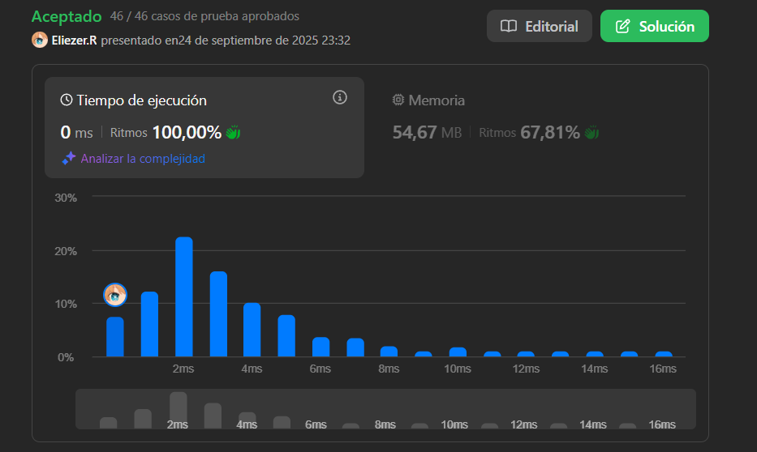

# 120. Triangle

Dada una matriz **triangle**, retorna la suma mínima del camino de arriba a abajo.

Para cada paso, puedes moverte a números **adyacentes** en la fila de abajo. Más formalmente, si estás en el índice `i` en la fila actual, puedes moverte a los índices `i` o `i + 1` en la siguiente fila.

**Dificultad:** Medium

---

## 📋 Ejemplos

**Ejemplo 1:**

- Entrada: `triangle = [[2],[3,4],[6,5,7],[4,1,8,3]]`
- Salida: `11`
- Explicación: El triángulo se ve así:
```
   2
  3 4
 6 5 7
4 1 8 3
```
La suma mínima del camino de arriba a abajo es `2 + 3 + 5 + 1 = 11`.

**Ejemplo 2:**

- Entrada: `triangle = [[-10]]`
- Salida: `-10`

---

## 💭 Enfoque y Estrategia

- **Objetivo**: Encontrar el camino con suma mínima desde la cima hasta la base del triángulo.
- **Insight clave**: Programación dinámica bottom-up - calcular desde abajo hacia arriba.
- **Técnica**: DP in-place modificando el triángulo original para ahorrar espacio.
- **Ventaja**: Cada posición almacena la suma mínima posible desde esa posición hasta el fondo.

La estrategia trabaja desde la penúltima fila hacia arriba, calculando para cada posición la suma mínima eligiendo entre los dos caminos posibles hacia abajo.

---

## 🔧 Implementación

```js
const minimumTotal = function (triangle) {
    // Empezar desde la penúltima fila y subir hacia la cima
    for (let i = triangle.length - 1; i > 0; i--) {
        // Para cada elemento en la fila actual
        for (let j = 0; j < (triangle[i].length - 1); j++) {
            // Encontrar el mínimo entre los dos caminos posibles hacia abajo
            let min = Math.min(triangle[i][j], triangle[i][j + 1])
            
            // Actualizar la fila superior con la suma mínima
            triangle[i - 1][j] += min
        }
    }
    
    // El resultado final está en la cima del triángulo
    return triangle[0][0]
}

console.log(minimumTotal([[2],[3,4],[6,5,7],[4,1,8,3]])) // 11

/**
 * Ejemplo paso a paso con triangle = [[2],[3,4],[6,5,7],[4,1,8,3]]:
 * 
 * Estado inicial:
 *    2
 *   3 4  
 *  6 5 7
 * 4 1 8 3
 * 
 * i=3 (fila [4,1,8,3]):
 * j=0: min(4,1)=1 → triangle[2][0] = 6+1 = 7
 * j=1: min(1,8)=1 → triangle[2][1] = 5+1 = 6  
 * j=2: min(8,3)=3 → triangle[2][2] = 7+3 = 10
 * Resultado después de i=3:
 *    2
 *   3 4
 *  7 6 10
 * 4 1 8 3
 * 
 * i=2 (fila [7,6,10]):
 * j=0: min(7,6)=6 → triangle[1][0] = 3+6 = 9
 * j=1: min(6,10)=6 → triangle[1][1] = 4+6 = 10
 * Resultado después de i=2:
 *    2
 *   9 10
 *  7 6 10
 * 4 1 8 3
 * 
 * i=1 (fila [9,10]):
 * j=0: min(9,10)=9 → triangle[0][0] = 2+9 = 11
 * Resultado final:
 *   11
 *   9 10
 *  7 6 10  
 * 4 1 8 3
 * 
 * Resultado: triangle[0][0] = 11
 */
```

---

## 📊 Análisis de Rendimiento

- **Complejidad temporal**: O(n²), donde n es el número de filas (total de elementos en el triángulo).
- **Complejidad espacial**: O(1), modificación in-place sin espacio adicional.


*Solución óptima en espacio que aprovecha la estructura del triángulo existente.*

---

## 🔧 Visualización del Proceso

**Bottom-up DP:**
```
Paso 0 (inicial):     Paso 1:          Paso 2:         Resultado:
   2                    2                 2               11
  3 4                  3 4               9 10              
 6 5 7                7 6 10                              
4 1 8 3              4 1 8 3                             

↑ Cada número en la fila superior se actualiza con la suma 
  mínima de los dos números posibles en la fila inferior
```

**Elección de caminos:**
- Desde posición `(i,j)` puedes ir a `(i+1,j)` o `(i+1,j+1)`
- Bottom-up: Para llegar a `(i,j)` desde abajo, elige el mínimo entre `(i+1,j)` y `(i+1,j+1)`

---

## 🔄 Enfoque Alternativo (Top-Down)

```js
const minimumTotalTopDown = function(triangle) {
    const memo = {}
    
    function dfs(i, j) {
        // Caso base: llegamos a la última fila
        if (i === triangle.length - 1) {
            return triangle[i][j]
        }
        
        // Verificar memoización
        const key = `${i},${j}`
        if (memo[key] !== undefined) {
            return memo[key]
        }
        
        // Calcular suma mínima recursivamente
        const left = dfs(i + 1, j)
        const right = dfs(i + 1, j + 1)
        const result = triangle[i][j] + Math.min(left, right)
        
        memo[key] = result
        return result
    }
    
    return dfs(0, 0)
}
// O(n²) tiempo, O(n²) espacio
```

---

## 🎯 Aprendizajes Clave

- **Bottom-up DP**: A menudo más eficiente y fácil de implementar que top-down.
- **In-place optimization**: Modificar la entrada original para ahorrar espacio.
- **Adyacencia en triángulos**: Desde `(i,j)` puedes ir a `(i+1,j)` y `(i+1,j+1)`.
- **Subproblemas overlapping**: Cada posición puede ser alcanzada por múltiples caminos.
- **Dirección de cálculo**: Bottom-up elimina necesidad de recursión y stack overflow.

---

## 🔍 Casos Edge

- **Triángulo de un elemento**: `[[-10]]` → `-10`
- **Triángulo de dos filas**: `[[1],[2,3]]` → `min(1+2, 1+3) = 3`
- **Números negativos**: Pueden crear caminos óptimos inesperados
- **Triángulo grande**: El algoritmo escala eficientemente

---

## 🧮 Ejemplo con Números Negativos

```
Entrada: [[-1],[2,3],[1,-1,-3]]
   -1
  2  3
 1 -1 -3

Caminos posibles:
-1 → 2 → 1  = 2
-1 → 2 → -1 = 0  
-1 → 3 → -1 = 1
-1 → 3 → -3 = -1  ← mínimo

Resultado: -1
```

---

## 🚀 Variaciones del Problema

- **Maximum path sum**: Cambiar `Math.min` por `Math.max`
- **Count paths**: Contar número de caminos con suma mínima
- **Path reconstruction**: Guardar el camino real, no solo la suma
- **3D triangle**: Extensión a más dimensiones

---

## 🏷️ Tags

`Array` `Dynamic Programming` `Medium`

---

**Tiempo invertido**: 25 minutos  
**Intentos**: 2  
**Dificultad percibida**: Medium